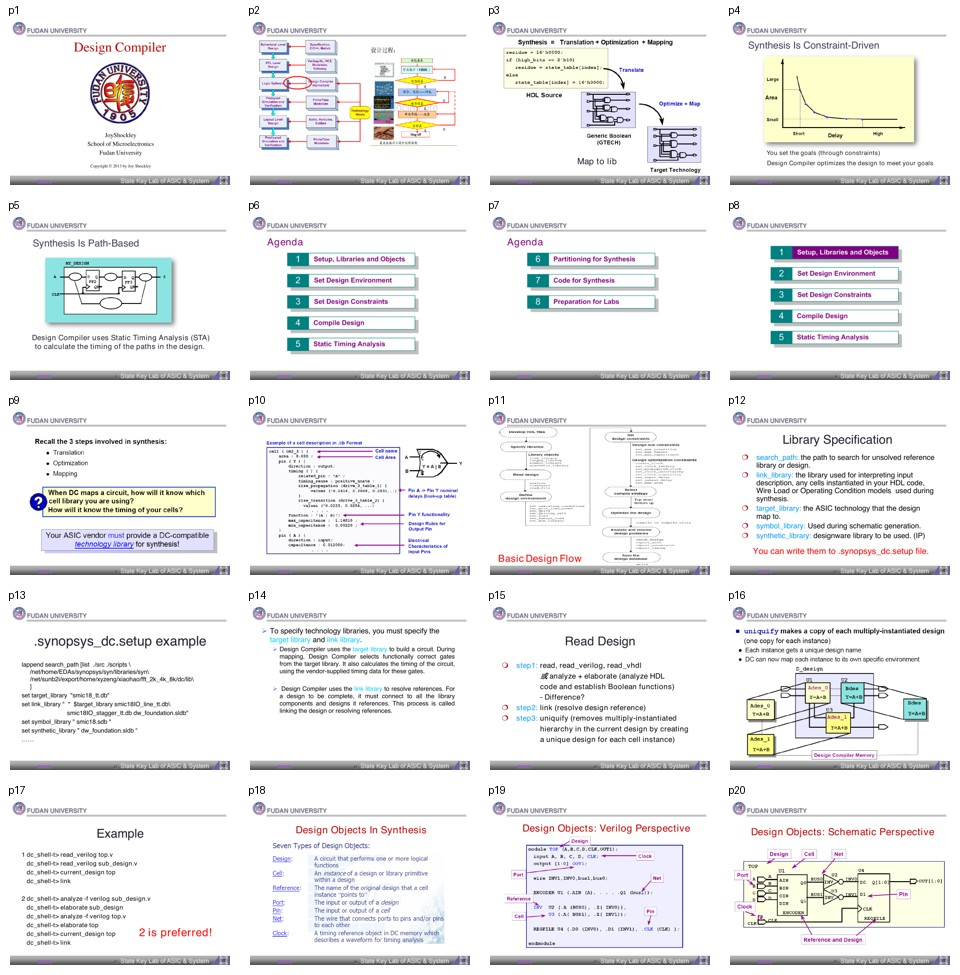

# 批次 1：页 1-20

**主题**：Design Compiler 基本思想、库设置、读入设计、设计对象  
**缩略图拼板**：

## 中文摘要

这一段建立 DC 的核心心智模型：综合不是简单把 HDL 翻成门级网表，而是一个受约束驱动的流程。用户提供库、设计、环境和约束，Design Compiler 根据这些目标做 translation、optimization 和 mapping。材料随后进入基础操作：指定库、读入 Verilog/VHDL、link 解析引用、uniquify 处理多实例层次，以及理解 DC 里的 design object。

## 关键结论

- DC 的目标是把 RTL/HDL 映射到目标工艺库，同时尽量满足 timing、area 和 design rule 约束。
- `target_library` 决定综合能用哪些门；`link_library` 决定设计引用如何解析。二者混淆会导致 link 失败或映射结果错误。
- 推荐使用 `analyze + elaborate` 方式读 HDL，而不是只用 `read_verilog`，因为前者更像编译流程，利于语法分析、层次建立和后续调试。
- `link` 用来解析模块、库单元和 DesignWare 等引用；`uniquify` 用来把多处复用的同一层次实例拆成独立设计，避免优化互相牵连。
- DC 中对象包括 design、cell、reference、port、pin、net、clock。后续所有约束命令都依赖这些对象。

## 分页解读

| 页码 | 内容 | 中文理解 |
|---:|---|---|
| 1-5 | 标题、综合三步、constraint-driven/path-based | DC 根据约束优化，STA 用来判断路径是否满足目标。 |
| 6-11 | Agenda 和 Basic Design Flow | 课程主线是库和对象、环境、约束、compile、STA、partitioning、code、lab。 |
| 12-14 | Library Specification | `.synopsys_dc.setup` 是 DC 项目的入口配置之一，库路径和库变量必须先稳定。 |
| 15-17 | Read Design | 两种读入方式，材料明确提示 `analyze + elaborate` 更推荐。 |
| 18-20 | Design Objects | 后续命令都不是对“字符串”生效，而是对 DC 数据库里的对象生效。 |

## 术语对照表

| 英文术语 | 中文解释 | 在本文中的含义 |
|---|---|---|
| Design Compiler, DC | Synopsys 逻辑综合工具 | 把 RTL 综合成门级网表的主工具 |
| Constraint-driven | 约束驱动 | 先定义目标，再由工具优化 |
| Path-based | 基于路径 | 通过 STA 分析路径 timing |
| `search_path` | 搜索路径 | 找 HDL、库、设计引用的位置 |
| `target_library` | 目标库 | 映射时可选择的工艺门库 |
| `link_library` | 链接库 | 解析设计引用、库单元和 DesignWare |
| `synthetic_library` | 综合库 | DesignWare 等高级组件库 |
| `link` | 链接/解析引用 | 让设计层次、库单元引用完整闭合 |
| `uniquify` | 实例唯一化 | 为多实例层次创建独立设计副本 |

## 实操笔记

一个最小 DC 读入流程可以记成：

```tcl
lappend search_path [list ./src ./scripts ./lib]
set target_library "smic18_tt.db"
set link_library "* $target_library dw_foundation.sldb"
set synthetic_library "dw_foundation.sldb"

analyze -f verilog sub_design.v
elaborate sub_design
analyze -f verilog top.v
elaborate top
current_design top
link
```

## 易错点

- `target_library` 不是“所有相关库”，而是 mapping 的目标门库。
- `link_library` 常需要包含 `*`，表示也在当前设计库中解析引用。
- 读入完设计不等于设计可综合，必须检查 `current_design` 和 `link`。
- 图形页 2、8-10 的文字抽取很少，实际包含流程图和示意图，建议回看拼板或原 PDF。

## 我的理解

这一批的核心不是记住命令，而是建立 DC 的数据库视角：HDL 读入后会变成一组对象，后续所有环境和约束都是给对象打属性。只要这个视角建立起来，`get_ports`、`get_clocks`、`current_design`、`link` 等命令就不再像零散咒语，而是“选对象、设属性、检查结果”的流程。
