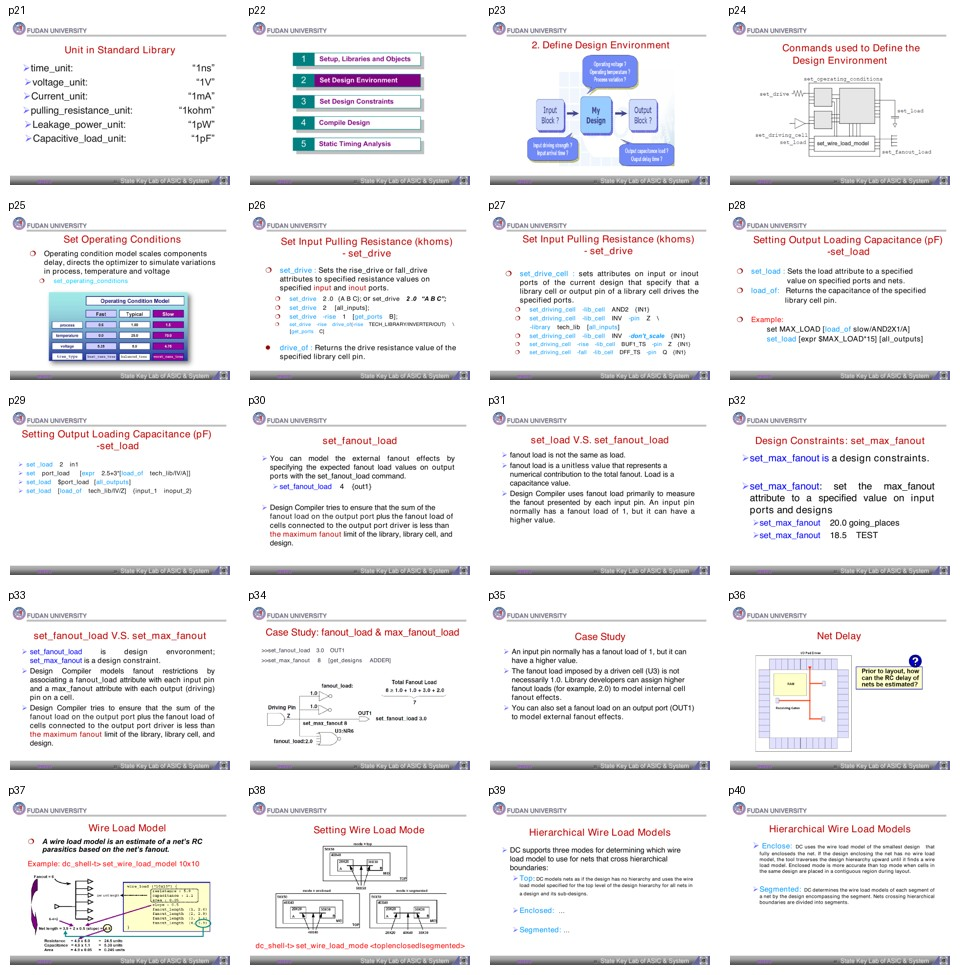

# 批次 2：页 21-40

**主题**：设计环境建模：operating condition、drive/load、fanout、wire load  
**缩略图拼板**：

## 中文摘要

这一段回答“综合时外部世界长什么样”。DC 不能只看 RTL，还需要知道库单位、PVT/operating condition、输入端由什么驱动、输出端挂了多大电容、外部扇出如何建模，以及还未布局时线延迟如何估算。这些设置属于 design environment，它们描述的是芯片边界和工艺环境，而不是设计目标本身。

## 关键结论

- 标准库定义了时间、电压、电流、电容、漏电功耗等单位，约束值必须和库单位一致。
- `set_operating_conditions` 用来建模 process、temperature、voltage 对延迟的影响。
- 输入端建模可用 `set_drive` 或 `set_driving_cell`；前者给等效电阻，后者指定由哪个库单元驱动。
- 输出端建模主要用 `set_load`，它表示电容负载；`set_fanout_load` 是无量纲 fanout 贡献，不等同于电容。
- `set_max_fanout` 是 design constraint，`set_fanout_load` 是 environment modeling。前者是目标/限制，后者是外部条件。
- 在没有实际布线前，wire load model 用 fanout 估计 net RC；层次化设计要选择 top、enclosed 或 segmented 模式。

## 分页解读

| 页码 | 内容 | 中文理解 |
|---:|---|---|
| 21 | Unit in Standard Library | 约束数值必须理解单位，否则 1ns、1pF、1kohm 会错用。 |
| 23-25 | Define Design Environment / operating conditions | 设置外部环境和 PVT，是综合前必须补齐的信息。 |
| 26-27 | `set_drive` / `set_driving_cell` | 输入端不是理想源，驱动能力会影响 transition 和 timing。 |
| 28-31 | `set_load` / `set_fanout_load` | 输出负载分电容负载和 fanout 负载，含义不同。 |
| 32-35 | `set_max_fanout` 与 case study | 解释外部 fanout 和内部最大 fanout 限制的关系。 |
| 36-40 | net delay / wire load model | 布局前通过 WLM 粗估线延迟，层次模式影响跨层 net 的估算。 |

## 术语对照表

| 英文术语 | 中文解释 | 在本文中的含义 |
|---|---|---|
| Operating condition | 工作条件 | PVT 角落，影响 cell delay |
| `set_drive` | 设置输入驱动电阻 | 用等效电阻描述外部驱动强度 |
| `set_driving_cell` | 设置输入驱动单元 | 用库单元 pin 描述外部驱动 |
| `set_load` | 设置输出电容负载 | 描述输出端实际要驱动的电容 |
| `load_of` | 读取库 pin 电容 | 常用于按库单元 pin 计算负载 |
| `set_fanout_load` | 设置外部 fanout 负载 | 无量纲 fanout 贡献 |
| `set_max_fanout` | 最大 fanout 约束 | 工具必须尽量满足的扇出限制 |
| Wire Load Model, WLM | 线负载模型 | 布局前估算 net RC 的模型 |
| top/enclosed/segmented | WLM 层次模式 | 决定跨层 net 使用哪个层次的线负载模型 |

## 命令速记

```tcl
set_operating_conditions slow

set_drive 2.0 [all_inputs]
set_driving_cell -lib_cell INV -pin Z [all_inputs]

set MAX_LOAD [load_of slow/AND2X1/A]
set_load [expr $MAX_LOAD * 15] [all_outputs]

set_fanout_load 4 [get_ports out1]
set_max_fanout 20 [current_design]

set_wire_load_model -name "10x10" -library my_lib.db
set_wire_load_mode enclosed
```

## 易错点

- `set_load` 是电容，`set_fanout_load` 是 fanout 数值贡献，不能互相替代。
- `set_fanout_load` 描述外部负载，`set_max_fanout` 是设计规则目标，二者角色不同。
- WLM 是 pre-layout 估算，准确性有限；如果有更后端的 parasitic 数据，后续应替换。
- 页 22、36-38 视觉信息较多，文本抽取少，建议结合原图理解。

## 我的理解

这一批的核心是“环境先于约束”。如果不告诉 DC 输入由谁驱动、输出接了什么、工艺角落是什么，它做出的 timing 和面积优化就是悬空的。真正写 DC 脚本时，environment 部分应在 clock 和 timing constraints 前面稳定下来。
