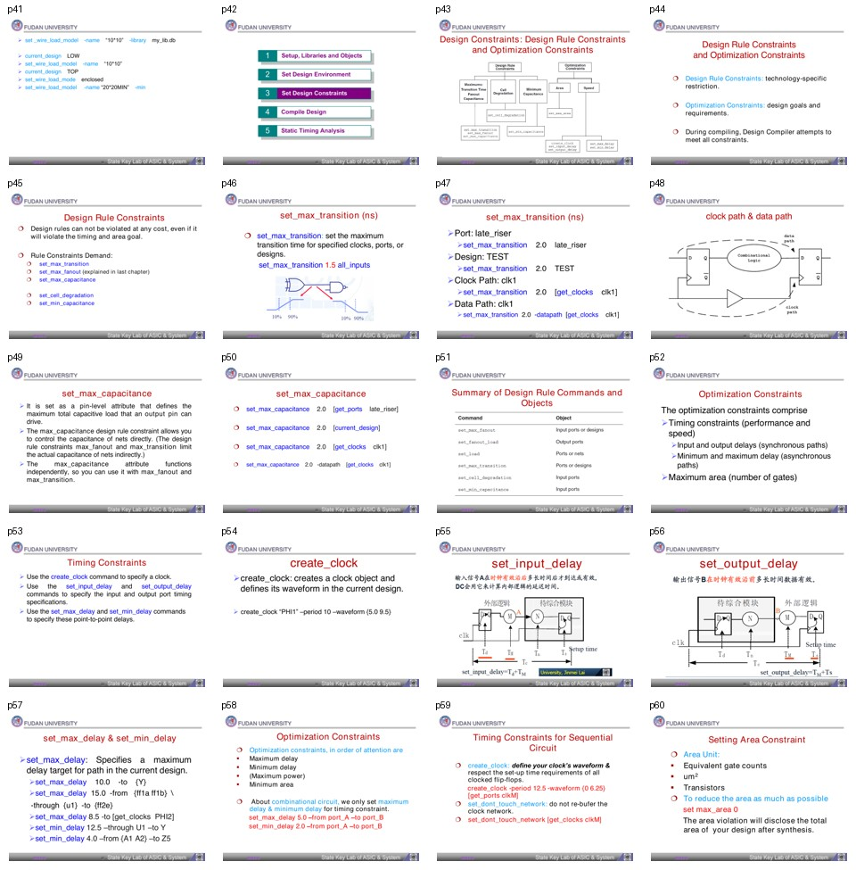

# 批次 3：页 41-60

**主题**：设计规则约束与优化约束  
**缩略图拼板**：

## 中文摘要

这一段开始区分两类约束：design rule constraints 和 optimization constraints。前者是工艺/库给出的硬性规则，通常不能违背；后者是设计目标，例如 timing、I/O delay、max/min delay、area。理解这个优先级非常重要，因为 DC 会优先修 design rule，再追 timing，最后才考虑面积等优化目标。

## 关键结论

- Design rule constraints 是技术库相关限制，例如最大 transition、最大 fanout、最大 capacitance。
- Optimization constraints 是设计目标，包括 timing、输入输出延迟、点到点最大/最小延迟、最大面积。
- `set_max_transition` 控制指定 clock、port 或 design 上的最大转换时间。
- `set_max_capacitance` 是 pin-level 属性，直接限制输出 pin 可驱动的总电容。
- `create_clock` 是时序约束的根，后续 input/output delay 和 path delay 都围绕 clock 建立。
- 对组合逻辑，常直接用 `set_max_delay` 和 `set_min_delay` 约束输入到输出路径。
- `set_max_area 0` 是常见技巧，表示尽可能压面积，并通过 area violation 看到综合后面积。

## 分页解读

| 页码 | 内容 | 中文理解 |
|---:|---|---|
| 41 | WLM 设置命令补充 | 当前设计可分别设置 WLM 和 min WLM。 |
| 43-45 | Design rule vs optimization | 硬规则和优化目标必须分开理解。 |
| 46-48 | `set_max_transition` | 可约束 port、design、clock path、data path。 |
| 49-51 | `set_max_capacitance` | 直接管电容，比 fanout/transition 更直接。 |
| 52-53 | Optimization constraints | timing、I/O delay、max/min delay、area 是主要优化目标。 |
| 54-59 | clock、input/output delay、max/min delay | clock 是同步约束中心，组合逻辑可用点到点约束。 |
| 60 | area constraint | 面积约束可用于引导面积优化和观察结果面积。 |

## 术语对照表

| 英文术语 | 中文解释 | 在本文中的含义 |
|---|---|---|
| Design rule constraint | 设计规则约束 | 技术库限制，优先级高 |
| Optimization constraint | 优化约束 | 设计目标，工具尽量满足 |
| Transition time | 转换时间 | 信号上升/下降边沿的变化时间 |
| Capacitance | 电容负载 | 输出 pin/net 需要驱动的总电容 |
| `create_clock` | 创建时钟 | 定义周期、波形和时钟对象 |
| `set_input_delay` | 输入延迟 | 外部逻辑到当前设计输入端的时间预算 |
| `set_output_delay` | 输出延迟 | 当前设计输出到外部逻辑的时间预算 |
| `set_max_delay` | 最大延迟 | 限制路径不能太慢 |
| `set_min_delay` | 最小延迟 | 限制路径不能太快，常关联 hold |
| `set_max_area` | 最大面积 | 面积优化目标 |

## 命令速记

```tcl
set_max_transition 1.5 [all_inputs]
set_max_transition 2.0 [current_design]
set_max_transition 2.0 [get_clocks clk1]
set_max_transition 2.0 -datapath [get_clocks clk1]

set_max_capacitance 2.0 [get_ports late_riser]
set_max_capacitance 2.0 [current_design]

create_clock PHI1 -period 10 -waveform {5.0 9.5}
set_max_delay 10.0 -to Y
set_min_delay 4.0 -from {A1 A2} -to Z5

set_max_area 0
```

## 易错点

- Design rule 不应被当成“建议值”；它们经常比 timing/area 更硬。
- `set_max_transition` 对 clock path 和 data path 的作用范围要明确，不要随手套全局。
- 输入/输出延迟本质是和外部模块分 timing budget，不是给内部路径凭空加延迟。
- 页 55-56 的图示是理解 input/output delay 的关键，文本抽取很少，建议对照拼板。

## 我的理解

这一批可以总结成一句话：先把“不能违反”的规则立住，再描述“希望达到”的目标。很多 DC 脚本混乱的根源，就是把工艺规则、外部环境、timing budget 和优化目标写成一锅粥，最后不知道 violation 是哪类问题。
