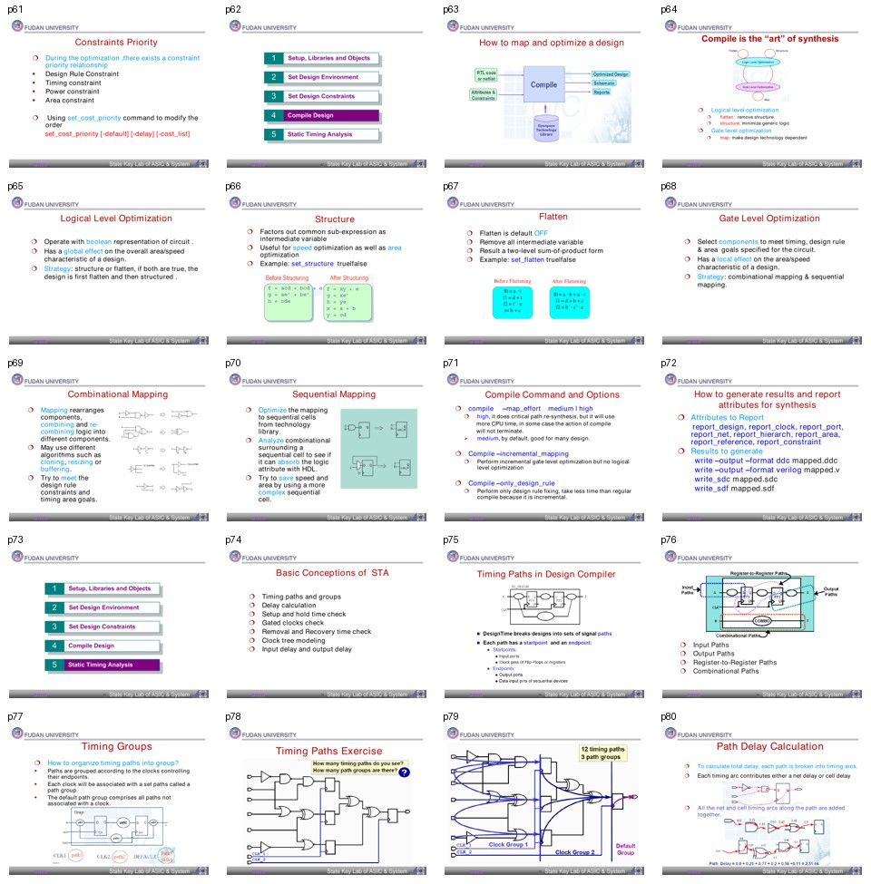

# 批次 4：页 61-80

**主题**：约束优先级、compile、逻辑/门级优化、报告输出、STA 基础  
**缩略图拼板**：

## 中文摘要

这一段从“约束怎么排优先级”转入“DC 怎么优化”。DC 的 compile 包含逻辑级优化和门级优化：逻辑级可以通过 structure 或 flatten 改写布尔表达式，门级则在目标库中做 combinational/sequential mapping。随后材料进入 STA 基础，介绍 timing path、timing group 和 path delay calculation。

## 关键结论

- 默认优先级大致是 design rule、timing、power、area；可用 `set_cost_priority` 修改。
- compile 是综合的核心动作，既包含逻辑变换，也包含技术库映射。
- `structure` 会提取公共子表达式，通常利于面积，也可能改善速度。
- `flatten` 会去掉中间变量，把逻辑摊平成两级 sum-of-product，可能改善某些速度但会破坏结构。
- Gate-level optimization 通过 mapping、cloning、resizing、buffering 等方法满足 timing/design rule/area。
- `compile -map_effort high` 可能做 critical path re-synthesis，但 CPU 时间高，甚至可能不收敛。
- 报告与输出包括 `report_area`、`report_timing`、`write_ddc`、`write_verilog`、`write_sdc`、`write_sdf` 等。
- STA 把路径拆成 timing arcs，累计 cell delay 和 net delay。

## 分页解读

| 页码 | 内容 | 中文理解 |
|---:|---|---|
| 61 | Constraints Priority | 说明优化时不同目标有优先级。 |
| 63-64 | map and optimize / compile | compile 是综合的“艺术”，不是机械转换。 |
| 65-67 | Logical optimization / structure / flatten | 逻辑表达式层面的全局优化。 |
| 68-70 | Gate-level / combinational / sequential mapping | 目标库层面的本地优化和映射。 |
| 71 | compile options | map effort、incremental、only design rule 的差异。 |
| 72 | reports and output | 综合结果要输出网表、约束、延迟和报告。 |
| 74-80 | STA 基础 | timing paths、groups、delay calculation 的核心概念。 |

## 术语对照表

| 英文术语 | 中文解释 | 在本文中的含义 |
|---|---|---|
| Compile | 综合优化执行 | DC 的核心优化和映射命令 |
| Logical optimization | 逻辑级优化 | 在布尔表达式层面优化 |
| Structure | 结构化 | 提取公共子表达式 |
| Flatten | 展平 | 移除中间变量，形成更扁平逻辑 |
| Gate-level optimization | 门级优化 | 在目标库 cell 上做优化 |
| Combinational mapping | 组合逻辑映射 | 映射组合逻辑到库单元 |
| Sequential mapping | 时序逻辑映射 | 优化触发器周围逻辑和时序单元 |
| Timing path | 时序路径 | STA 检查的起点到终点路径 |
| Timing group | 时序组 | 按 clock endpoint 组织路径 |
| Timing arc | 时序弧 | path delay 的基本累计单元 |

## 命令速记

```tcl
set_cost_priority -delay

set_structure true
set_flatten false

compile -map_effort medium
compile -map_effort high
compile -incremental_mapping
compile -only_design_rule

report_design
report_clock
report_port
report_net
report_area
report_constraint

write -format ddc -output mapped.ddc
write -format verilog -output mapped.v
write_sdc mapped.sdc
write_sdf mapped.sdf
```

## 易错点

- `compile -map_effort high` 不是默认越高越好；长时间运行和不收敛风险要考虑。
- `flatten` 会改变层次和可读性，不能为了局部 timing 随意全局打开。
- Incremental mapping 不做逻辑级优化，适合已有结果的小修，不适合从零优化。
- STA 的 path group 默认归 clock，未归属 clock 的路径会进入 default group。

## 我的理解

这一批把 DC 从“设约束的工具”推进到“优化引擎”。实际项目里，脚本调试要把问题分层：是逻辑结构不好，还是门级映射不够，还是约束/环境写错。不同层的问题，用不同 compile 策略处理。
