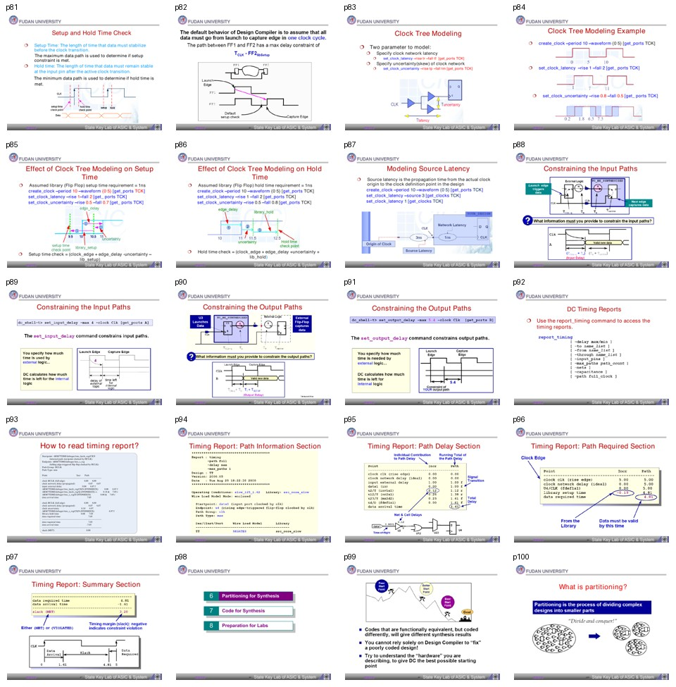

# 批次 5：页 81-100

**主题**：setup/hold、clock tree modeling、I/O path 约束、timing report、partitioning 起点  
**缩略图拼板**：

## 中文摘要

这一段是 STA 实战核心。材料先解释 setup 和 hold 的本质，再讲 clock latency、clock uncertainty、source latency 如何影响检查。随后进入 input/output path 约束以及 timing report 的阅读方式。最后开始 partitioning，说明复杂设计要拆成更小块处理。

## 关键结论

- Setup 检查看最大数据路径，要求数据在捕获时钟沿前稳定。
- Hold 检查看最小数据路径，要求数据在捕获时钟沿后保持稳定。
- Clock tree modeling 主要用 clock latency 和 clock uncertainty 建模时钟网络。
- Source latency 表示真实 clock origin 到设计中 clock definition point 的传播时间。
- `set_input_delay` 和 `set_output_delay` 是模块边界 timing budget 的核心命令。
- `report_timing` 的阅读要分四块：path information、path delay、path required、summary。
- Timing report 中 `data arrival time` 和 `data required time` 的差决定 slack；slack 非负表示 MET，负数表示 VIOLATED。
- Partitioning 不是随便切块，而是为了降低复杂度、减少交叉优化问题、提高综合可控性。

## 分页解读

| 页码 | 内容 | 中文理解 |
|---:|---|---|
| 81-82 | Setup/Hold | 最大路径决定 setup，最小路径决定 hold。 |
| 83-87 | Clock tree modeling | latency、uncertainty、source latency 改变 required/arrival 关系。 |
| 88-91 | Input/output paths | 对模块边界设定外部逻辑占用的时间。 |
| 92-97 | Timing report | 学会从 startpoint/endpoint 到 slack 读完整报告。 |
| 98-100 | Partitioning 起点 | 大设计拆分成更小设计，降低综合复杂度。 |

## 术语对照表

| 英文术语 | 中文解释 | 在本文中的含义 |
|---|---|---|
| Setup time | 建立时间 | 数据必须在捕获沿前稳定的时间 |
| Hold time | 保持时间 | 数据必须在捕获沿后保持的时间 |
| Clock latency | 时钟延迟 | clock definition point 到寄存器 clock pin 的传播 |
| Clock uncertainty | 时钟不确定性 | skew、jitter、margin 的抽象 |
| Source latency | 源时钟延迟 | 真实时钟源到设计时钟定义点的传播 |
| `report_timing` | 时序报告 | DC/STA 读取路径 slack 的主报告 |
| Data arrival time | 数据到达时间 | 数据路径累计后的到达时间 |
| Data required time | 数据要求时间 | 为满足 setup/hold 的最晚/最早要求 |
| Slack | 时序余量 | required 和 arrival 的差 |
| Partitioning | 设计分区 | 将复杂设计拆成较小模块综合 |

## 命令速记

```tcl
create_clock -period 10 -waveform {0 5} [get_ports TCK]
set_clock_latency -rise 1 -fall 2 [get_ports TCK]
set_clock_uncertainty -rise 0.8 -fall 0.5 [get_ports TCK]

set_clock_latency -source 3 [get_clocks TCK]
set_clock_latency 1 [get_clocks TCK]

report_timing
report_timing -delay min
report_timing -delay max
```

## Timing Report 阅读顺序

1. 看 `Startpoint` 和 `Endpoint`，判断是哪类路径。
2. 看 `Path Group` 和 `Path Type`，确认是 max/setup 还是 min/hold。
3. 读 `Point / Incr / Path`，区分 cell delay、net delay、clock network delay。
4. 找 `data arrival time`。
5. 找 `data required time`。
6. 看 `slack (MET/VIOLATED)`，判断是否收敛。

## 易错点

- Setup 和 hold 不是同一个方向的问题：一个怕数据太慢，一个怕数据太快。
- `clock uncertainty` 对 setup 通常收紧 required time，对 hold 也会改变检查边界，不能随意填。
- I/O delay 是和外部模块切 timing budget，不是修内部路径的万能工具。
- 页 88-91 的图示对理解 input/output delay 很关键，建议对照原 PDF。

## 我的理解

这一批是整份材料最值得反复看的部分。前面所有库、环境、约束、compile 的设置，最后都会落到 timing report 上接受审判。能读懂 report，才知道下一步该改约束、改 RTL、调 compile 策略，还是和后端/接口重新分 budget。
