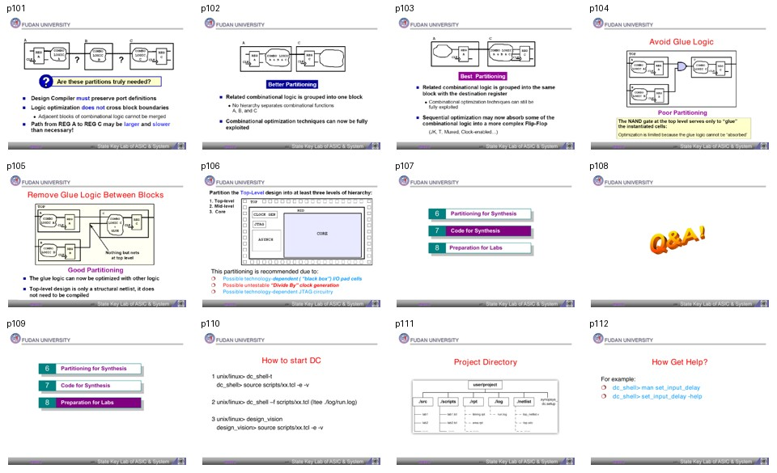

# 批次 6：页 101-112

**主题**：partitioning、glue logic、启动 DC、项目目录、帮助命令  
**缩略图拼板**：

## 中文摘要

最后一段主要讲设计分区和实操入口。好的 partitioning 应该减少跨 block 的组合逻辑，避免 glue logic 卡在模块边界，便于每个 block 独立综合和优化。材料最后给出启动 DC 的方式、推荐项目目录结构和帮助命令。

## 关键结论

- Partitioning 的目标是把复杂设计拆成更小、更容易综合和约束的部分。
- 好的分区通常把相关组合逻辑放在同一个 block，减少边界穿越。
- 避免 glue logic：如果两个 block 之间夹着少量逻辑，这些逻辑可能无法被任一 block 内部充分优化。
- 顶层设计最好偏结构化，只做实例连接，不放太多需要优化的组合逻辑。
- 某些技术相关模块适合独立分区，如 I/O pad、clock generation、JTAG circuitry。
- 启动 DC 可以用交互式 `dc_shell-t`、批处理 `dc_shell -f` 或 GUI `design_vision`。
- 遇到命令细节问题，用 `man <command>` 或 `<command> -help`。

## 分页解读

| 页码 | 内容 | 中文理解 |
|---:|---|---|
| 100-103 | What is partitioning / better partitioning | 分区不是只为了小，而是为了让优化边界合理。 |
| 104-105 | Avoid / Remove Glue Logic | 边界上的小逻辑会阻止综合器跨模块优化。 |
| 106 | Recommended partitioning | I/O pad、clock generation、JTAG 等技术相关逻辑可独立处理。 |
| 107-109 | Agenda / Q&A | 课程收尾和实验准备。 |
| 110 | How to start DC | 交互式、批处理、GUI 三种入口。 |
| 111 | Project Directory | 项目目录应分 src、scripts、rpt、log、netlist 等。 |
| 112 | Help | `man` 和 `-help` 是命令自查入口。 |

## 命令速记

```bash
dc_shell-t
```

```tcl
source scripts/xx.tcl -e -v
```

```bash
dc_shell -f scripts/xx.tcl | tee ./log/run.log
design_vision
```

```tcl
man set_input_delay
set_input_delay -help
```

## 建议项目目录

```text
project/
  src/        # RTL 源码
  scripts/    # DC Tcl 脚本
  rpt/        # report_area/report_timing 等报告
  log/        # dc_shell 执行日志
  netlist/    # mapped.v
  sdc/        # mapped.sdc
  sdf/        # mapped.sdf
```

## 易错点

- 顶层不应堆太多 glue logic，否则 block 内优化无法处理边界逻辑。
- 分区不是越细越好；太细会产生更多边界和约束管理成本。
- 批处理运行应保存 log，否则 timing/constraint 问题追踪困难。

## 我的理解

这一批把综合从“工具命令”拉回“工程组织”。DC 脚本写得再熟，如果 RTL 分区不好、顶层 glue logic 太多，综合也会处处受限。好的综合流程应该同时管理代码结构、约束边界、脚本目录和报告归档。
