# Design Compiler Training Fudan - 逐页读书笔记

本文件按 PDF 原始页码逐页整理。每页均保留单页截图、原文要点、中文解读、我的理解、实操提醒和本页小结；适合在 Obsidian 中按页复习。

# Page 001 - Design Compiler

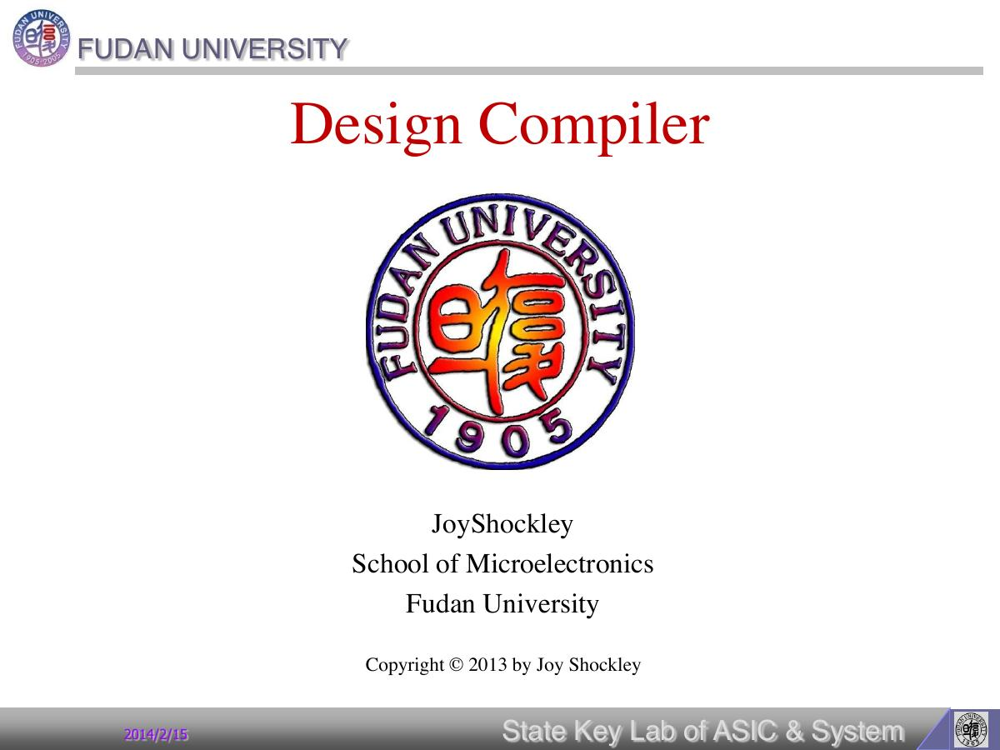

## 页面定位

- **页码**：1/112
- **所属阶段**：综合总览：约束驱动、路径驱动和库映射
- **本页角色**：执行优化和映射
- **阅读问题**：本页要回答：DC 如何从逻辑表达变成目标库门级实现？
- **前后关系**：先建立全局认知：DC 的输出质量取决于库、约束和路径分析，而不是单纯运行 compile。

## 原文要点

> Design Compiler
> JoyShockley
> School of Microelectronics
> Fudan University

## 原文解读

本页讲综合优化与映射。逻辑级优化处理布尔结构，gate-level optimization 在目标库单元中选择实现；structure/flatten 会改变中间层次和表达形式。

本页关联的关键对象/命令：`compile`

## 我的理解

我的理解是：compile 是 DC 把约束转化为电路结构变化的核心步骤。`map_effort` 越高，可能带来更长运行时间和更激进的关键路径重综合。

把它放回完整 DC 流程里看，本页不是孤立知识点，而是在帮助我们更准确地描述“设计、环境、约束、优化结果”中的一个环节。读这一页时，我会优先问：它改变的是 DC 数据库里的哪个对象？它会让 compile 的优化空间变大还是变小？它最终应该在什么报告里被验证？

## 实操提醒

改 compile 选项前先读 timing/area/report_design，确认瓶颈是在逻辑结构、门级映射还是约束本身。

## 本页小结

本页的核心收获：Design Compiler 这一页应被理解为“执行优化和映射”的读书笔记节点；掌握它的标准不是背下标题，而是能说明它如何影响后续约束、优化或 timing 报告。

## 导航

- 上一页：无
- 下一页：[Page 002](pages/page-002.md)

# Page 002 - Basic synthesis flow diagram

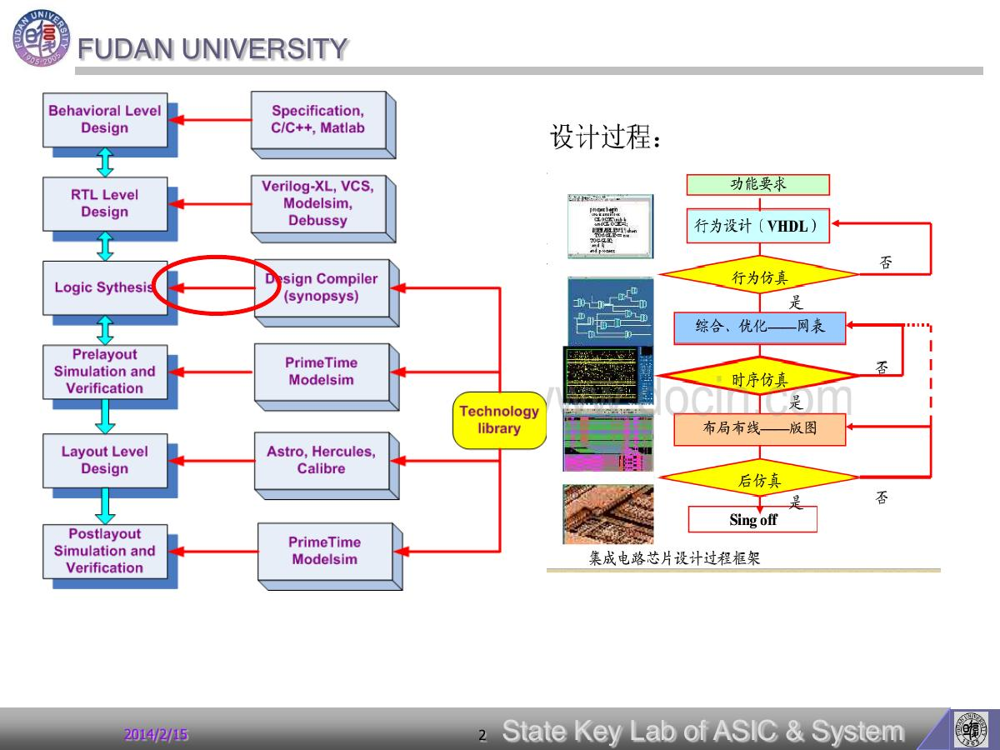

## 页面定位

- **页码**：2/112
- **所属阶段**：综合总览：约束驱动、路径驱动和库映射
- **本页角色**：建立全局框架
- **阅读问题**：本页要回答：Design Compiler 综合的基本工作方式是什么？
- **前后关系**：先建立全局认知：DC 的输出质量取决于库、约束和路径分析，而不是单纯运行 compile。

## 原文要点

> 本页 OCR 可抽取文本为空或很少，解读主要依据页面标题、页码位置和单页图像。

## 原文解读

这页是整套综合流程的总览图。虽然 OCR 没有文字，但它表达的是：RTL/HDL、库、约束进入 DC 后，通过分析、优化和映射生成门级网表与报告。

本页关联的关键对象/命令：本页以概念/图示为主，重点看标题和图中对象关系。

## 我的理解

读这页时要把 DC 看成“约束解释器 + 优化器 + 报告器”：库告诉它有哪些门可用，约束告诉它目标是什么，报告告诉我们目标是否达成。

把它放回完整 DC 流程里看，本页不是孤立知识点，而是在帮助我们更准确地描述“设计、环境、约束、优化结果”中的一个环节。读这一页时，我会优先问：它改变的是 DC 数据库里的哪个对象？它会让 compile 的优化空间变大还是变小？它最终应该在什么报告里被验证？

## 实操提醒

复习时把 `库/约束/路径/报告` 四个词写在页边，后面遇到任何命令都归类到其中之一。

## 本页小结

本页的核心收获：Basic synthesis flow diagram 这一页应被理解为“建立全局框架”的读书笔记节点；掌握它的标准不是背下标题，而是能说明它如何影响后续约束、优化或 timing 报告。

## 导航

- 上一页：[Page 001](pages/page-001.md)
- 下一页：[Page 003](pages/page-003.md)

# Page 003 - Map to lib

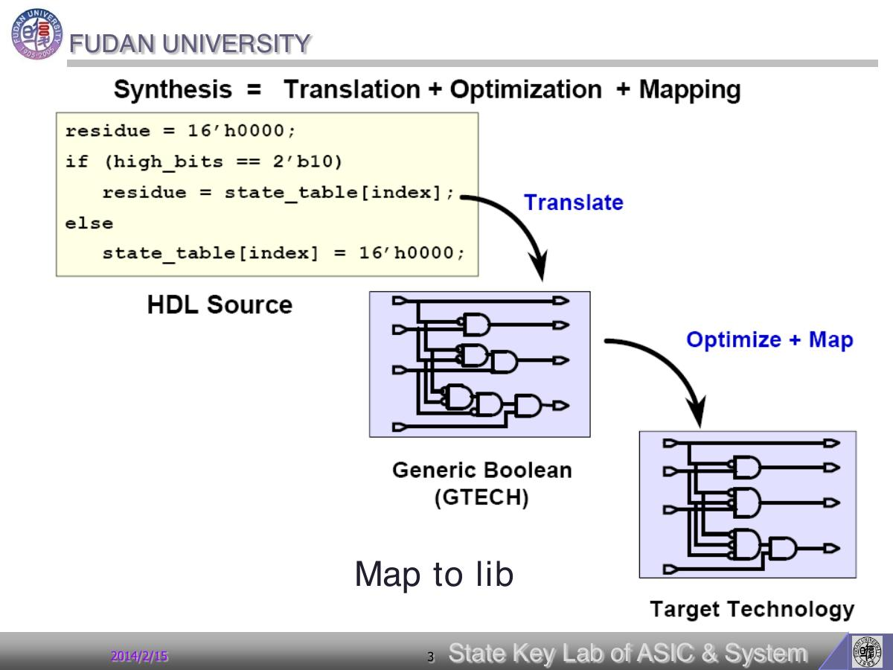

## 页面定位

- **页码**：3/112
- **所属阶段**：综合总览：约束驱动、路径驱动和库映射
- **本页角色**：建立全局框架
- **阅读问题**：本页要回答：Design Compiler 综合的基本工作方式是什么？
- **前后关系**：先建立全局认知：DC 的输出质量取决于库、约束和路径分析，而不是单纯运行 compile。

## 原文要点

> Map to lib

## 原文解读

`Map to lib` 说明综合最终必须落到目标工艺库。RTL 中的抽象逻辑只有映射到 library cell 后，才具备面积、延迟、功耗等物理相关属性。

本页关联的关键对象/命令：本页以概念/图示为主，重点看标题和图中对象关系。

## 我的理解

我的理解是：没有库就没有真实综合结果，只有抽象逻辑变换。库映射决定 DC 能用哪些门来实现逻辑。

把它放回完整 DC 流程里看，本页不是孤立知识点，而是在帮助我们更准确地描述“设计、环境、约束、优化结果”中的一个环节。读这一页时，我会优先问：它改变的是 DC 数据库里的哪个对象？它会让 compile 的优化空间变大还是变小？它最终应该在什么报告里被验证？

## 实操提醒

检查 target_library 是否包含预期的标准单元库。

## 本页小结

本页的核心收获：Map to lib 这一页应被理解为“建立全局框架”的读书笔记节点；掌握它的标准不是背下标题，而是能说明它如何影响后续约束、优化或 timing 报告。

## 导航

- 上一页：[Page 002](pages/page-002.md)
- 下一页：[Page 004](pages/page-004.md)

# Page 004 - Synthesis Is Constraint-Driven

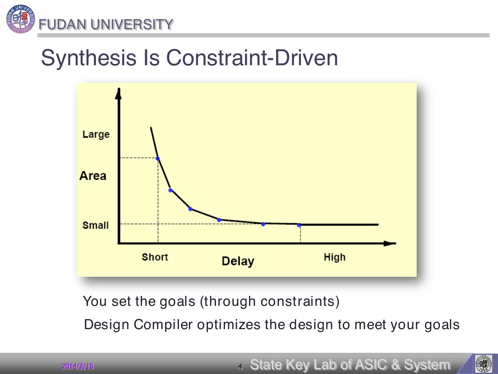

## 页面定位

- **页码**：4/112
- **所属阶段**：综合总览：约束驱动、路径驱动和库映射
- **本页角色**：执行优化和映射
- **阅读问题**：本页要回答：DC 如何从逻辑表达变成目标库门级实现？
- **前后关系**：先建立全局认知：DC 的输出质量取决于库、约束和路径分析，而不是单纯运行 compile。

## 原文要点

> Synthesis Is Constraint-Driven
> You set the goals (through constraints)
> Design Compiler optimizes the design to meet your goals

## 原文解读

本页直接给出综合的约束驱动本质：用户通过 constraints 设置目标，DC 围绕这些目标优化设计。

本页关联的关键对象/命令：`compile`

## 我的理解

我的理解是：DC 不会自动知道“好设计”是什么，设计者必须用约束把性能、面积、规则边界说清楚。

把它放回完整 DC 流程里看，本页不是孤立知识点，而是在帮助我们更准确地描述“设计、环境、约束、优化结果”中的一个环节。读这一页时，我会优先问：它改变的是 DC 数据库里的哪个对象？它会让 compile 的优化空间变大还是变小？它最终应该在什么报告里被验证？

## 实操提醒

约束不清楚时，compile 的结果也没有可评价的标准。

## 本页小结

本页的核心收获：Synthesis Is Constraint-Driven 这一页应被理解为“执行优化和映射”的读书笔记节点；掌握它的标准不是背下标题，而是能说明它如何影响后续约束、优化或 timing 报告。

## 导航

- 上一页：[Page 003](pages/page-003.md)
- 下一页：[Page 005](pages/page-005.md)

# Page 005 - Synthesis Is Path-Based

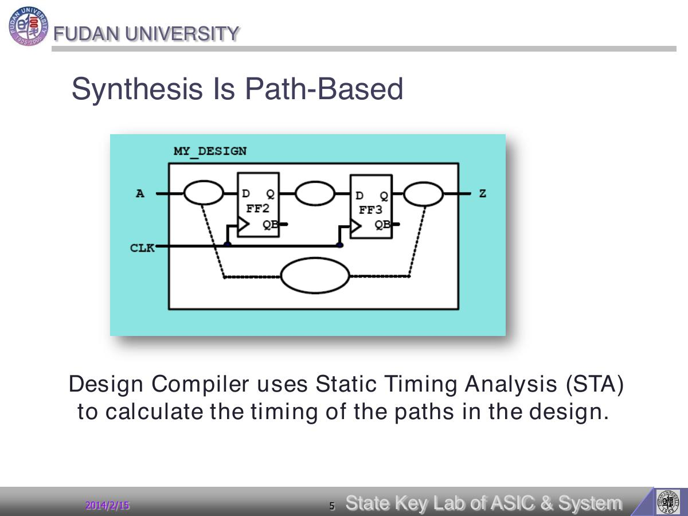

## 页面定位

- **页码**：5/112
- **所属阶段**：综合总览：约束驱动、路径驱动和库映射
- **本页角色**：执行优化和映射
- **阅读问题**：本页要回答：DC 如何从逻辑表达变成目标库门级实现？
- **前后关系**：先建立全局认知：DC 的输出质量取决于库、约束和路径分析，而不是单纯运行 compile。

## 原文要点

> Synthesis Is Path-Based
> Design Compiler uses Static Timing Analysis (STA)
> to calculate the timing of the paths in the design.

## 原文解读

本页强调 path-based。DC 使用 STA 计算路径 timing，并围绕关键路径做优化。

本页关联的关键对象/命令：`compile`

## 我的理解

我的理解是：综合优化不是平均用力，真正决定频率的是关键路径；报告和优化都围绕路径展开。

把它放回完整 DC 流程里看，本页不是孤立知识点，而是在帮助我们更准确地描述“设计、环境、约束、优化结果”中的一个环节。读这一页时，我会优先问：它改变的是 DC 数据库里的哪个对象？它会让 compile 的优化空间变大还是变小？它最终应该在什么报告里被验证？

## 实操提醒

后面读 timing report 时，要回到这一页：路径是 DC 判断性能的基本单位。

## 本页小结

本页的核心收获：Synthesis Is Path-Based 这一页应被理解为“执行优化和映射”的读书笔记节点；掌握它的标准不是背下标题，而是能说明它如何影响后续约束、优化或 timing 报告。

## 导航

- 上一页：[Page 004](pages/page-004.md)
- 下一页：[Page 006](pages/page-006.md)

# Page 006 - Agenda

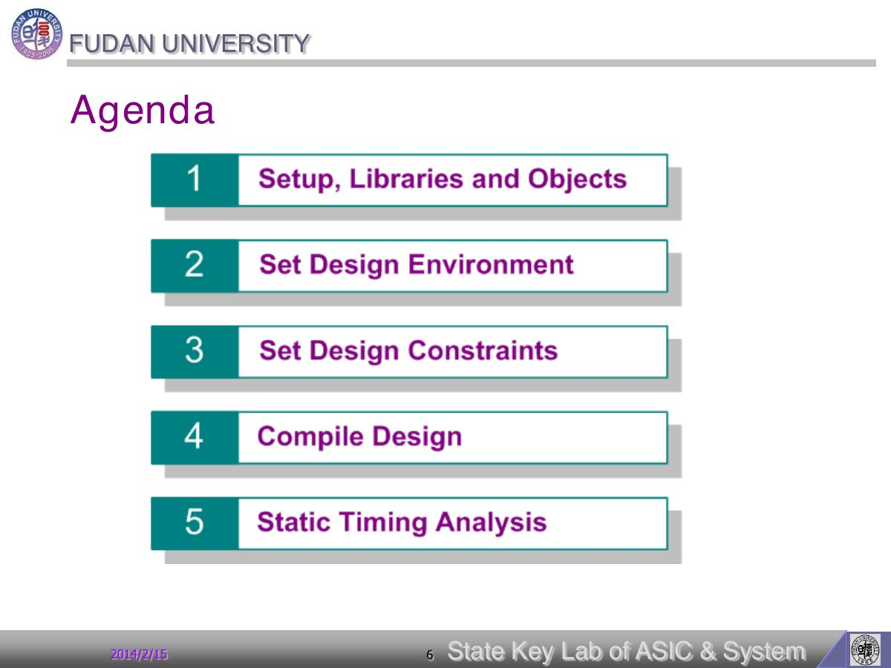

## 页面定位

- **页码**：6/112
- **所属阶段**：课程目录：建立阅读地图
- **本页角色**：章节导航
- **阅读问题**：本页要回答：这一章在整套课程中处于什么位置？
- **前后关系**：目录页用于定位后续知识块，阅读时要把每个章节放回完整综合流程。

## 原文要点

> Agenda

## 原文解读

本页是课程目录或章节过渡。它本身不引入复杂命令，但提供阅读顺序：先基础流程，再环境与约束，再优化与报告。

本页关联的关键对象/命令：本页以概念/图示为主，重点看标题和图中对象关系。

## 我的理解

我的理解是：目录页要当成路线图。DC 学习的难点不是命令数量，而是知道某条命令属于哪个阶段、解决什么问题。

把它放回完整 DC 流程里看，本页不是孤立知识点，而是在帮助我们更准确地描述“设计、环境、约束、优化结果”中的一个环节。读这一页时，我会优先问：它改变的是 DC 数据库里的哪个对象？它会让 compile 的优化空间变大还是变小？它最终应该在什么报告里被验证？

## 实操提醒

复习时按章节建立检查清单，不要按幻灯片顺序机械背命令。

## 本页小结

本页的核心收获：Agenda 这一页应被理解为“章节导航”的读书笔记节点；掌握它的标准不是背下标题，而是能说明它如何影响后续约束、优化或 timing 报告。

## 导航

- 上一页：[Page 005](pages/page-005.md)
- 下一页：[Page 007](pages/page-007.md)

# Page 007 - Agenda

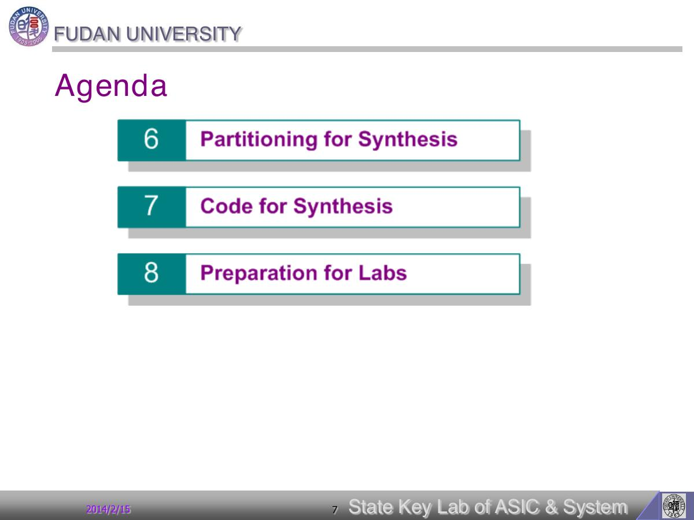

## 页面定位

- **页码**：7/112
- **所属阶段**：课程目录：建立阅读地图
- **本页角色**：章节导航
- **阅读问题**：本页要回答：这一章在整套课程中处于什么位置？
- **前后关系**：目录页用于定位后续知识块，阅读时要把每个章节放回完整综合流程。

## 原文要点

> Agenda

## 原文解读

本页是课程目录或章节过渡。它本身不引入复杂命令，但提供阅读顺序：先基础流程，再环境与约束，再优化与报告。

本页关联的关键对象/命令：本页以概念/图示为主，重点看标题和图中对象关系。

## 我的理解

我的理解是：目录页要当成路线图。DC 学习的难点不是命令数量，而是知道某条命令属于哪个阶段、解决什么问题。

把它放回完整 DC 流程里看，本页不是孤立知识点，而是在帮助我们更准确地描述“设计、环境、约束、优化结果”中的一个环节。读这一页时，我会优先问：它改变的是 DC 数据库里的哪个对象？它会让 compile 的优化空间变大还是变小？它最终应该在什么报告里被验证？

## 实操提醒

复习时按章节建立检查清单，不要按幻灯片顺序机械背命令。

## 本页小结

本页的核心收获：Agenda 这一页应被理解为“章节导航”的读书笔记节点；掌握它的标准不是背下标题，而是能说明它如何影响后续约束、优化或 timing 报告。

## 导航

- 上一页：[Page 006](pages/page-006.md)
- 下一页：[Page 008](pages/page-008.md)

# Page 008 - Agenda transition

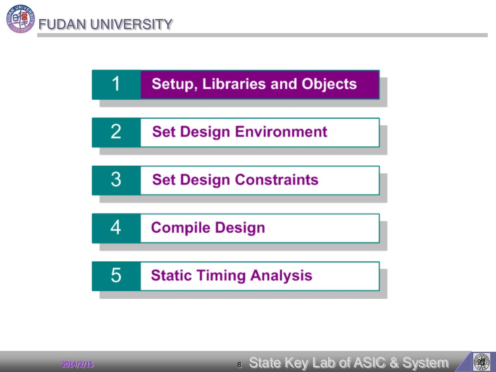

## 页面定位

- **页码**：8/112
- **所属阶段**：课程目录：建立阅读地图
- **本页角色**：章节导航
- **阅读问题**：本页要回答：这一章在整套课程中处于什么位置？
- **前后关系**：目录页用于定位后续知识块，阅读时要把每个章节放回完整综合流程。

## 原文要点

> 本页 OCR 可抽取文本为空或很少，解读主要依据页面标题、页码位置和单页图像。

## 原文解读

这页属于目录/章节过渡，提示课程即将从概念进入库和设计读入。

本页关联的关键对象/命令：本页以概念/图示为主，重点看标题和图中对象关系。

## 我的理解

目录页的价值是建立索引：后续所有命令都可以归入“建库环境、读设计、约束、优化、报告”这几类。

把它放回完整 DC 流程里看，本页不是孤立知识点，而是在帮助我们更准确地描述“设计、环境、约束、优化结果”中的一个环节。读这一页时，我会优先问：它改变的是 DC 数据库里的哪个对象？它会让 compile 的优化空间变大还是变小？它最终应该在什么报告里被验证？

## 实操提醒

复习时按章节建立检查清单，不要按幻灯片顺序机械背命令。

## 本页小结

本页的核心收获：Agenda transition 这一页应被理解为“章节导航”的读书笔记节点；掌握它的标准不是背下标题，而是能说明它如何影响后续约束、优化或 timing 报告。

## 导航

- 上一页：[Page 007](pages/page-007.md)
- 下一页：[Page 009](pages/page-009.md)

# Page 009 - Agenda transition

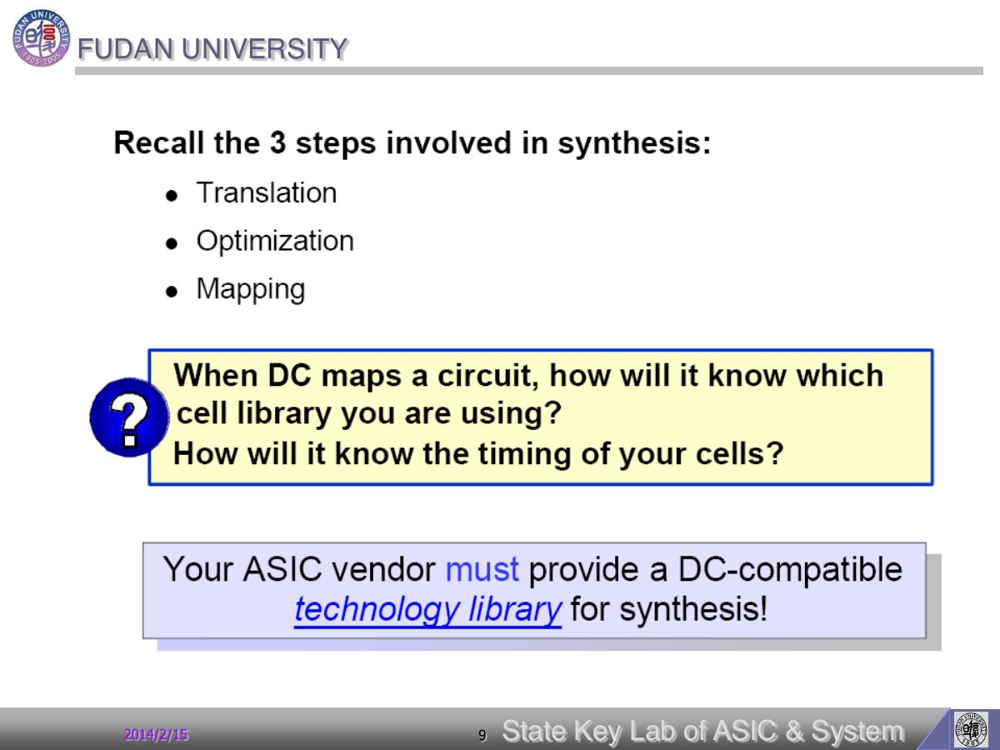

## 页面定位

- **页码**：9/112
- **所属阶段**：课程目录：建立阅读地图
- **本页角色**：章节导航
- **阅读问题**：本页要回答：这一章在整套课程中处于什么位置？
- **前后关系**：目录页用于定位后续知识块，阅读时要把每个章节放回完整综合流程。

## 原文要点

> 本页 OCR 可抽取文本为空或很少，解读主要依据页面标题、页码位置和单页图像。

## 原文解读

这页继续承担章节切换作用，帮助把前面的综合概念和后面的环境约束连接起来。

本页关联的关键对象/命令：本页以概念/图示为主，重点看标题和图中对象关系。

## 我的理解

学习 DC 时最容易散成命令清单，目录页提醒我们每条命令都服务于某个流程阶段。

把它放回完整 DC 流程里看，本页不是孤立知识点，而是在帮助我们更准确地描述“设计、环境、约束、优化结果”中的一个环节。读这一页时，我会优先问：它改变的是 DC 数据库里的哪个对象？它会让 compile 的优化空间变大还是变小？它最终应该在什么报告里被验证？

## 实操提醒

复习时按章节建立检查清单，不要按幻灯片顺序机械背命令。

## 本页小结

本页的核心收获：Agenda transition 这一页应被理解为“章节导航”的读书笔记节点；掌握它的标准不是背下标题，而是能说明它如何影响后续约束、优化或 timing 报告。

## 导航

- 上一页：[Page 008](pages/page-008.md)
- 下一页：[Page 010](pages/page-010.md)

# Page 010 - Agenda transition

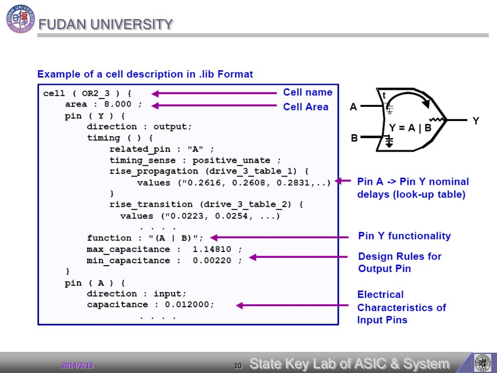

## 页面定位

- **页码**：10/112
- **所属阶段**：课程目录：建立阅读地图
- **本页角色**：章节导航
- **阅读问题**：本页要回答：这一章在整套课程中处于什么位置？
- **前后关系**：目录页用于定位后续知识块，阅读时要把每个章节放回完整综合流程。

## 原文要点

> 本页 OCR 可抽取文本为空或很少，解读主要依据页面标题、页码位置和单页图像。

## 原文解读

这页是进入 Basic Design Flow 前的过渡页，重点是提醒读者接下来要按流程而不是按孤立命令学习。

本页关联的关键对象/命令：本页以概念/图示为主，重点看标题和图中对象关系。

## 我的理解

后续读书笔记会沿着这个顺序：先让设计可被 DC 解析，再定义环境和约束，再优化并读报告。

把它放回完整 DC 流程里看，本页不是孤立知识点，而是在帮助我们更准确地描述“设计、环境、约束、优化结果”中的一个环节。读这一页时，我会优先问：它改变的是 DC 数据库里的哪个对象？它会让 compile 的优化空间变大还是变小？它最终应该在什么报告里被验证？

## 实操提醒

复习时按章节建立检查清单，不要按幻灯片顺序机械背命令。

## 本页小结

本页的核心收获：Agenda transition 这一页应被理解为“章节导航”的读书笔记节点；掌握它的标准不是背下标题，而是能说明它如何影响后续约束、优化或 timing 报告。

## 导航

- 上一页：[Page 009](pages/page-009.md)
- 下一页：[Page 011](pages/page-011.md)

# Page 011 - Basic Design Flow

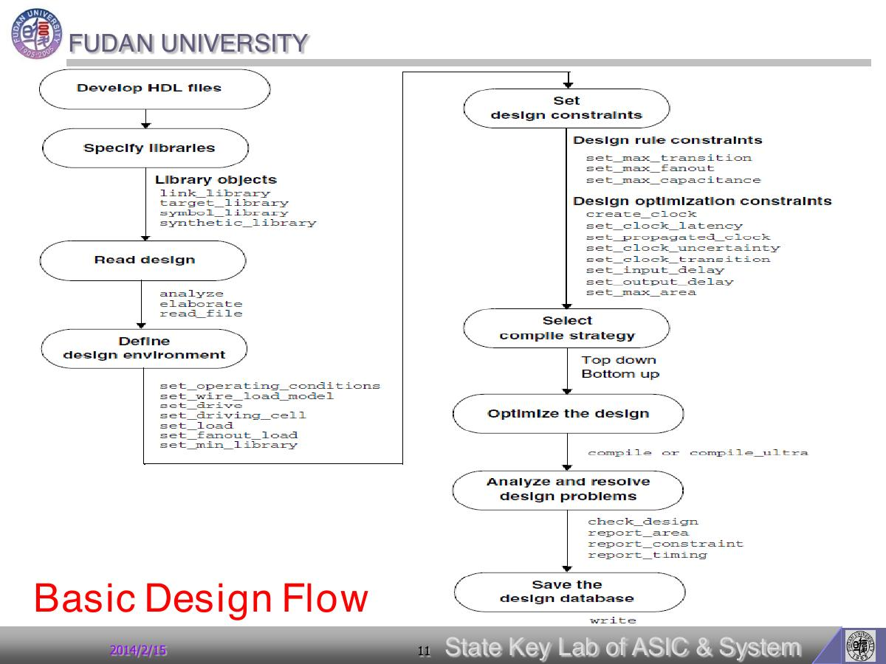

## 页面定位

- **页码**：11/112
- **所属阶段**：前端准备：库、读入设计和 DC 对象模型
- **本页角色**：流程节点说明
- **阅读问题**：本页要回答：这个概念/命令在流程中解决什么问题？
- **前后关系**：这部分回答“DC 如何认识设计”：库在哪里、RTL 如何读入、对象如何被引用。

## 原文要点

> Basic Design Flow

## 原文解读

`Basic Design Flow` 是后续章节的骨架：设置库、读入设计、定义环境和约束、compile、最后生成报告和网表。

本页关联的关键对象/命令：本页以概念/图示为主，重点看标题和图中对象关系。

## 我的理解

我的理解是：这页是整个 PDF 的目录压缩版；每一步少做或顺序错，都会影响最终结果。

把它放回完整 DC 流程里看，本页不是孤立知识点，而是在帮助我们更准确地描述“设计、环境、约束、优化结果”中的一个环节。读这一页时，我会优先问：它改变的是 DC 数据库里的哪个对象？它会让 compile 的优化空间变大还是变小？它最终应该在什么报告里被验证？

## 实操提醒

实际项目里可以把这页变成脚本模板的一级标题。

## 本页小结

本页的核心收获：Basic Design Flow 这一页应被理解为“流程节点说明”的读书笔记节点；掌握它的标准不是背下标题，而是能说明它如何影响后续约束、优化或 timing 报告。

## 导航

- 上一页：[Page 010](pages/page-010.md)
- 下一页：[Page 012](pages/page-012.md)

# Page 012 - Library Specification

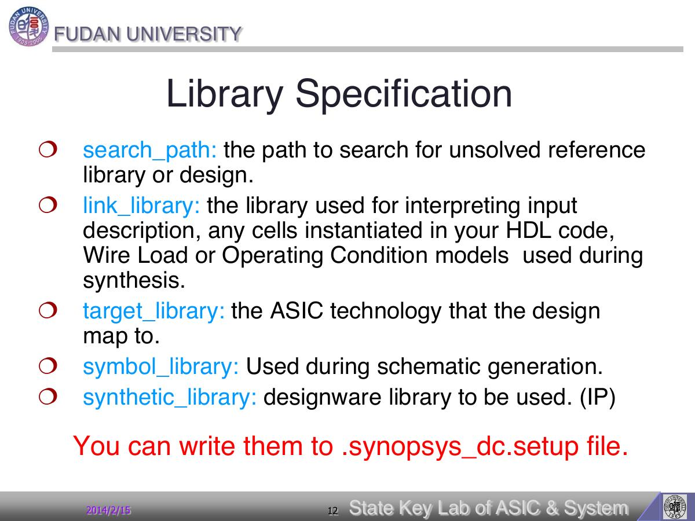

## 页面定位

- **页码**：12/112
- **所属阶段**：前端准备：库、读入设计和 DC 对象模型
- **本页角色**：配置综合库
- **阅读问题**：本页要回答：DC 到哪里找库，最终映射到哪个目标库？
- **前后关系**：这部分回答“DC 如何认识设计”：库在哪里、RTL 如何读入、对象如何被引用。

## 原文要点

> Library Specification
> - search_path: the path to search for unsolved reference
> library or design.
> - link_library: the library used for interpreting input
> description, any cells instantiated in your HDL code,
> Wire Load or Operating Condition models used during
> synthesis.
> - target_library: the ASIC technology that the design
> map to.
> - symbol_library: Used during schematic generation.
> - synthetic_library: designware library to be used. (IP)
> You can write them to .synopsys_dc.setup file.

## 原文解读

本页讲库相关设置。`search_path` 决定 DC 到哪里找文件，`link_library` 用来解析已有设计和引用，`target_library` 决定最终映射到哪些工艺单元。

本页关联的关键对象/命令：`search_path`, `link_library`, `target_library`

## 我的理解

我的理解是：库配置不是前置杂项，而是综合的“词典”和“零件仓库”。库配错时，后面 timing 再怎么调都可能是在错误模型上优化。

把它放回完整 DC 流程里看，本页不是孤立知识点，而是在帮助我们更准确地描述“设计、环境、约束、优化结果”中的一个环节。读这一页时，我会优先问：它改变的是 DC 数据库里的哪个对象？它会让 compile 的优化空间变大还是变小？它最终应该在什么报告里被验证？

## 实操提醒

检查脚本时先看 `.synopsys_dc.setup`、`target_library`、`link_library`，确认路径、库名和工艺角一致。

## 本页小结

本页的核心收获：Library Specification 这一页应被理解为“配置综合库”的读书笔记节点；掌握它的标准不是背下标题，而是能说明它如何影响后续约束、优化或 timing 报告。

## 导航

- 上一页：[Page 011](pages/page-011.md)
- 下一页：[Page 013](pages/page-013.md)

# Page 013 - .synopsys_dc.setup example

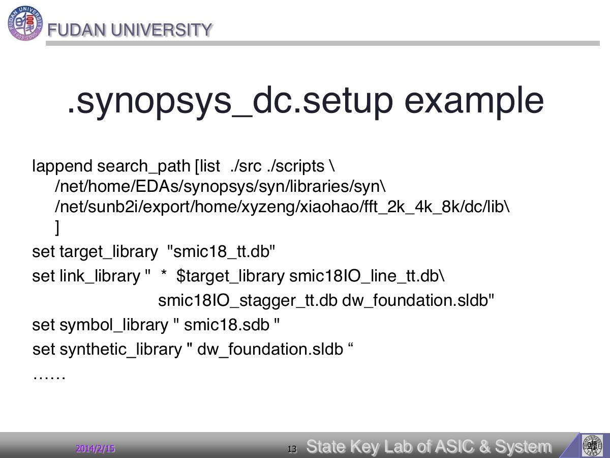

## 页面定位

- **页码**：13/112
- **所属阶段**：前端准备：库、读入设计和 DC 对象模型
- **本页角色**：配置综合库
- **阅读问题**：本页要回答：DC 到哪里找库，最终映射到哪个目标库？
- **前后关系**：这部分回答“DC 如何认识设计”：库在哪里、RTL 如何读入、对象如何被引用。

## 原文要点

> .synopsys_dc.setup example
> lappend search_path [list ./src ./scripts \
> /net/home/EDAs/synopsys/syn/libraries/syn\
> /net/sunb2i/export/home/xyzeng/xiaohao/fft_2k_4k_8k/dc/lib\
> ]
> set target_library "smic18_tt.db"
> set link_library " * $target_library smic18IO_line_tt.db\
> smic18IO_stagger_tt.db dw_foundation.sldb"
> set symbol_library " smic18.sdb "
> set synthetic_library " dw_foundation.sldb “
> ……

## 原文解读

本页讲库相关设置。`search_path` 决定 DC 到哪里找文件，`link_library` 用来解析已有设计和引用，`target_library` 决定最终映射到哪些工艺单元。

本页关联的关键对象/命令：`search_path`, `link_library`, `target_library`

## 我的理解

我的理解是：库配置不是前置杂项，而是综合的“词典”和“零件仓库”。库配错时，后面 timing 再怎么调都可能是在错误模型上优化。

把它放回完整 DC 流程里看，本页不是孤立知识点，而是在帮助我们更准确地描述“设计、环境、约束、优化结果”中的一个环节。读这一页时，我会优先问：它改变的是 DC 数据库里的哪个对象？它会让 compile 的优化空间变大还是变小？它最终应该在什么报告里被验证？

## 实操提醒

检查脚本时先看 `.synopsys_dc.setup`、`target_library`、`link_library`，确认路径、库名和工艺角一致。

## 本页小结

本页的核心收获：.synopsys_dc.setup example 这一页应被理解为“配置综合库”的读书笔记节点；掌握它的标准不是背下标题，而是能说明它如何影响后续约束、优化或 timing 报告。

## 导航

- 上一页：[Page 012](pages/page-012.md)
- 下一页：[Page 014](pages/page-014.md)

# Page 014 - - To specify technology libraries, you must specify the

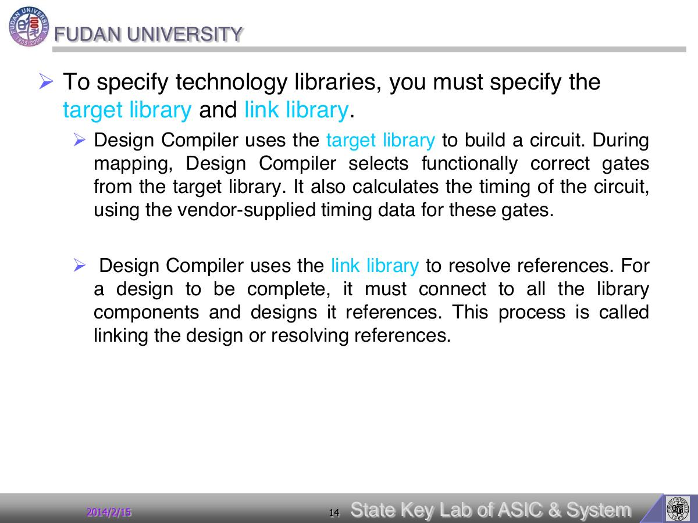

## 页面定位

- **页码**：14/112
- **所属阶段**：前端准备：库、读入设计和 DC 对象模型
- **本页角色**：配置综合库
- **阅读问题**：本页要回答：DC 到哪里找库，最终映射到哪个目标库？
- **前后关系**：这部分回答“DC 如何认识设计”：库在哪里、RTL 如何读入、对象如何被引用。

## 原文要点

> - To specify technology libraries, you must specify the
> target library and link library.
> - Design Compiler uses the target library to build a circuit. During
> mapping, Design Compiler selects functionally correct gates
> from the target library. It also calculates the timing of the circuit,
> using the vendor-supplied timing data for these gates.
> - Design Compiler uses the link library to resolve references. For
> a design to be complete, it must connect to all the library
> components and designs it references. This process is called
> linking the design or resolving references.

## 原文解读

本页讲库相关设置。`search_path` 决定 DC 到哪里找文件，`link_library` 用来解析已有设计和引用，`target_library` 决定最终映射到哪些工艺单元。

本页关联的关键对象/命令：`compile`

## 我的理解

我的理解是：库配置不是前置杂项，而是综合的“词典”和“零件仓库”。库配错时，后面 timing 再怎么调都可能是在错误模型上优化。

把它放回完整 DC 流程里看，本页不是孤立知识点，而是在帮助我们更准确地描述“设计、环境、约束、优化结果”中的一个环节。读这一页时，我会优先问：它改变的是 DC 数据库里的哪个对象？它会让 compile 的优化空间变大还是变小？它最终应该在什么报告里被验证？

## 实操提醒

检查脚本时先看 `.synopsys_dc.setup`、`target_library`、`link_library`，确认路径、库名和工艺角一致。

## 本页小结

本页的核心收获：- To specify technology libraries, you must specify the 这一页应被理解为“配置综合库”的读书笔记节点；掌握它的标准不是背下标题，而是能说明它如何影响后续约束、优化或 timing 报告。

## 导航

- 上一页：[Page 013](pages/page-013.md)
- 下一页：[Page 015](pages/page-015.md)

# Page 015 - Read Design

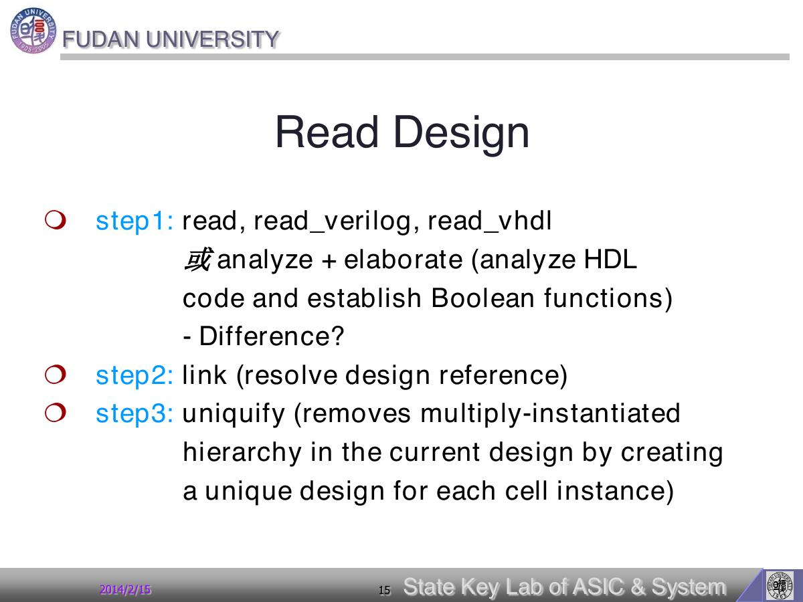

## 页面定位

- **页码**：15/112
- **所属阶段**：前端准备：库、读入设计和 DC 对象模型
- **本页角色**：读入并建立设计层次
- **阅读问题**：本页要回答：RTL 如何进入 DC 数据库，设计层次如何建立？
- **前后关系**：这部分回答“DC 如何认识设计”：库在哪里、RTL 如何读入、对象如何被引用。

## 原文要点

> Read Design
>  step1: read, read_verilog, read_vhdl
> 或 analyze + elaborate (analyze HDL
> code and establish Boolean functions)
> - Difference?
> - step2: link (resolve design reference)
> - step3: uniquify (removes multiply-instantiated
> hierarchy in the current design by creating
> a unique design for each cell instance)

## 原文解读

本页讲 DC 如何读入设计。`read/read_verilog/read_vhdl` 是直接读入文件；`analyze + elaborate` 更强调先分析 HDL，再建立层次和布尔函数。

本页关联的关键对象/命令：`read_verilog`, `analyze`, `elaborate`

## 我的理解

我的理解是：读设计不是“打开文件”，而是把 RTL 转换为 DC 内部 design database。复杂工程中，能否清楚地 current_design、link 和定位 instance，取决于这个阶段是否干净。

把它放回完整 DC 流程里看，本页不是孤立知识点，而是在帮助我们更准确地描述“设计、环境、约束、优化结果”中的一个环节。读这一页时，我会优先问：它改变的是 DC 数据库里的哪个对象？它会让 compile 的优化空间变大还是变小？它最终应该在什么报告里被验证？

## 实操提醒

读入后应检查 `current_design`、unresolved references 和 hierarchy，避免带着未解析模块进入 compile。

## 本页小结

本页的核心收获：Read Design 这一页应被理解为“读入并建立设计层次”的读书笔记节点；掌握它的标准不是背下标题，而是能说明它如何影响后续约束、优化或 timing 报告。

## 导航

- 上一页：[Page 014](pages/page-014.md)
- 下一页：[Page 016](pages/page-016.md)

# Page 016 - Read design visual note

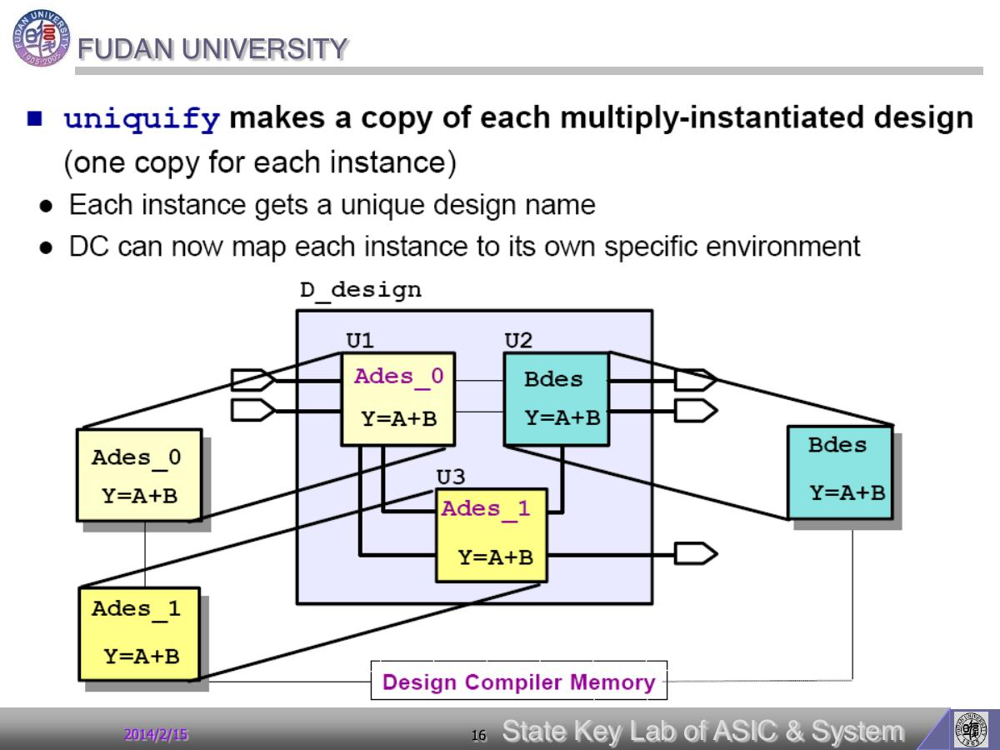

## 页面定位

- **页码**：16/112
- **所属阶段**：前端准备：库、读入设计和 DC 对象模型
- **本页角色**：读入并建立设计层次
- **阅读问题**：本页要回答：RTL 如何进入 DC 数据库，设计层次如何建立？
- **前后关系**：这部分回答“DC 如何认识设计”：库在哪里、RTL 如何读入、对象如何被引用。

## 原文要点

> 本页 OCR 可抽取文本为空或很少，解读主要依据页面标题、页码位置和单页图像。

## 原文解读

这页是 Read Design 部分的图示/留白页，作用是把 read/read_verilog/read_vhdl 与 analyze+elaborate 的两种路径分开。

本页关联的关键对象/命令：本页以概念/图示为主，重点看标题和图中对象关系。

## 我的理解

我的理解是：read 类命令偏直接导入，analyze+elaborate 更像先编译 HDL 再建立设计层次，复杂工程更适合后者。

把它放回完整 DC 流程里看，本页不是孤立知识点，而是在帮助我们更准确地描述“设计、环境、约束、优化结果”中的一个环节。读这一页时，我会优先问：它改变的是 DC 数据库里的哪个对象？它会让 compile 的优化空间变大还是变小？它最终应该在什么报告里被验证？

## 实操提醒

读入后应检查 `current_design`、unresolved references 和 hierarchy，避免带着未解析模块进入 compile。

## 本页小结

本页的核心收获：Read design visual note 这一页应被理解为“读入并建立设计层次”的读书笔记节点；掌握它的标准不是背下标题，而是能说明它如何影响后续约束、优化或 timing 报告。

## 导航

- 上一页：[Page 015](pages/page-015.md)
- 下一页：[Page 017](pages/page-017.md)

# Page 017 - Example

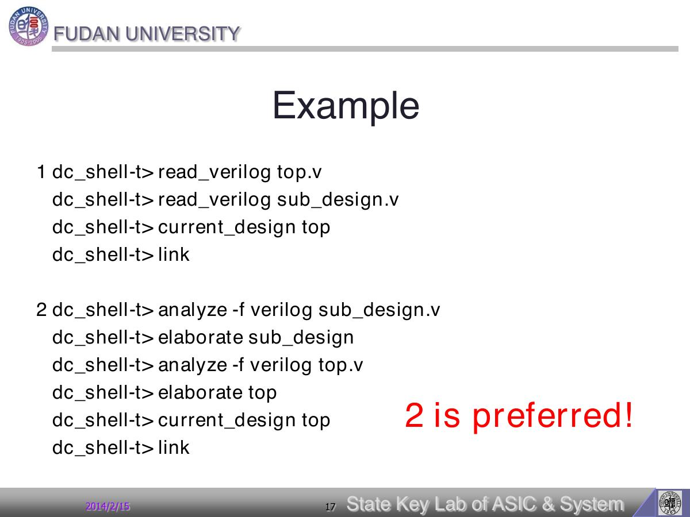

## 页面定位

- **页码**：17/112
- **所属阶段**：前端准备：库、读入设计和 DC 对象模型
- **本页角色**：读入并建立设计层次
- **阅读问题**：本页要回答：RTL 如何进入 DC 数据库，设计层次如何建立？
- **前后关系**：这部分回答“DC 如何认识设计”：库在哪里、RTL 如何读入、对象如何被引用。

## 原文要点

> Example
> 1 dc_shell-t> read_verilog top.v
> dc_shell-t> read_verilog sub_design.v
> dc_shell-t> current_design top
> dc_shell-t> link
> 2 dc_shell-t> analyze -f verilog sub_design.v
> dc_shell-t> elaborate sub_design
> dc_shell-t> analyze -f verilog top.v
> dc_shell-t> elaborate top
> dc_shell-t> current_design top
> dc_shell-t> link
> 2 is preferred!

## 原文解读

本页讲 DC 如何读入设计。`read/read_verilog/read_vhdl` 是直接读入文件；`analyze + elaborate` 更强调先分析 HDL，再建立层次和布尔函数。

本页关联的关键对象/命令：`read_verilog`, `analyze`, `elaborate`, `dc_shell`

## 我的理解

我的理解是：读设计不是“打开文件”，而是把 RTL 转换为 DC 内部 design database。复杂工程中，能否清楚地 current_design、link 和定位 instance，取决于这个阶段是否干净。

把它放回完整 DC 流程里看，本页不是孤立知识点，而是在帮助我们更准确地描述“设计、环境、约束、优化结果”中的一个环节。读这一页时，我会优先问：它改变的是 DC 数据库里的哪个对象？它会让 compile 的优化空间变大还是变小？它最终应该在什么报告里被验证？

## 实操提醒

读入后应检查 `current_design`、unresolved references 和 hierarchy，避免带着未解析模块进入 compile。

## 本页小结

本页的核心收获：Example 这一页应被理解为“读入并建立设计层次”的读书笔记节点；掌握它的标准不是背下标题，而是能说明它如何影响后续约束、优化或 timing 报告。

## 导航

- 上一页：[Page 016](pages/page-016.md)
- 下一页：[Page 018](pages/page-018.md)

# Page 018 - Design Objects In Synthesis

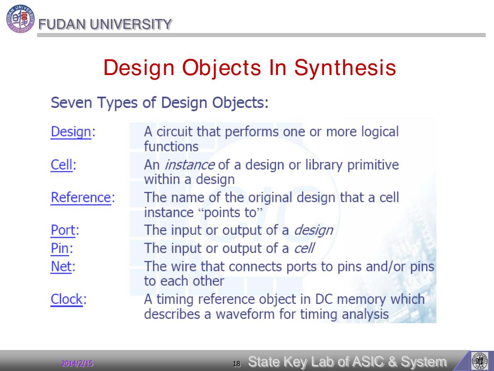

## 页面定位

- **页码**：18/112
- **所属阶段**：前端准备：库、读入设计和 DC 对象模型
- **本页角色**：理解 DC 对象模型
- **阅读问题**：本页要回答：DC 命令操作的对象到底是什么？
- **前后关系**：这部分回答“DC 如何认识设计”：库在哪里、RTL 如何读入、对象如何被引用。

## 原文要点

> Design Objects In Synthesis

## 原文解读

本页讲 DC 中的设计对象。Verilog 里的 module、port、net、cell 到 DC 里会变成可查询、可设置属性的对象。

本页关联的关键对象/命令：本页以概念/图示为主，重点看标题和图中对象关系。

## 我的理解

我的理解是：DC 命令的难点不在命令名，而在对象选择。`get_ports`、`get_pins`、`get_cells`、`get_designs` 选错，约束就会落到错误对象上。

把它放回完整 DC 流程里看，本页不是孤立知识点，而是在帮助我们更准确地描述“设计、环境、约束、优化结果”中的一个环节。读这一页时，我会优先问：它改变的是 DC 数据库里的哪个对象？它会让 compile 的优化空间变大还是变小？它最终应该在什么报告里被验证？

## 实操提醒

写脚本时每个约束后面都要能回答：这个命令作用于 design、port、pin、net、clock 还是 cell？

## 本页小结

本页的核心收获：Design Objects In Synthesis 这一页应被理解为“理解 DC 对象模型”的读书笔记节点；掌握它的标准不是背下标题，而是能说明它如何影响后续约束、优化或 timing 报告。

## 导航

- 上一页：[Page 017](pages/page-017.md)
- 下一页：[Page 019](pages/page-019.md)

# Page 019 - Design Objects: Verilog Perspective

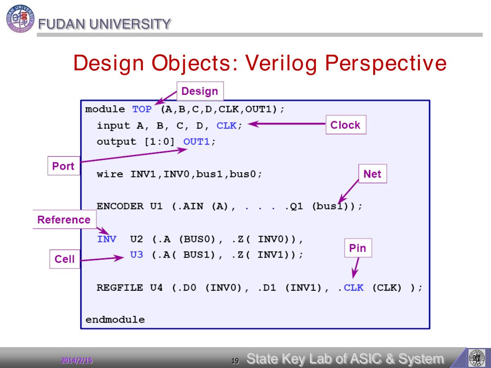

## 页面定位

- **页码**：19/112
- **所属阶段**：前端准备：库、读入设计和 DC 对象模型
- **本页角色**：理解 DC 对象模型
- **阅读问题**：本页要回答：DC 命令操作的对象到底是什么？
- **前后关系**：这部分回答“DC 如何认识设计”：库在哪里、RTL 如何读入、对象如何被引用。

## 原文要点

> Design Objects: Verilog Perspective

## 原文解读

本页讲 DC 中的设计对象。Verilog 里的 module、port、net、cell 到 DC 里会变成可查询、可设置属性的对象。

本页关联的关键对象/命令：本页以概念/图示为主，重点看标题和图中对象关系。

## 我的理解

我的理解是：DC 命令的难点不在命令名，而在对象选择。`get_ports`、`get_pins`、`get_cells`、`get_designs` 选错，约束就会落到错误对象上。

把它放回完整 DC 流程里看，本页不是孤立知识点，而是在帮助我们更准确地描述“设计、环境、约束、优化结果”中的一个环节。读这一页时，我会优先问：它改变的是 DC 数据库里的哪个对象？它会让 compile 的优化空间变大还是变小？它最终应该在什么报告里被验证？

## 实操提醒

写脚本时每个约束后面都要能回答：这个命令作用于 design、port、pin、net、clock 还是 cell？

## 本页小结

本页的核心收获：Design Objects: Verilog Perspective 这一页应被理解为“理解 DC 对象模型”的读书笔记节点；掌握它的标准不是背下标题，而是能说明它如何影响后续约束、优化或 timing 报告。

## 导航

- 上一页：[Page 018](pages/page-018.md)
- 下一页：[Page 020](pages/page-020.md)

# Page 020 - Design Objects: Schematic Perspective

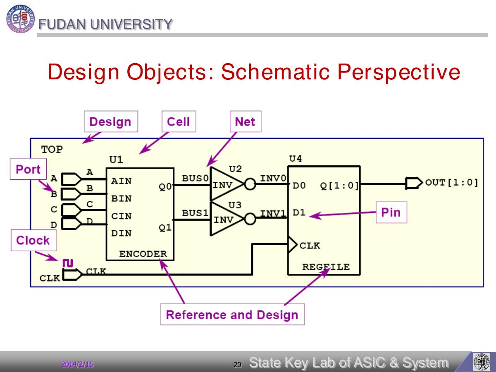

## 页面定位

- **页码**：20/112
- **所属阶段**：前端准备：库、读入设计和 DC 对象模型
- **本页角色**：理解 DC 对象模型
- **阅读问题**：本页要回答：DC 命令操作的对象到底是什么？
- **前后关系**：这部分回答“DC 如何认识设计”：库在哪里、RTL 如何读入、对象如何被引用。

## 原文要点

> Design Objects: Schematic Perspective

## 原文解读

本页讲 DC 中的设计对象。Verilog 里的 module、port、net、cell 到 DC 里会变成可查询、可设置属性的对象。

本页关联的关键对象/命令：本页以概念/图示为主，重点看标题和图中对象关系。

## 我的理解

我的理解是：DC 命令的难点不在命令名，而在对象选择。`get_ports`、`get_pins`、`get_cells`、`get_designs` 选错，约束就会落到错误对象上。

把它放回完整 DC 流程里看，本页不是孤立知识点，而是在帮助我们更准确地描述“设计、环境、约束、优化结果”中的一个环节。读这一页时，我会优先问：它改变的是 DC 数据库里的哪个对象？它会让 compile 的优化空间变大还是变小？它最终应该在什么报告里被验证？

## 实操提醒

写脚本时每个约束后面都要能回答：这个命令作用于 design、port、pin、net、clock 还是 cell？

## 本页小结

本页的核心收获：Design Objects: Schematic Perspective 这一页应被理解为“理解 DC 对象模型”的读书笔记节点；掌握它的标准不是背下标题，而是能说明它如何影响后续约束、优化或 timing 报告。

## 导航

- 上一页：[Page 019](pages/page-019.md)
- 下一页：[Page 021](pages/page-021.md)

# Page 021 - Unit in Standard Library

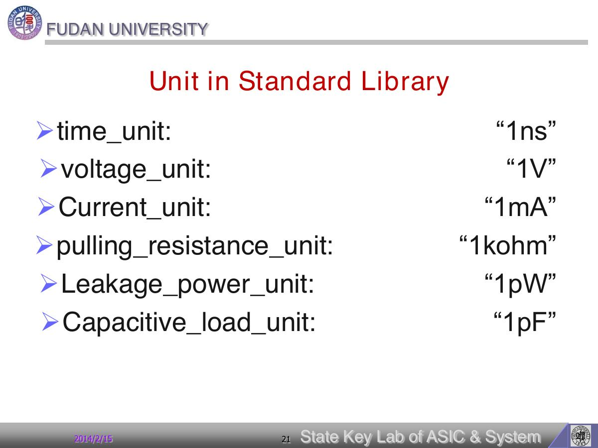

## 页面定位

- **页码**：21/112
- **所属阶段**：前端准备：库、读入设计和 DC 对象模型
- **本页角色**：确认库单位
- **阅读问题**：本页要回答：标准库中的时间、电压、电流、负载单位如何影响约束数值？
- **前后关系**：这部分回答“DC 如何认识设计”：库在哪里、RTL 如何读入、对象如何被引用。

## 原文要点

> Unit in Standard Library
> -time_unit: “1ns”
> -voltage_unit: “1V”
> -Current_unit: “1mA”
> -pulling_resistance_unit: “1kohm”
> -Leakage_power_unit: “1pW”
> -Capacitive_load_unit: “1pF”

## 原文解读

本页列出标准库中的基本单位：time、voltage、current、pulling resistance、leakage power、capacitive load。DC 后续所有 delay、load、drive、power 数值都要按这些库单位解释。

本页关联的关键对象/命令：本页以概念/图示为主，重点看标题和图中对象关系。

## 我的理解

我的理解是：单位是阅读约束和报告的底层语境。`set_load 2`、`create_clock -period 10` 这类数值只有放到库单位里才有真实含义。

把它放回完整 DC 流程里看，本页不是孤立知识点，而是在帮助我们更准确地描述“设计、环境、约束、优化结果”中的一个环节。读这一页时，我会优先问：它改变的是 DC 数据库里的哪个对象？它会让 compile 的优化空间变大还是变小？它最终应该在什么报告里被验证？

## 实操提醒

导入新工艺库后先确认 library unit，再写 clock period、input/output delay、set_load 和 set_drive。

## 本页小结

本页的核心收获：Unit in Standard Library 这一页应被理解为“确认库单位”的读书笔记节点；掌握它的标准不是背下标题，而是能说明它如何影响后续约束、优化或 timing 报告。

## 导航

- 上一页：[Page 020](pages/page-020.md)
- 下一页：[Page 022](pages/page-022.md)

# Page 022 - Library units visual note

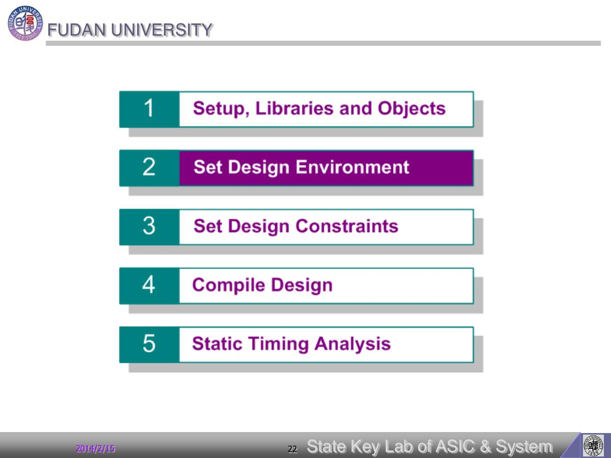

## 页面定位

- **页码**：22/112
- **所属阶段**：前端准备：库、读入设计和 DC 对象模型
- **本页角色**：确认库单位
- **阅读问题**：本页要回答：标准库单位和后续 Design Environment 有什么关系？
- **前后关系**：这部分回答“DC 如何认识设计”：库在哪里、RTL 如何读入、对象如何被引用。

## 原文要点

> 本页 OCR 可抽取文本为空或很少，解读主要依据页面标题、页码位置和单页图像。

## 原文解读

这页是标准库单位之后的过渡页。前一页讲 time/voltage/current 等单位，后一页进入 Design Environment，意味着后续驱动、负载和线延迟都要沿用库里的单位体系。

本页关联的关键对象/命令：本页以概念/图示为主，重点看标题和图中对象关系。

## 我的理解

我的理解是：单位不是装饰信息；如果库单位和约束数值理解错，时序、负载、面积数字都会被误读。

把它放回完整 DC 流程里看，本页不是孤立知识点，而是在帮助我们更准确地描述“设计、环境、约束、优化结果”中的一个环节。读这一页时，我会优先问：它改变的是 DC 数据库里的哪个对象？它会让 compile 的优化空间变大还是变小？它最终应该在什么报告里被验证？

## 实操提醒

写环境约束前，把库单位和脚本中使用的数值单位对齐，避免把 pF、kohm、ns 等假设混在一起。

## 本页小结

本页的核心收获：Library units visual note 这一页应被理解为“确认库单位”的读书笔记节点；掌握它的标准不是背下标题，而是能说明它如何影响后续约束、优化或 timing 报告。

## 导航

- 上一页：[Page 021](pages/page-021.md)
- 下一页：[Page 023](pages/page-023.md)

# Page 023 - 2. Define Design Environment

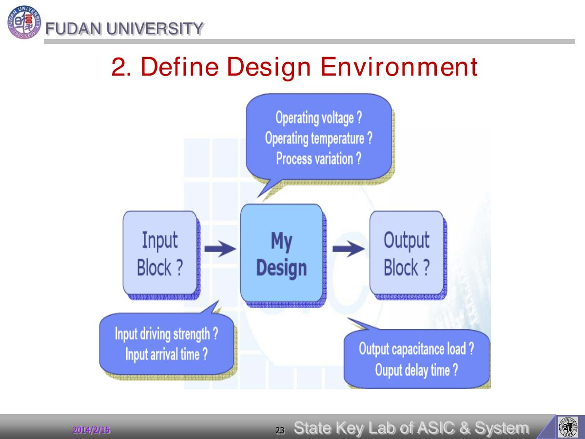

## 页面定位

- **页码**：23/112
- **所属阶段**：设计环境建模：工艺、负载、扇出和线负载
- **本页角色**：流程节点说明
- **阅读问题**：本页要回答：这个概念/命令在流程中解决什么问题？
- **前后关系**：这部分回答“模块外部世界是什么样”：输入驱动、输出负载、扇出和互连估计都会影响优化。

## 原文要点

> 2. Define Design Environment

## 原文解读

本页承接前后章节，提供一个具体概念、命令或图示。阅读时要把标题、对象、命令作用和后续报告联系起来。

本页关联的关键对象/命令：本页以概念/图示为主，重点看标题和图中对象关系。

## 我的理解

我的理解是：这页虽然信息量不一定大，但它仍然是流程中的一个节点；跳过会让后面命令缺少上下文。

把它放回完整 DC 流程里看，本页不是孤立知识点，而是在帮助我们更准确地描述“设计、环境、约束、优化结果”中的一个环节。读这一页时，我会优先问：它改变的是 DC 数据库里的哪个对象？它会让 compile 的优化空间变大还是变小？它最终应该在什么报告里被验证？

## 实操提醒

把本页标题写成一个问题，再用原文里的命令或图示回答它。

## 本页小结

本页的核心收获：2. Define Design Environment 这一页应被理解为“流程节点说明”的读书笔记节点；掌握它的标准不是背下标题，而是能说明它如何影响后续约束、优化或 timing 报告。

## 导航

- 上一页：[Page 022](pages/page-022.md)
- 下一页：[Page 024](pages/page-024.md)

# Page 024 - Conmands used to Define the

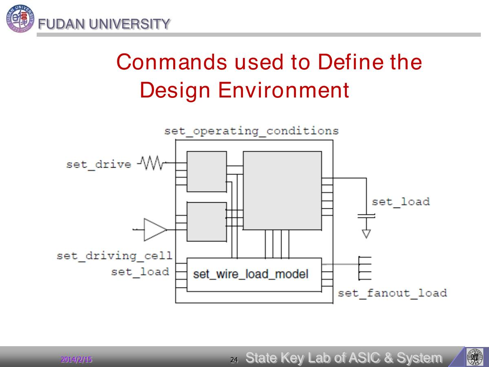

## 页面定位

- **页码**：24/112
- **所属阶段**：设计环境建模：工艺、负载、扇出和线负载
- **本页角色**：流程节点说明
- **阅读问题**：本页要回答：这个概念/命令在流程中解决什么问题？
- **前后关系**：这部分回答“模块外部世界是什么样”：输入驱动、输出负载、扇出和互连估计都会影响优化。

## 原文要点

> Conmands used to Define the
> Design Environment

## 原文解读

本页承接前后章节，提供一个具体概念、命令或图示。阅读时要把标题、对象、命令作用和后续报告联系起来。

本页关联的关键对象/命令：本页以概念/图示为主，重点看标题和图中对象关系。

## 我的理解

我的理解是：这页虽然信息量不一定大，但它仍然是流程中的一个节点；跳过会让后面命令缺少上下文。

把它放回完整 DC 流程里看，本页不是孤立知识点，而是在帮助我们更准确地描述“设计、环境、约束、优化结果”中的一个环节。读这一页时，我会优先问：它改变的是 DC 数据库里的哪个对象？它会让 compile 的优化空间变大还是变小？它最终应该在什么报告里被验证？

## 实操提醒

把本页标题写成一个问题，再用原文里的命令或图示回答它。

## 本页小结

本页的核心收获：Conmands used to Define the 这一页应被理解为“流程节点说明”的读书笔记节点；掌握它的标准不是背下标题，而是能说明它如何影响后续约束、优化或 timing 报告。

## 导航

- 上一页：[Page 023](pages/page-023.md)
- 下一页：[Page 025](pages/page-025.md)

# Page 025 - Set Operating Conditions

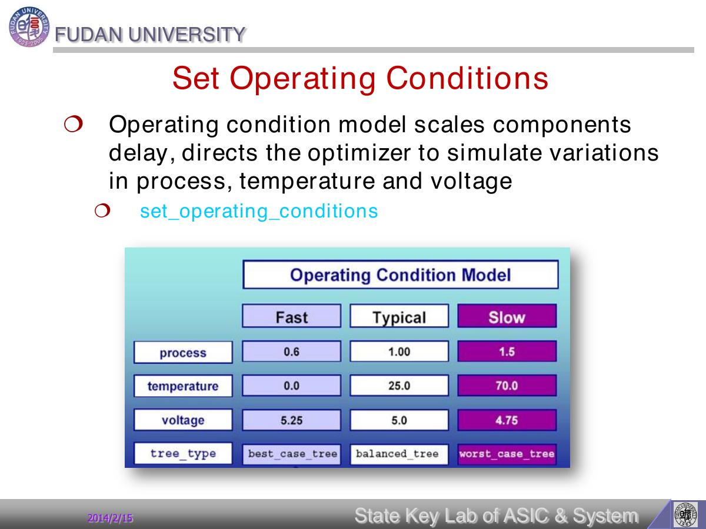

## 页面定位

- **页码**：25/112
- **所属阶段**：设计环境建模：工艺、负载、扇出和线负载
- **本页角色**：建模 PVT 环境
- **阅读问题**：本页要回答：当前设计被假设运行在什么 PVT/环境条件下？
- **前后关系**：这部分回答“模块外部世界是什么样”：输入驱动、输出负载、扇出和互连估计都会影响优化。

## 原文要点

> Set Operating Conditions
> - Operating condition model scales components
> delay, directs the optimizer to simulate variations
> in process, temperature and voltage
> - set_operating_conditions

## 原文解读

本页讲 operating conditions，用来模拟工艺、电压、温度变化对延迟和优化的影响。

本页关联的关键对象/命令：本页以概念/图示为主，重点看标题和图中对象关系。

## 我的理解

我的理解是：operating condition 是把“芯片在什么环境下工作”告诉 DC。不同 PVT 角下，cell delay 和优化选择都会变化。

把它放回完整 DC 流程里看，本页不是孤立知识点，而是在帮助我们更准确地描述“设计、环境、约束、优化结果”中的一个环节。读这一页时，我会优先问：它改变的是 DC 数据库里的哪个对象？它会让 compile 的优化空间变大还是变小？它最终应该在什么报告里被验证？

## 实操提醒

约束脚本要明确典型/慢速/快速角，不能默认环境就进入 signoff 式判断。

## 本页小结

本页的核心收获：Set Operating Conditions 这一页应被理解为“建模 PVT 环境”的读书笔记节点；掌握它的标准不是背下标题，而是能说明它如何影响后续约束、优化或 timing 报告。

## 导航

- 上一页：[Page 024](pages/page-024.md)
- 下一页：[Page 026](pages/page-026.md)

# Page 026 - Set Input Pulling Resistance (khoms)

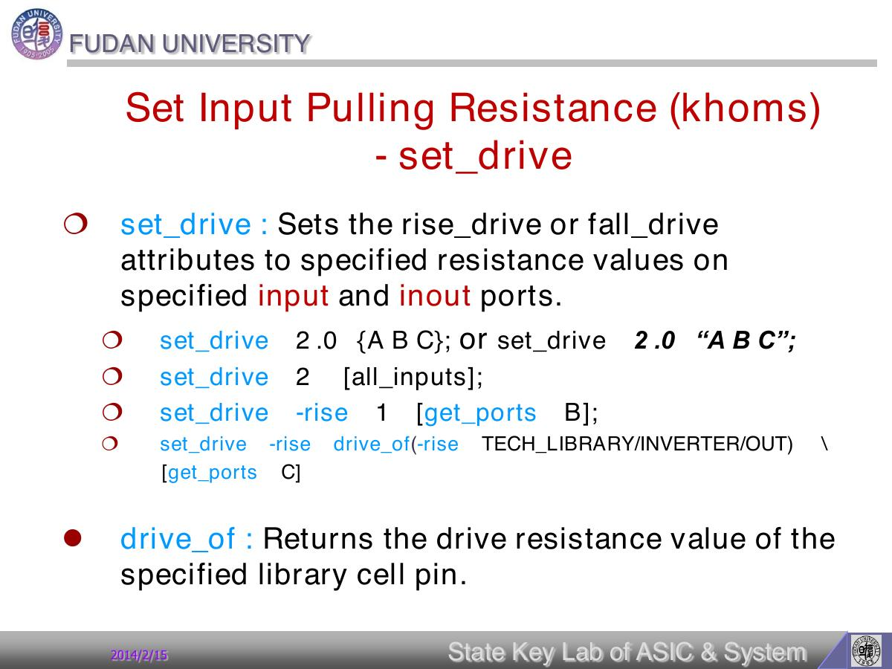

## 页面定位

- **页码**：26/112
- **所属阶段**：设计环境建模：工艺、负载、扇出和线负载
- **本页角色**：建模输入驱动
- **阅读问题**：本页要回答：输入端外部驱动能力如何建模？
- **前后关系**：这部分回答“模块外部世界是什么样”：输入驱动、输出负载、扇出和互连估计都会影响优化。

## 原文要点

> Set Input Pulling Resistance (khoms)
> - set_drive
> - set_drive : Sets the rise_drive or fall_drive
> attributes to specified resistance values on
> specified input and inout ports.
> - set_drive 2 .0 {A B C}; or set_drive 2 .0 “A B C”;
> - set_drive 2 [all_inputs];
> - set_drive -rise 1 [get_ports B];
> - set_drive -rise drive_of(-rise TECH_LIBRARY/INVERTER/OUT) \
> [get_ports C]
>  drive_of : Returns the drive resistance value of the
> specified library cell pin.

## 原文解读

本页讲 `set_drive`。它在 input/inout port 上设置 rise_drive 或 fall_drive，相当于用电阻值描述外部电路驱动当前模块输入的能力；`drive_of` 可以从库单元 pin 上读取驱动电阻作为参考。

本页关联的关键对象/命令：`set_drive`

## 我的理解

我的理解是：输入端不是理想信号源。外部驱动越弱，输入 transition 越慢，内部 delay 和 design rule 检查都会受影响。

把它放回完整 DC 流程里看，本页不是孤立知识点，而是在帮助我们更准确地描述“设计、环境、约束、优化结果”中的一个环节。读这一页时，我会优先问：它改变的是 DC 数据库里的哪个对象？它会让 compile 的优化空间变大还是变小？它最终应该在什么报告里被验证？

## 实操提醒

对输入端口建模时，要确认是用固定 resistance，还是用库单元 pin 的 `drive_of` 作为外部驱动模型。

## 本页小结

本页的核心收获：Set Input Pulling Resistance (khoms) 这一页应被理解为“建模输入驱动”的读书笔记节点；掌握它的标准不是背下标题，而是能说明它如何影响后续约束、优化或 timing 报告。

## 导航

- 上一页：[Page 025](pages/page-025.md)
- 下一页：[Page 027](pages/page-027.md)

# Page 027 - Set Input Pulling Resistance (khoms)

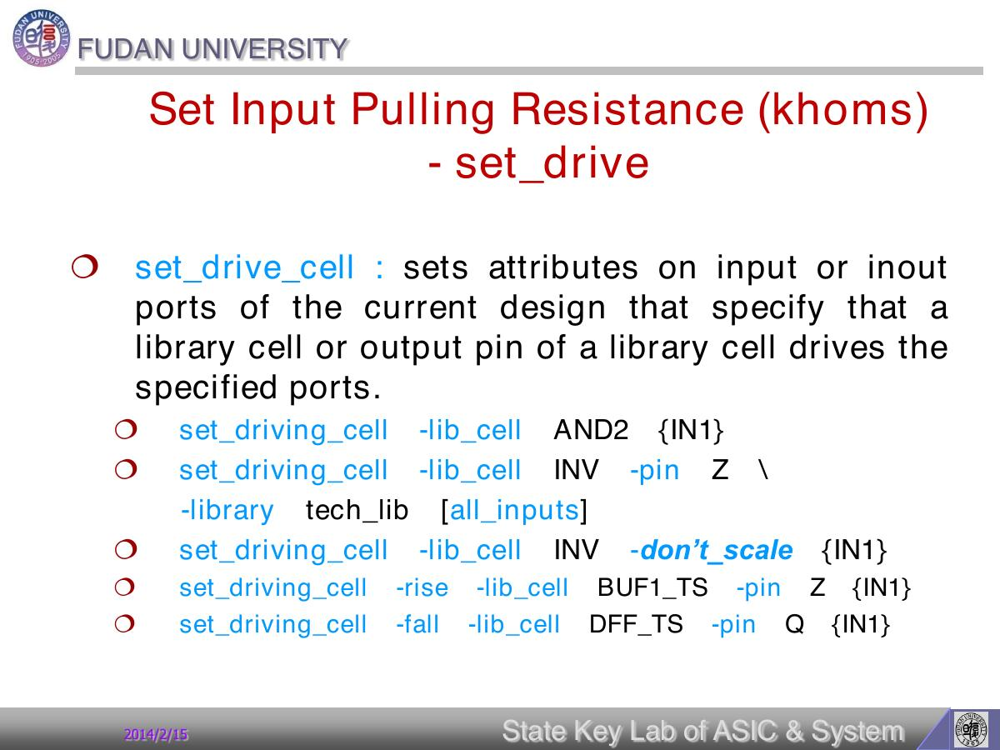

## 页面定位

- **页码**：27/112
- **所属阶段**：设计环境建模：工艺、负载、扇出和线负载
- **本页角色**：建模输入驱动
- **阅读问题**：本页要回答：如何用具体库单元描述输入端外部驱动？
- **前后关系**：这部分回答“模块外部世界是什么样”：输入驱动、输出负载、扇出和互连估计都会影响优化。

## 原文要点

> Set Input Pulling Resistance (khoms)
> - set_drive
> - set_drive_cell : sets attributes on input or inout
> ports of the current design that specify that a
> library cell or output pin of a library cell drives the
> specified ports.
> - set_driving_cell -lib_cell AND2 {IN1}
> - set_driving_cell -lib_cell INV -pin Z \
> -library tech_lib [all_inputs]
> - set_driving_cell -lib_cell INV -don’t_scale {IN1}
> - set_driving_cell -rise -lib_cell BUF1_TS -pin Z {IN1}
> - set_driving_cell -fall -lib_cell DFF_TS -pin Q {IN1}

## 原文解读

本页讲 `set_driving_cell` / `set_drive_cell` 思路：不用抽象电阻，而是指定某个 library cell 或它的输出 pin 来驱动当前设计的输入端口。这样 DC 可以用更接近真实上游单元的 transition/delay 模型。

本页关联的关键对象/命令：`set_drive`, `set_drive_cell`

## 我的理解

我的理解是：当上游逻辑已知时，用 driving cell 比手填电阻更可追溯。它把“外部谁在驱动我”建模成具体库单元，而不是一个孤立数字。

把它放回完整 DC 流程里看，本页不是孤立知识点，而是在帮助我们更准确地描述“设计、环境、约束、优化结果”中的一个环节。读这一页时，我会优先问：它改变的是 DC 数据库里的哪个对象？它会让 compile 的优化空间变大还是变小？它最终应该在什么报告里被验证？

## 实操提醒

不要同时给同一输入端口叠加互相矛盾的 `set_drive` 和 `set_driving_cell`；约束脚本里要保留建模来源。

## 本页小结

本页的核心收获：Set Input Pulling Resistance (khoms) 这一页应被理解为“建模输入驱动”的读书笔记节点；掌握它的标准不是背下标题，而是能说明它如何影响后续约束、优化或 timing 报告。

## 导航

- 上一页：[Page 026](pages/page-026.md)
- 下一页：[Page 028](pages/page-028.md)

# Page 028 - Setting Output Loading Capacitance (pF)

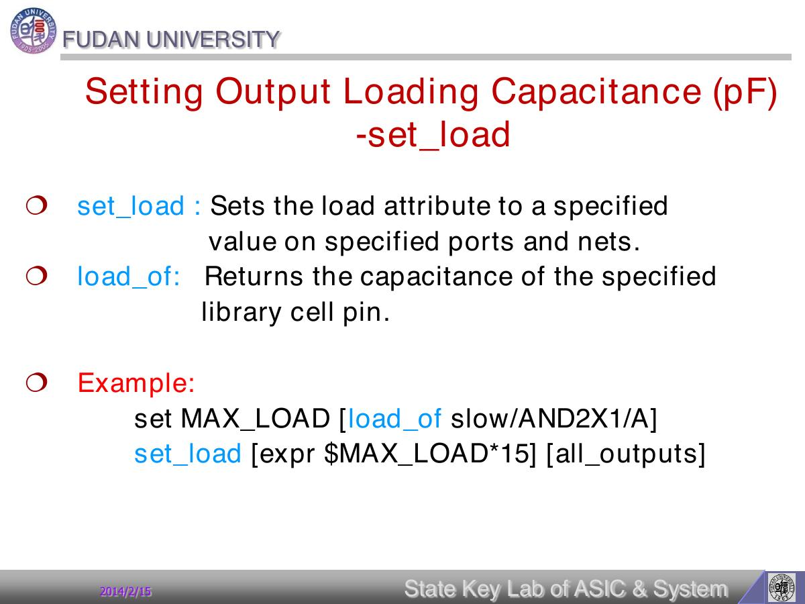

## 页面定位

- **页码**：28/112
- **所属阶段**：设计环境建模：工艺、负载、扇出和线负载
- **本页角色**：建模输出负载
- **阅读问题**：本页要回答：输出端外部负载如何建模？
- **前后关系**：这部分回答“模块外部世界是什么样”：输入驱动、输出负载、扇出和互连估计都会影响优化。

## 原文要点

> Setting Output Loading Capacitance (pF)
> -set_load
> - set_load : Sets the load attribute to a specified
> value on specified ports and nets.
> - load_of: Returns the capacitance of the specified
> library cell pin.
> - Example:
> set MAX_LOAD [load_of slow/AND2X1/A]
> set_load [expr $MAX_LOAD*15] [all_outputs]

## 原文解读

本页讲 `set_load`。它在 port 或 net 上设置电容负载；`load_of` 可以从库单元 pin 读取电容，用来估算下游多个输入 pin 带来的总负载。

本页关联的关键对象/命令：`set_load`

## 我的理解

我的理解是：输出端负载决定当前模块需要多强的输出驱动。负载估小会让时序过于乐观，估大则可能迫使 DC 选择更大的 cell，带来面积和功耗增加。

把它放回完整 DC 流程里看，本页不是孤立知识点，而是在帮助我们更准确地描述“设计、环境、约束、优化结果”中的一个环节。读这一页时，我会优先问：它改变的是 DC 数据库里的哪个对象？它会让 compile 的优化空间变大还是变小？它最终应该在什么报告里被验证？

## 实操提醒

对 output port 写 `set_load` 时，把 pad、电容预算、下游输入 pin 数量分开核算，再合成脚本里的最终数值。

## 本页小结

本页的核心收获：Setting Output Loading Capacitance (pF) 这一页应被理解为“建模输出负载”的读书笔记节点；掌握它的标准不是背下标题，而是能说明它如何影响后续约束、优化或 timing 报告。

## 导航

- 上一页：[Page 027](pages/page-027.md)
- 下一页：[Page 029](pages/page-029.md)

# Page 029 - Setting Output Loading Capacitance (pF)

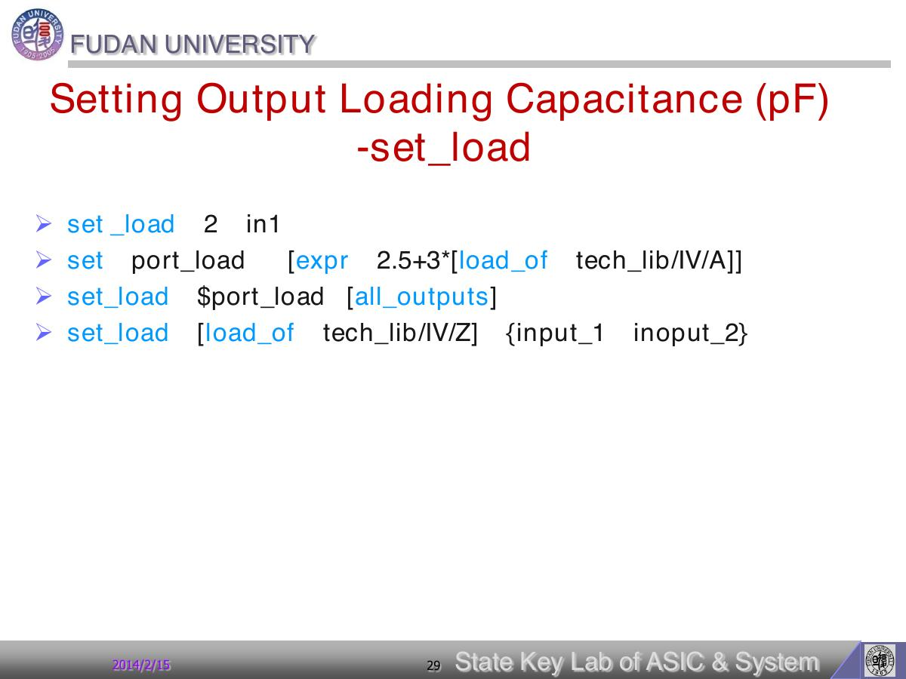

## 页面定位

- **页码**：29/112
- **所属阶段**：设计环境建模：工艺、负载、扇出和线负载
- **本页角色**：建模输出负载
- **阅读问题**：本页要回答：输出端外部负载如何建模？
- **前后关系**：这部分回答“模块外部世界是什么样”：输入驱动、输出负载、扇出和互连估计都会影响优化。

## 原文要点

> Setting Output Loading Capacitance (pF)
> -set_load
> - set _load 2 in1
> - set port_load [expr 2.5+3*[load_of tech_lib/IV/A]]
> - set_load $port_load [all_outputs]
> - set_load [load_of tech_lib/IV/Z] {input_1 inoput_2}

## 原文解读

本页讲输出负载建模。`set_load` 给端口或 net 设置电容负载，影响输出 cell sizing、transition 和 delay。

本页关联的关键对象/命令：`set_load`

## 我的理解

我的理解是：输出端连接了外部逻辑，DC 必须知道要推动多重的负载；负载估小会得到乐观时序，估大会增加面积和功耗压力。

把它放回完整 DC 流程里看，本页不是孤立知识点，而是在帮助我们更准确地描述“设计、环境、约束、优化结果”中的一个环节。读这一页时，我会优先问：它改变的是 DC 数据库里的哪个对象？它会让 compile 的优化空间变大还是变小？它最终应该在什么报告里被验证？

## 实操提醒

对 output port 写约束时，把 pad、下游输入 pin、电容预算分别核清楚。

## 本页小结

本页的核心收获：Setting Output Loading Capacitance (pF) 这一页应被理解为“建模输出负载”的读书笔记节点；掌握它的标准不是背下标题，而是能说明它如何影响后续约束、优化或 timing 报告。

## 导航

- 上一页：[Page 028](pages/page-028.md)
- 下一页：[Page 030](pages/page-030.md)

# Page 030 - set_fanout_load

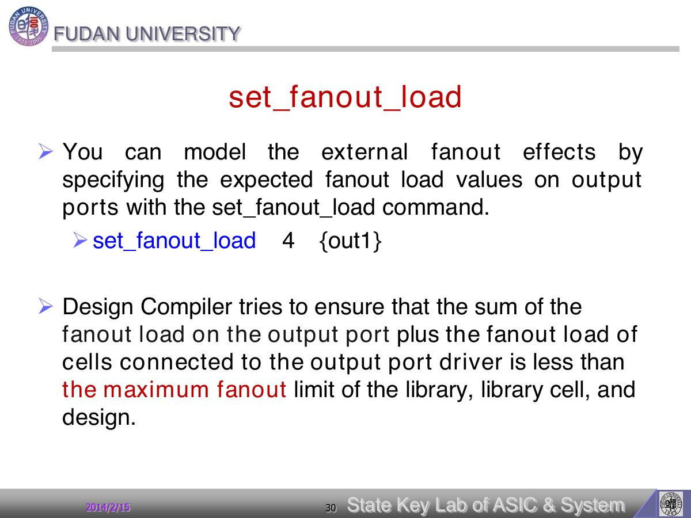

## 页面定位

- **页码**：30/112
- **所属阶段**：设计环境建模：工艺、负载、扇出和线负载
- **本页角色**：区分扇出环境和扇出规则
- **阅读问题**：本页要回答：外部 fanout load 如何影响 max fanout 判断？
- **前后关系**：这部分回答“模块外部世界是什么样”：输入驱动、输出负载、扇出和互连估计都会影响优化。

## 原文要点

> set_fanout_load
> - You can model the external fanout effects by
> specifying the expected fanout load values on output
> ports with the set_fanout_load command.
> - set_fanout_load 4 {out1}
> - Design Compiler tries to ensure that the sum of the
> fanout load on the output port plus the fanout load of
> cells connected to the output port driver is less than
> the maximum fanout limit of the library, library cell, and
> design.

## 原文解读

本页讲 `set_fanout_load`，用于在 output port 上建模外部 fanout 效应。DC 会把端口上的外部 fanout load 与实际连接 cell 的 fanout load 相加，再和 library/cell/design 上的最大 fanout 限制比较。

本页关联的关键对象/命令：`set_fanout_load`, `compile`

## 我的理解

我的理解是：`set_fanout_load` 不等于电容负载，它是无单位的 fanout 贡献值。它让模块级综合时也能考虑模块外部的扇出压力。

把它放回完整 DC 流程里看，本页不是孤立知识点，而是在帮助我们更准确地描述“设计、环境、约束、优化结果”中的一个环节。读这一页时，我会优先问：它改变的是 DC 数据库里的哪个对象？它会让 compile 的优化空间变大还是变小？它最终应该在什么报告里被验证？

## 实操提醒

如果 report 中出现 max fanout 问题，要同时检查外部 `set_fanout_load` 和内部连接 cell 的 fanout load。

## 本页小结

本页的核心收获：set_fanout_load 这一页应被理解为“区分扇出环境和扇出规则”的读书笔记节点；掌握它的标准不是背下标题，而是能说明它如何影响后续约束、优化或 timing 报告。

## 导航

- 上一页：[Page 029](pages/page-029.md)
- 下一页：[Page 031](pages/page-031.md)

# Page 031 - set_load V.S. set_fanout_load

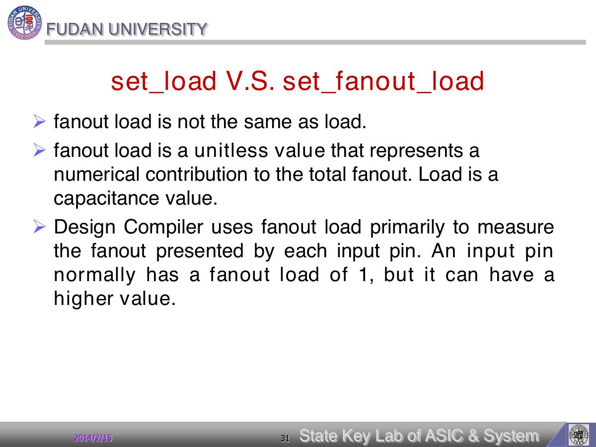

## 页面定位

- **页码**：31/112
- **所属阶段**：设计环境建模：工艺、负载、扇出和线负载
- **本页角色**：区分扇出环境和电容负载
- **阅读问题**：本页要回答：`set_load` 和 `set_fanout_load` 为什么不是一回事？
- **前后关系**：这部分回答“模块外部世界是什么样”：输入驱动、输出负载、扇出和互连估计都会影响优化。

## 原文要点

> set_load V.S. set_fanout_load
> - fanout load is not the same as load.
> - fanout load is a unitless value that represents a
> numerical contribution to the total fanout. Load is a
> capacitance value.
> - Design Compiler uses fanout load primarily to measure
> the fanout presented by each input pin. An input pin
> normally has a fanout load of 1, but it can have a
> higher value.

## 原文解读

本页明确说明 fanout load 和 load 不同：fanout load 是无单位的扇出贡献值，用于 fanout 规则统计；load 是电容值，用于 transition、delay 和驱动能力估算。

本页关联的关键对象/命令：`set_load`, `set_fanout_load`, `compile`

## 我的理解

我的理解是：这页是在防止把两个外部环境模型混用。`set_load` 影响电容和时序，`set_fanout_load` 影响 fanout 计数和 max fanout 检查。

把它放回完整 DC 流程里看，本页不是孤立知识点，而是在帮助我们更准确地描述“设计、环境、约束、优化结果”中的一个环节。读这一页时，我会优先问：它改变的是 DC 数据库里的哪个对象？它会让 compile 的优化空间变大还是变小？它最终应该在什么报告里被验证？

## 实操提醒

写输出约束时，电容负载和 fanout load 要分别建模；不要用其中一个替代另一个。

## 本页小结

本页的核心收获：set_load V.S. set_fanout_load 这一页应被理解为“区分扇出环境和电容负载”的读书笔记节点；掌握它的标准不是背下标题，而是能说明它如何影响后续约束、优化或 timing 报告。

## 导航

- 上一页：[Page 030](pages/page-030.md)
- 下一页：[Page 032](pages/page-032.md)

# Page 032 - Design Constraints: set_max_fanout

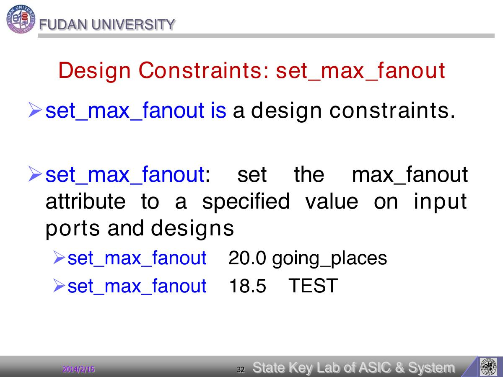

## 页面定位

- **页码**：32/112
- **所属阶段**：设计环境建模：工艺、负载、扇出和线负载
- **本页角色**：区分扇出环境和扇出规则
- **阅读问题**：本页要回答：外部扇出模型和最大扇出规则有什么区别？
- **前后关系**：这部分回答“模块外部世界是什么样”：输入驱动、输出负载、扇出和互连估计都会影响优化。

## 原文要点

> Design Constraints: set_max_fanout
> -set_max_fanout is a design constraints.
> -set_max_fanout: set the max_fanout
> attribute to a specified value on input
> ports and designs
> -set_max_fanout 20.0 going_places
> -set_max_fanout 18.5 TEST

## 原文解读

本页讲 fanout load 与 max fanout。`set_fanout_load` 是环境建模，描述外部扇出贡献；`set_max_fanout` 是设计规则约束，限制可接受的最大扇出。

本页关联的关键对象/命令：`set_max_fanout`

## 我的理解

我的理解是：前者告诉 DC “外面接了多少负担”，后者告诉 DC “最多允许多大扇出”。二者数值长得像，但语义完全不同。

把它放回完整 DC 流程里看，本页不是孤立知识点，而是在帮助我们更准确地描述“设计、环境、约束、优化结果”中的一个环节。读这一页时，我会优先问：它改变的是 DC 数据库里的哪个对象？它会让 compile 的优化空间变大还是变小？它最终应该在什么报告里被验证？

## 实操提醒

debug fanout violation 时先分清是外部模型导致，还是 design rule 限制导致。

## 本页小结

本页的核心收获：Design Constraints: set_max_fanout 这一页应被理解为“区分扇出环境和扇出规则”的读书笔记节点；掌握它的标准不是背下标题，而是能说明它如何影响后续约束、优化或 timing 报告。

## 导航

- 上一页：[Page 031](pages/page-031.md)
- 下一页：[Page 033](pages/page-033.md)

# Page 033 - set_fanout_load V.S. set_max_fanout

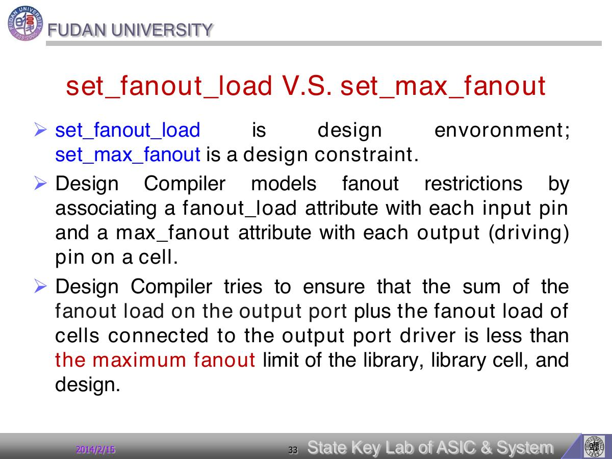

## 页面定位

- **页码**：33/112
- **所属阶段**：设计环境建模：工艺、负载、扇出和线负载
- **本页角色**：区分扇出环境和扇出规则
- **阅读问题**：本页要回答：外部扇出模型和最大扇出规则有什么区别？
- **前后关系**：这部分回答“模块外部世界是什么样”：输入驱动、输出负载、扇出和互连估计都会影响优化。

## 原文要点

> set_fanout_load V.S. set_max_fanout
> - set_fanout_load is design envoronment;
> set_max_fanout is a design constraint.
> - Design Compiler models fanout restrictions by
> associating a fanout_load attribute with each input pin
> and a max_fanout attribute with each output (driving)
> pin on a cell.
> - Design Compiler tries to ensure that the sum of the
> fanout load on the output port plus the fanout load of
> cells connected to the output port driver is less than
> the maximum fanout limit of the library, library cell, and
> design.

## 原文解读

本页明确区分 `set_fanout_load` 和 `set_max_fanout`：前者是 design environment，用来描述输出端口外部扇出负担；后者是 design constraint，用来限制驱动端允许看到的最大 fanout。DC 会把输出端口外部 fanout load 和所连接 cell 的 fanout load 累加，再与库、cell 或 design 上的 max fanout 限制比较。

本页关联的关键对象/命令：`set_fanout_load`, `set_max_fanout`, `compile`

## 我的理解

我的理解是：这页最重要的是语义区分。`set_fanout_load` 是告诉工具“外面有多少负载”，`set_max_fanout` 是告诉工具“最多允许多少负载”。两者都会影响优化，但一个是环境假设，一个是硬性规则。

把它放回完整 DC 流程里看，本页不是孤立知识点，而是在帮助我们更准确地描述“设计、环境、约束、优化结果”中的一个环节。读这一页时，我会优先问：它改变的是 DC 数据库里的哪个对象？它会让 compile 的优化空间变大还是变小？它最终应该在什么报告里被验证？

## 实操提醒

检查 fanout 问题时，先确认 violation 来自外部建模还是 max_fanout 规则，不要用改环境模型来掩盖真实设计规则问题。

## 本页小结

本页的核心收获：set_fanout_load V.S. set_max_fanout 这一页应被理解为“区分扇出环境和扇出规则”的读书笔记节点；掌握它的标准不是背下标题，而是能说明它如何影响后续约束、优化或 timing 报告。

## 导航

- 上一页：[Page 032](pages/page-032.md)
- 下一页：[Page 034](pages/page-034.md)

# Page 034 - Case Study: fanout_load & max_fanout_load

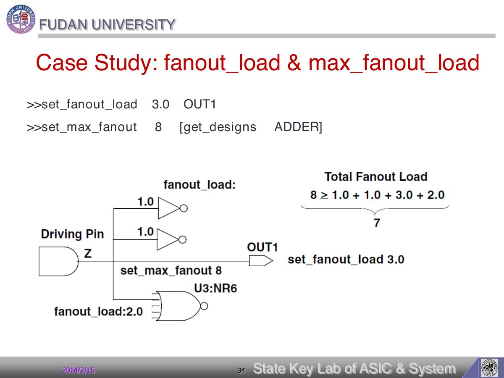

## 页面定位

- **页码**：34/112
- **所属阶段**：设计环境建模：工艺、负载、扇出和线负载
- **本页角色**：区分扇出环境和扇出规则
- **阅读问题**：本页要回答：外部扇出模型和最大扇出规则有什么区别？
- **前后关系**：这部分回答“模块外部世界是什么样”：输入驱动、输出负载、扇出和互连估计都会影响优化。

## 原文要点

> Case Study: fanout_load & max_fanout_load
> >>set_fanout_load 3.0 OUT1
> >>set_max_fanout 8 [get_designs ADDER]

## 原文解读

本页讲 fanout load 与 max fanout。`set_fanout_load` 是环境建模，描述外部扇出贡献；`set_max_fanout` 是设计规则约束，限制可接受的最大扇出。

本页关联的关键对象/命令：`set_fanout_load`, `set_max_fanout`

## 我的理解

我的理解是：前者告诉 DC “外面接了多少负担”，后者告诉 DC “最多允许多大扇出”。二者数值长得像，但语义完全不同。

把它放回完整 DC 流程里看，本页不是孤立知识点，而是在帮助我们更准确地描述“设计、环境、约束、优化结果”中的一个环节。读这一页时，我会优先问：它改变的是 DC 数据库里的哪个对象？它会让 compile 的优化空间变大还是变小？它最终应该在什么报告里被验证？

## 实操提醒

debug fanout violation 时先分清是外部模型导致，还是 design rule 限制导致。

## 本页小结

本页的核心收获：Case Study: fanout_load & max_fanout_load 这一页应被理解为“区分扇出环境和扇出规则”的读书笔记节点；掌握它的标准不是背下标题，而是能说明它如何影响后续约束、优化或 timing 报告。

## 导航

- 上一页：[Page 033](pages/page-033.md)
- 下一页：[Page 035](pages/page-035.md)

# Page 035 - Case Study

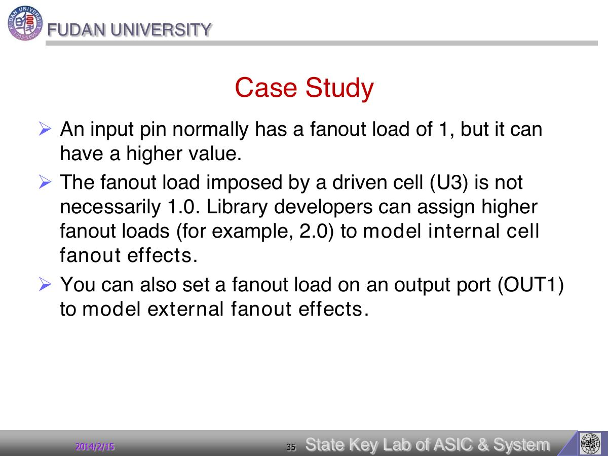

## 页面定位

- **页码**：35/112
- **所属阶段**：设计环境建模：工艺、负载、扇出和线负载
- **本页角色**：区分扇出环境和扇出规则
- **阅读问题**：本页要回答：外部扇出模型和最大扇出规则有什么区别？
- **前后关系**：这部分回答“模块外部世界是什么样”：输入驱动、输出负载、扇出和互连估计都会影响优化。

## 原文要点

> Case Study
> - An input pin normally has a fanout load of 1, but it can
> have a higher value.
> - The fanout load imposed by a driven cell (U3) is not
> necessarily 1.0. Library developers can assign higher
> fanout loads (for example, 2.0) to model internal cell
> fanout effects.
> - You can also set a fanout load on an output port (OUT1)
> to model external fanout effects.

## 原文解读

本页通过 case study 说明 fanout load 不一定等于连接数量。普通 input pin 的 fanout load 常见为 1，但库开发者可以把某些 cell 的输入 fanout load 设为更高值，用来反映内部电路负担；设计者也可以在 output port 上设置 fanout load 来模拟外部负载。

本页关联的关键对象/命令：本页以概念/图示为主，重点看标题和图中对象关系。

## 我的理解

我的理解是：fanout load 是抽象负载权重，不是简单数引脚。一个输入 pin 可能等价于 2 个或更多单位负载，因此 DC 计算 fanout 时会结合库属性和用户设置。

把它放回完整 DC 流程里看，本页不是孤立知识点，而是在帮助我们更准确地描述“设计、环境、约束、优化结果”中的一个环节。读这一页时，我会优先问：它改变的是 DC 数据库里的哪个对象？它会让 compile 的优化空间变大还是变小？它最终应该在什么报告里被验证？

## 实操提醒

做模块级综合时，要把外部 fanout load 和库 cell 自带 fanout load 分开理解；否则会误判为什么某个输出很快超过 max_fanout。

## 本页小结

本页的核心收获：Case Study 这一页应被理解为“区分扇出环境和扇出规则”的读书笔记节点；掌握它的标准不是背下标题，而是能说明它如何影响后续约束、优化或 timing 报告。

## 导航

- 上一页：[Page 034](pages/page-034.md)
- 下一页：[Page 036](pages/page-036.md)

# Page 036 - Net Delay

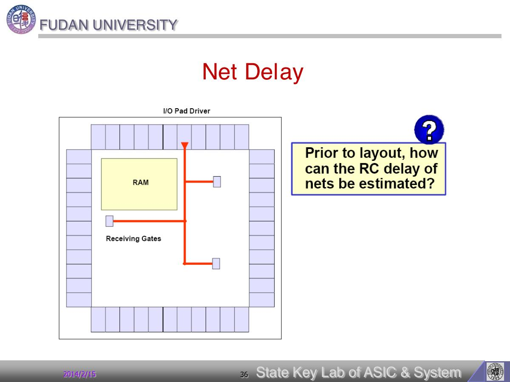

## 页面定位

- **页码**：36/112
- **所属阶段**：设计环境建模：工艺、负载、扇出和线负载
- **本页角色**：估计互连延迟
- **阅读问题**：本页要回答：没有布局布线时，DC 如何估计 net delay？
- **前后关系**：这部分回答“模块外部世界是什么样”：输入驱动、输出负载、扇出和互连估计都会影响优化。

## 原文要点

> Net Delay

## 原文解读

本页讲 wire load/net delay。早期综合没有真实布局布线，只能用 wire load model 按 fanout 和层次估计互连 RC。

本页关联的关键对象/命令：本页以概念/图示为主，重点看标题和图中对象关系。

## 我的理解

我的理解是：线延迟是综合阶段最大的近似之一。top/enclosed/segmented 模式不同，会改变跨层级 net 采用哪个 wire load model。

把它放回完整 DC 流程里看，本页不是孤立知识点，而是在帮助我们更准确地描述“设计、环境、约束、优化结果”中的一个环节。读这一页时，我会优先问：它改变的是 DC 数据库里的哪个对象？它会让 compile 的优化空间变大还是变小？它最终应该在什么报告里被验证？

## 实操提醒

层次设计里要特别检查跨 boundary net；wire load mode 选择会影响时序乐观/悲观程度。

## 本页小结

本页的核心收获：Net Delay 这一页应被理解为“估计互连延迟”的读书笔记节点；掌握它的标准不是背下标题，而是能说明它如何影响后续约束、优化或 timing 报告。

## 导航

- 上一页：[Page 035](pages/page-035.md)
- 下一页：[Page 037](pages/page-037.md)

# Page 037 - Wire Load Model

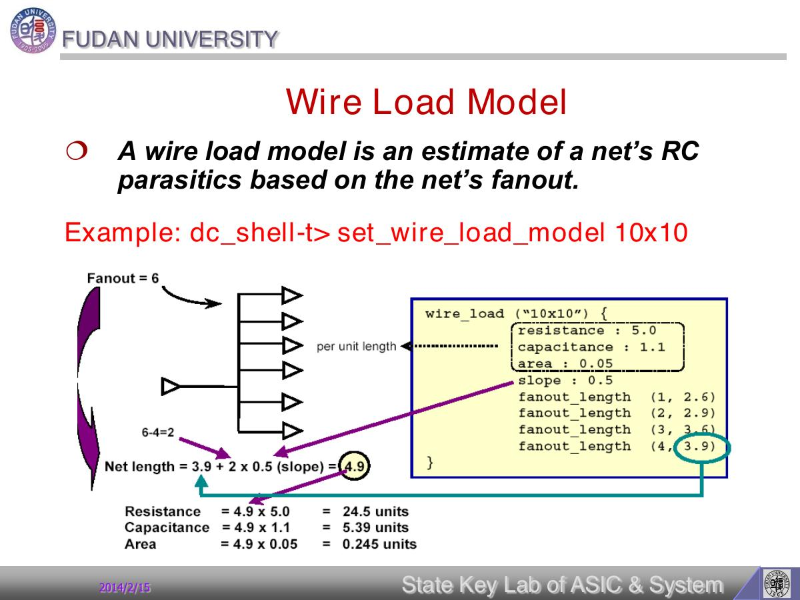

## 页面定位

- **页码**：37/112
- **所属阶段**：设计环境建模：工艺、负载、扇出和线负载
- **本页角色**：估计互连延迟
- **阅读问题**：本页要回答：没有布局布线时，DC 如何估计 net delay？
- **前后关系**：这部分回答“模块外部世界是什么样”：输入驱动、输出负载、扇出和互连估计都会影响优化。

## 原文要点

> Wire Load Model
> - A wire load model is an estimate of a net’s RC
> parasitics based on the net’s fanout.
> Example: dc_shell-t> set_wire_load_model 10x10

## 原文解读

本页定义 wire load model：在还没有真实布局布线 RC 的综合阶段，根据 net 的 fanout 估计互连寄生参数。`set_wire_load_model` 用来指定这种估计模型。

本页关联的关键对象/命令：`set_wire_load_model`, `set_wire_load_mode`, `dc_shell`

## 我的理解

我的理解是：wire load model 是早期综合对物理互连的近似。它利用 fanout 推测线长和 RC，因此 fanout 不只是规则统计，也会间接影响 net delay 估算。

把它放回完整 DC 流程里看，本页不是孤立知识点，而是在帮助我们更准确地描述“设计、环境、约束、优化结果”中的一个环节。读这一页时，我会优先问：它改变的是 DC 数据库里的哪个对象？它会让 compile 的优化空间变大还是变小？它最终应该在什么报告里被验证？

## 实操提醒

在没有后端寄生参数前，检查 wire load model 是否匹配设计规模；过于乐观或悲观都会影响 timing 优化方向。

## 本页小结

本页的核心收获：Wire Load Model 这一页应被理解为“估计互连延迟”的读书笔记节点；掌握它的标准不是背下标题，而是能说明它如何影响后续约束、优化或 timing 报告。

## 导航

- 上一页：[Page 036](pages/page-036.md)
- 下一页：[Page 038](pages/page-038.md)

# Page 038 - Setting Wire Load Mode

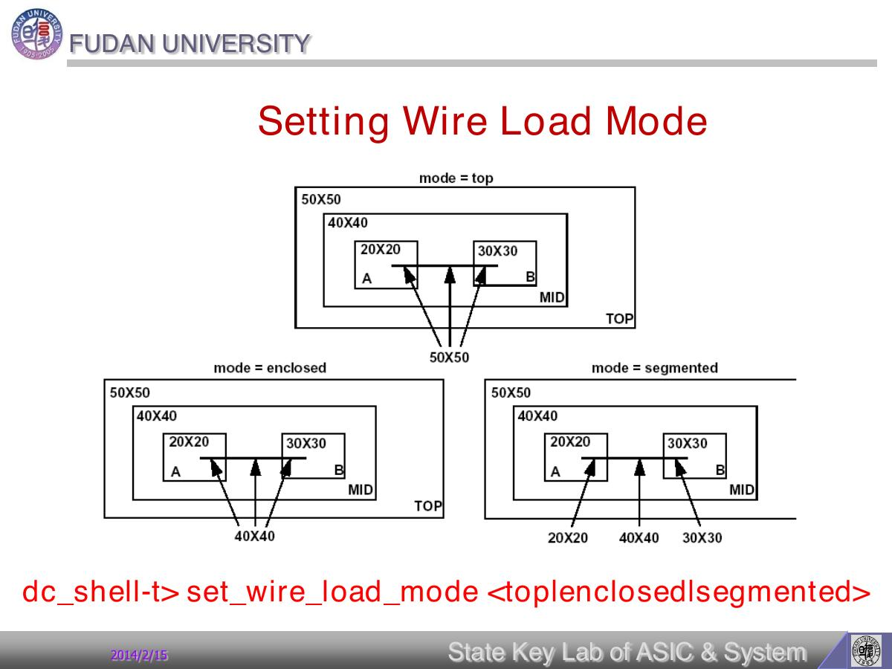

## 页面定位

- **页码**：38/112
- **所属阶段**：设计环境建模：工艺、负载、扇出和线负载
- **本页角色**：估计互连延迟
- **阅读问题**：本页要回答：没有布局布线时，DC 如何估计 net delay？
- **前后关系**：这部分回答“模块外部世界是什么样”：输入驱动、输出负载、扇出和互连估计都会影响优化。

## 原文要点

> Setting Wire Load Mode
> dc_shell-t> set_wire_load_mode <top|enclosed|segmented>

## 原文解读

本页讲 wire load/net delay。早期综合没有真实布局布线，只能用 wire load model 按 fanout 和层次估计互连 RC。

本页关联的关键对象/命令：`set_wire_load_mode`, `dc_shell`

## 我的理解

我的理解是：线延迟是综合阶段最大的近似之一。top/enclosed/segmented 模式不同，会改变跨层级 net 采用哪个 wire load model。

把它放回完整 DC 流程里看，本页不是孤立知识点，而是在帮助我们更准确地描述“设计、环境、约束、优化结果”中的一个环节。读这一页时，我会优先问：它改变的是 DC 数据库里的哪个对象？它会让 compile 的优化空间变大还是变小？它最终应该在什么报告里被验证？

## 实操提醒

层次设计里要特别检查跨 boundary net；wire load mode 选择会影响时序乐观/悲观程度。

## 本页小结

本页的核心收获：Setting Wire Load Mode 这一页应被理解为“估计互连延迟”的读书笔记节点；掌握它的标准不是背下标题，而是能说明它如何影响后续约束、优化或 timing 报告。

## 导航

- 上一页：[Page 037](pages/page-037.md)
- 下一页：[Page 039](pages/page-039.md)

# Page 039 - Hierarchical Wire Load Models

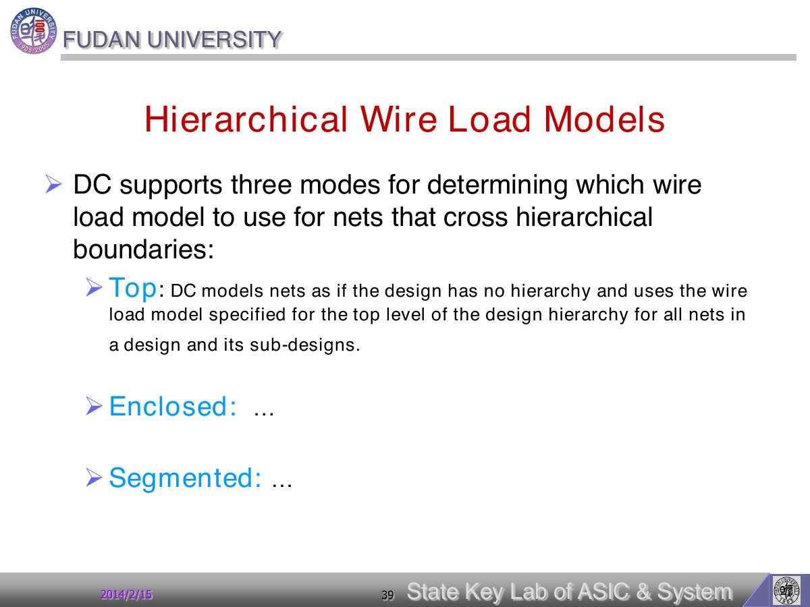

## 页面定位

- **页码**：39/112
- **所属阶段**：设计环境建模：工艺、负载、扇出和线负载
- **本页角色**：估计互连延迟
- **阅读问题**：本页要回答：没有布局布线时，DC 如何估计 net delay？
- **前后关系**：这部分回答“模块外部世界是什么样”：输入驱动、输出负载、扇出和互连估计都会影响优化。

## 原文要点

> Hierarchical Wire Load Models
> - DC supports three modes for determining which wire
> load model to use for nets that cross hierarchical
> boundaries:
> - Top: DC models nets as if the design has no hierarchy and uses the wire
> load model specified for the top level of the design hierarchy for all nets in
> a design and its sub-designs.
> - Enclosed: …
> - Segmented: …

## 原文解读

本页讲 wire load/net delay。早期综合没有真实布局布线，只能用 wire load model 按 fanout 和层次估计互连 RC。

本页关联的关键对象/命令：本页以概念/图示为主，重点看标题和图中对象关系。

## 我的理解

我的理解是：线延迟是综合阶段最大的近似之一。top/enclosed/segmented 模式不同，会改变跨层级 net 采用哪个 wire load model。

把它放回完整 DC 流程里看，本页不是孤立知识点，而是在帮助我们更准确地描述“设计、环境、约束、优化结果”中的一个环节。读这一页时，我会优先问：它改变的是 DC 数据库里的哪个对象？它会让 compile 的优化空间变大还是变小？它最终应该在什么报告里被验证？

## 实操提醒

层次设计里要特别检查跨 boundary net；wire load mode 选择会影响时序乐观/悲观程度。

## 本页小结

本页的核心收获：Hierarchical Wire Load Models 这一页应被理解为“估计互连延迟”的读书笔记节点；掌握它的标准不是背下标题，而是能说明它如何影响后续约束、优化或 timing 报告。

## 导航

- 上一页：[Page 038](pages/page-038.md)
- 下一页：[Page 040](pages/page-040.md)

# Page 040 - Hierarchical Wire Load Models

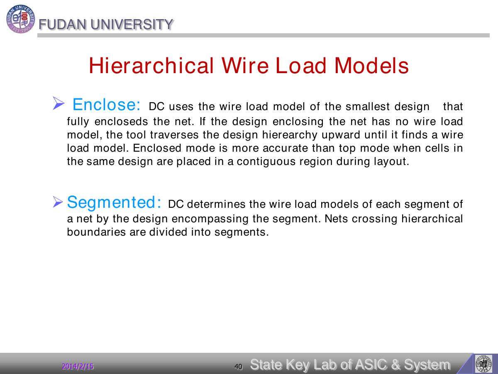

## 页面定位

- **页码**：40/112
- **所属阶段**：设计环境建模：工艺、负载、扇出和线负载
- **本页角色**：估计互连延迟
- **阅读问题**：本页要回答：没有布局布线时，DC 如何估计 net delay？
- **前后关系**：这部分回答“模块外部世界是什么样”：输入驱动、输出负载、扇出和互连估计都会影响优化。

## 原文要点

> Hierarchical Wire Load Models
> - Enclose: DC uses the wire load model of the smallest design that
> fully encloseds the net. If the design enclosing the net has no wire load
> model, the tool traverses the design hierearchy upward until it finds a wire
> load model. Enclosed mode is more accurate than top mode when cells in
> the same design are placed in a contiguous region during layout.
> - Segmented: DC determines the wire load models of each segment of
> a net by the design encompassing the segment. Nets crossing hierarchical
> boundaries are divided into segments.

## 原文解读

本页讲 wire load/net delay。早期综合没有真实布局布线，只能用 wire load model 按 fanout 和层次估计互连 RC。

本页关联的关键对象/命令：本页以概念/图示为主，重点看标题和图中对象关系。

## 我的理解

我的理解是：线延迟是综合阶段最大的近似之一。top/enclosed/segmented 模式不同，会改变跨层级 net 采用哪个 wire load model。

把它放回完整 DC 流程里看，本页不是孤立知识点，而是在帮助我们更准确地描述“设计、环境、约束、优化结果”中的一个环节。读这一页时，我会优先问：它改变的是 DC 数据库里的哪个对象？它会让 compile 的优化空间变大还是变小？它最终应该在什么报告里被验证？

## 实操提醒

层次设计里要特别检查跨 boundary net；wire load mode 选择会影响时序乐观/悲观程度。

## 本页小结

本页的核心收获：Hierarchical Wire Load Models 这一页应被理解为“估计互连延迟”的读书笔记节点；掌握它的标准不是背下标题，而是能说明它如何影响后续约束、优化或 timing 报告。

## 导航

- 上一页：[Page 039](pages/page-039.md)
- 下一页：[Page 041](pages/page-041.md)

# Page 041 - - set _wire_load_model -name “10*10” -library my_lib.db

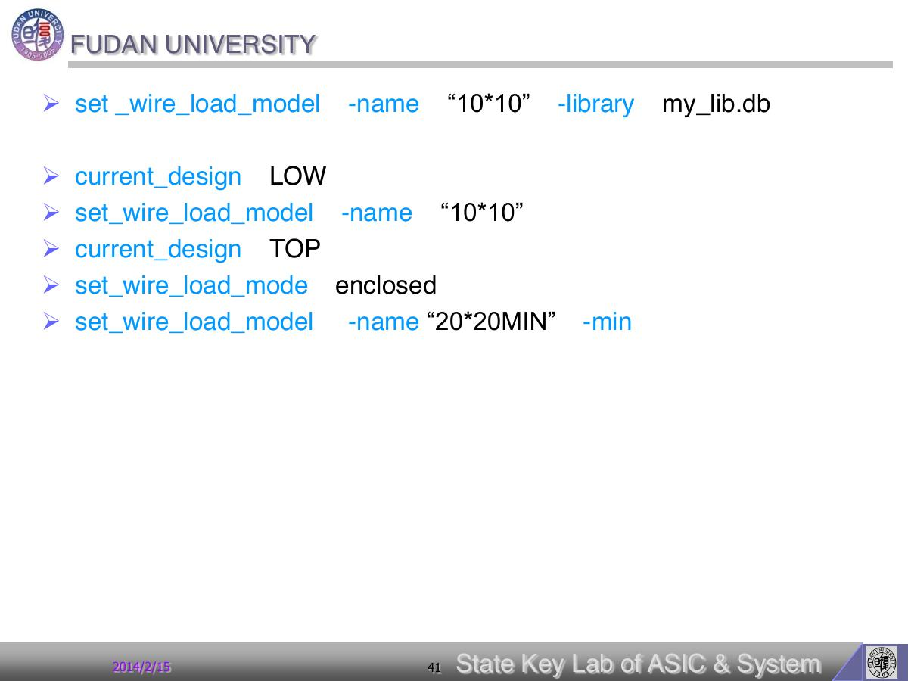

## 页面定位

- **页码**：41/112
- **所属阶段**：设计环境建模：工艺、负载、扇出和线负载
- **本页角色**：估计互连延迟
- **阅读问题**：本页要回答：没有布局布线时，DC 如何估计 net delay？
- **前后关系**：这部分回答“模块外部世界是什么样”：输入驱动、输出负载、扇出和互连估计都会影响优化。

## 原文要点

> - set _wire_load_model -name “10*10” -library my_lib.db
> - current_design LOW
> - set_wire_load_model -name “10*10”
> - current_design TOP
> - set_wire_load_mode enclosed
> - set_wire_load_model -name “20*20MIN” -min

## 原文解读

本页展示 `set_wire_load_model` 和 `set_wire_load_mode` 的用法。脚本先对不同层次的 current_design 设置 wire load model，再在 TOP 上设置 enclosed mode，并指定 min 角的 wire load model。重点是：wire load model 可以按设计层次和工艺角分别指定。

本页关联的关键对象/命令：`set_wire_load_model`, `set_wire_load_mode`

## 我的理解

我的理解是：wire load model 是综合阶段对互连 RC 的早期估计。它不是库路径配置，而是影响 net delay 计算的模型选择；层次模式和 min/max 模型选错，会直接改变 timing 的乐观或悲观程度。

把它放回完整 DC 流程里看，本页不是孤立知识点，而是在帮助我们更准确地描述“设计、环境、约束、优化结果”中的一个环节。读这一页时，我会优先问：它改变的是 DC 数据库里的哪个对象？它会让 compile 的优化空间变大还是变小？它最终应该在什么报告里被验证？

## 实操提醒

层次化设计里要记录每个 current_design 使用的 wire load model，并确认 top/enclosed/segmented 模式与项目约定一致。

## 本页小结

本页的核心收获：- set _wire_load_model -name “10*10” -library my_lib.db 这一页应被理解为“估计互连延迟”的读书笔记节点；掌握它的标准不是背下标题，而是能说明它如何影响后续约束、优化或 timing 报告。

## 导航

- 上一页：[Page 040](pages/page-040.md)
- 下一页：[Page 042](pages/page-042.md)

# Page 042 - Design constraints transition

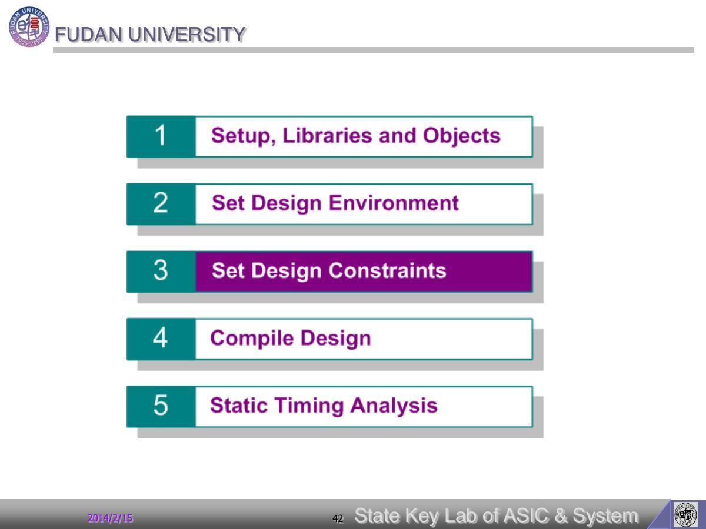

## 页面定位

- **页码**：42/112
- **所属阶段**：设计环境建模：工艺、负载、扇出和线负载
- **本页角色**：流程节点说明
- **阅读问题**：本页要回答：这个概念/命令在流程中解决什么问题？
- **前后关系**：这部分回答“模块外部世界是什么样”：输入驱动、输出负载、扇出和互连估计都会影响优化。

## 原文要点

> 本页 OCR 可抽取文本为空或很少，解读主要依据页面标题、页码位置和单页图像。

## 原文解读

这页是从线负载模型转向约束分类的章节过渡。

本页关联的关键对象/命令：本页以概念/图示为主，重点看标题和图中对象关系。

## 我的理解

读到这里应完成一个转换：前面是在描述外部物理/电气环境，后面开始告诉 DC 哪些目标必须满足。

把它放回完整 DC 流程里看，本页不是孤立知识点，而是在帮助我们更准确地描述“设计、环境、约束、优化结果”中的一个环节。读这一页时，我会优先问：它改变的是 DC 数据库里的哪个对象？它会让 compile 的优化空间变大还是变小？它最终应该在什么报告里被验证？

## 实操提醒

把本页标题写成一个问题，再用原文里的命令或图示回答它。

## 本页小结

本页的核心收获：Design constraints transition 这一页应被理解为“流程节点说明”的读书笔记节点；掌握它的标准不是背下标题，而是能说明它如何影响后续约束、优化或 timing 报告。

## 导航

- 上一页：[Page 041](pages/page-041.md)
- 下一页：[Page 043](pages/page-043.md)

# Page 043 - Design Constraints: Design Rule Constraints

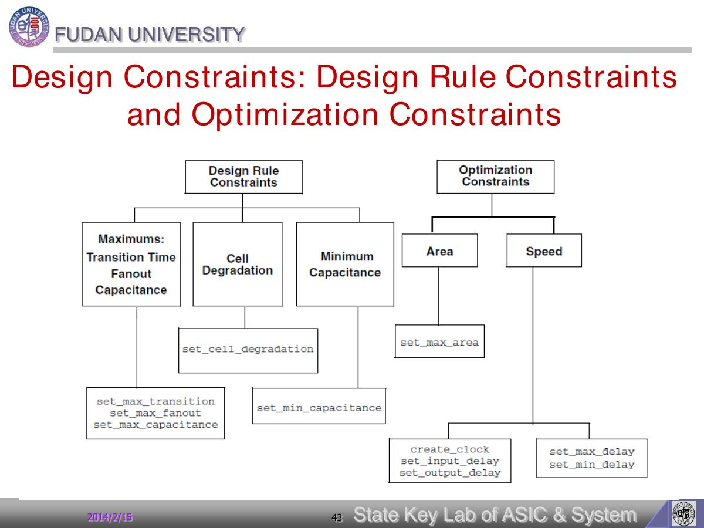

## 页面定位

- **页码**：43/112
- **所属阶段**：约束建模：设计规则、时序、面积和优先级
- **本页角色**：设置设计规则底线
- **阅读问题**：本页要回答：哪些约束是工艺规则底线，不能为了面积/速度牺牲？
- **前后关系**：这部分回答“工具必须满足什么”：硬性 design rule 与优化目标要分清。

## 原文要点

> Design Constraints: Design Rule Constraints
> and Optimization Constraints

## 原文解读

本页讲 design rule constraints。max transition、max capacitance、max fanout 这类约束通常来自工艺库限制，优先级高于面积/速度目标。

本页关联的关键对象/命令：本页以概念/图示为主，重点看标题和图中对象关系。

## 我的理解

我的理解是：design rule 是“不能违反”的底线，不是优化偏好。DC 会优先修 DRC，即使这让面积变大或局部时序变差。

把它放回完整 DC 流程里看，本页不是孤立知识点，而是在帮助我们更准确地描述“设计、环境、约束、优化结果”中的一个环节。读这一页时，我会优先问：它改变的是 DC 数据库里的哪个对象？它会让 compile 的优化空间变大还是变小？它最终应该在什么报告里被验证？

## 实操提醒

报告中若有 transition/cap/fanout violation，先修规则，再讨论 timing/area trade-off。

## 本页小结

本页的核心收获：Design Constraints: Design Rule Constraints 这一页应被理解为“设置设计规则底线”的读书笔记节点；掌握它的标准不是背下标题，而是能说明它如何影响后续约束、优化或 timing 报告。

## 导航

- 上一页：[Page 042](pages/page-042.md)
- 下一页：[Page 044](pages/page-044.md)

# Page 044 - - Design Rule Constraints: technology-specific

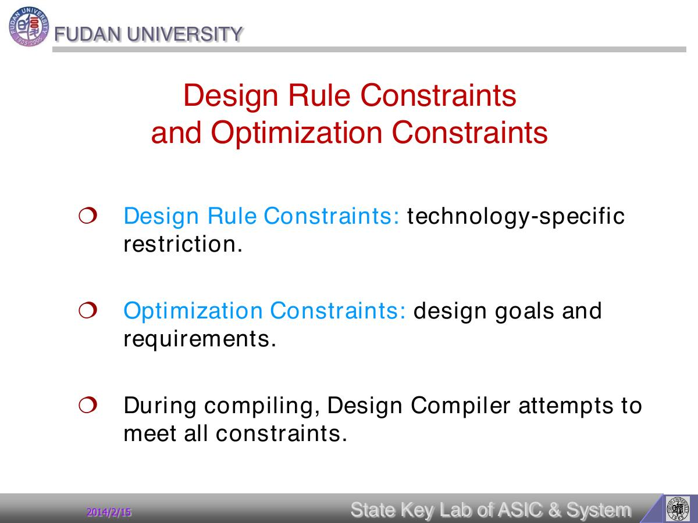

## 页面定位

- **页码**：44/112
- **所属阶段**：约束建模：设计规则、时序、面积和优先级
- **本页角色**：设置设计规则底线
- **阅读问题**：本页要回答：哪些约束是工艺规则底线，不能为了面积/速度牺牲？
- **前后关系**：这部分回答“工具必须满足什么”：硬性 design rule 与优化目标要分清。

## 原文要点

> - Design Rule Constraints: technology-specific
> restriction.
> - Optimization Constraints: design goals and
> requirements.
> - During compiling, Design Compiler attempts to
> meet all constraints.
> Design Rule Constraints
> and Optimization Constraints

## 原文解读

本页讲 design rule constraints。max transition、max capacitance、max fanout 这类约束通常来自工艺库限制，优先级高于面积/速度目标。

本页关联的关键对象/命令：`compile`

## 我的理解

我的理解是：design rule 是“不能违反”的底线，不是优化偏好。DC 会优先修 DRC，即使这让面积变大或局部时序变差。

把它放回完整 DC 流程里看，本页不是孤立知识点，而是在帮助我们更准确地描述“设计、环境、约束、优化结果”中的一个环节。读这一页时，我会优先问：它改变的是 DC 数据库里的哪个对象？它会让 compile 的优化空间变大还是变小？它最终应该在什么报告里被验证？

## 实操提醒

报告中若有 transition/cap/fanout violation，先修规则，再讨论 timing/area trade-off。

## 本页小结

本页的核心收获：- Design Rule Constraints: technology-specific 这一页应被理解为“设置设计规则底线”的读书笔记节点；掌握它的标准不是背下标题，而是能说明它如何影响后续约束、优化或 timing 报告。

## 导航

- 上一页：[Page 043](pages/page-043.md)
- 下一页：[Page 045](pages/page-045.md)

# Page 045 - Design Rule Constraints

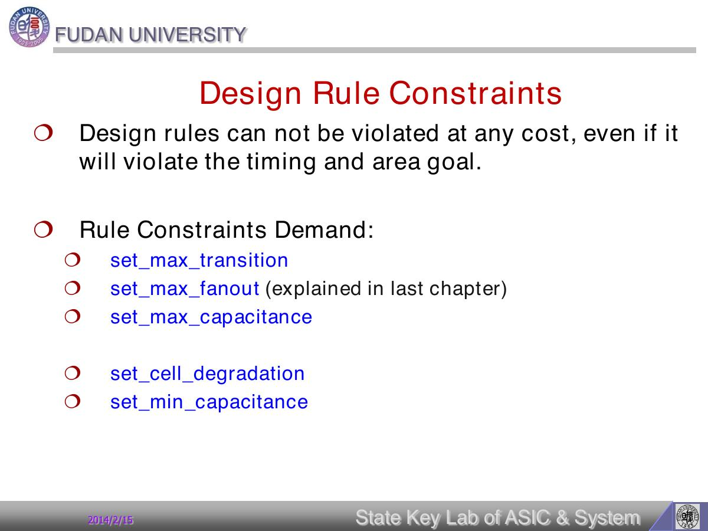

## 页面定位

- **页码**：45/112
- **所属阶段**：约束建模：设计规则、时序、面积和优先级
- **本页角色**：建模输出负载
- **阅读问题**：本页要回答：输出端外部负载如何建模？
- **前后关系**：这部分回答“工具必须满足什么”：硬性 design rule 与优化目标要分清。

## 原文要点

> Design Rule Constraints
> - Design rules can not be violated at any cost, even if it
> will violate the timing and area goal.
> - Rule Constraints Demand:
> - set_max_transition
> - set_max_fanout (explained in last chapter)
> - set_max_capacitance
> - set_cell_degradation
> - set_min_capacitance

## 原文解读

本页讲输出负载建模。`set_load` 给端口或 net 设置电容负载，影响输出 cell sizing、transition 和 delay。

本页关联的关键对象/命令：`set_max_fanout`, `set_max_transition`, `set_max_capacitance`

## 我的理解

我的理解是：输出端连接了外部逻辑，DC 必须知道要推动多重的负载；负载估小会得到乐观时序，估大会增加面积和功耗压力。

把它放回完整 DC 流程里看，本页不是孤立知识点，而是在帮助我们更准确地描述“设计、环境、约束、优化结果”中的一个环节。读这一页时，我会优先问：它改变的是 DC 数据库里的哪个对象？它会让 compile 的优化空间变大还是变小？它最终应该在什么报告里被验证？

## 实操提醒

对 output port 写约束时，把 pad、下游输入 pin、电容预算分别核清楚。

## 本页小结

本页的核心收获：Design Rule Constraints 这一页应被理解为“建模输出负载”的读书笔记节点；掌握它的标准不是背下标题，而是能说明它如何影响后续约束、优化或 timing 报告。

## 导航

- 上一页：[Page 044](pages/page-044.md)
- 下一页：[Page 046](pages/page-046.md)

# Page 046 - set_max_transition (ns)

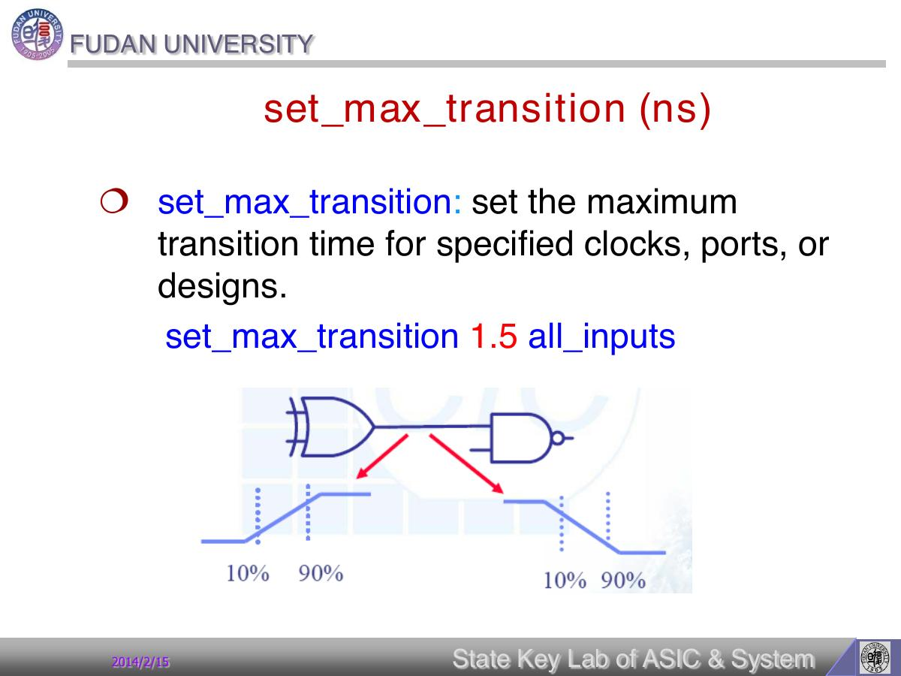

## 页面定位

- **页码**：46/112
- **所属阶段**：约束建模：设计规则、时序、面积和优先级
- **本页角色**：设置设计规则底线
- **阅读问题**：本页要回答：哪些约束是工艺规则底线，不能为了面积/速度牺牲？
- **前后关系**：这部分回答“工具必须满足什么”：硬性 design rule 与优化目标要分清。

## 原文要点

> set_max_transition (ns)
> - set_max_transition: set the maximum
> transition time for specified clocks, ports, or
> designs.
> set_max_transition 1.5 all_inputs

## 原文解读

本页讲 design rule constraints。max transition、max capacitance、max fanout 这类约束通常来自工艺库限制，优先级高于面积/速度目标。

本页关联的关键对象/命令：`set_max_transition`

## 我的理解

我的理解是：design rule 是“不能违反”的底线，不是优化偏好。DC 会优先修 DRC，即使这让面积变大或局部时序变差。

把它放回完整 DC 流程里看，本页不是孤立知识点，而是在帮助我们更准确地描述“设计、环境、约束、优化结果”中的一个环节。读这一页时，我会优先问：它改变的是 DC 数据库里的哪个对象？它会让 compile 的优化空间变大还是变小？它最终应该在什么报告里被验证？

## 实操提醒

报告中若有 transition/cap/fanout violation，先修规则，再讨论 timing/area trade-off。

## 本页小结

本页的核心收获：set_max_transition (ns) 这一页应被理解为“设置设计规则底线”的读书笔记节点；掌握它的标准不是背下标题，而是能说明它如何影响后续约束、优化或 timing 报告。

## 导航

- 上一页：[Page 045](pages/page-045.md)
- 下一页：[Page 047](pages/page-047.md)

# Page 047 - set_max_transition (ns)

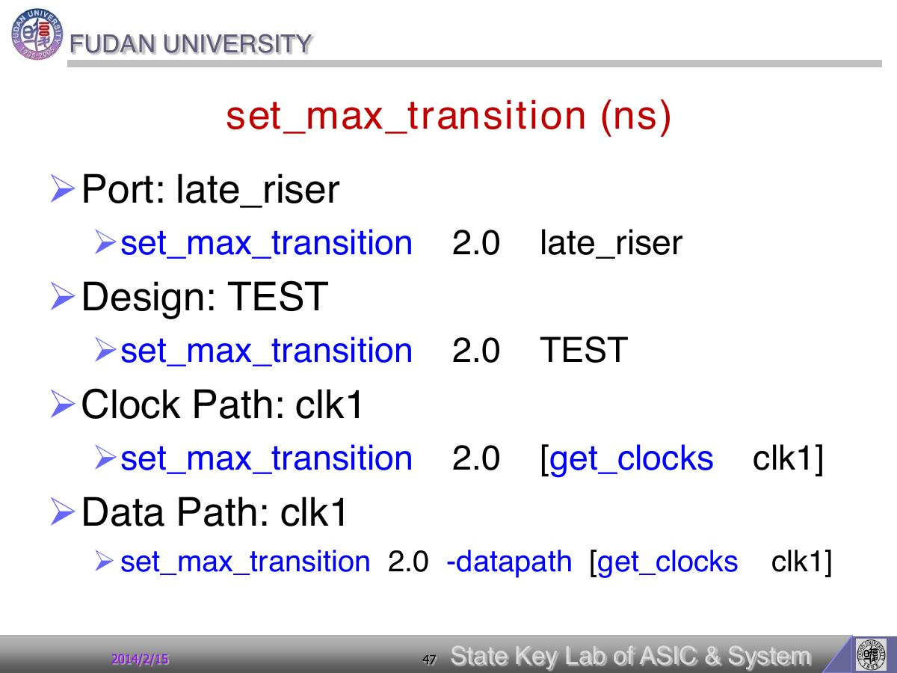

## 页面定位

- **页码**：47/112
- **所属阶段**：约束建模：设计规则、时序、面积和优先级
- **本页角色**：设置设计规则底线
- **阅读问题**：本页要回答：哪些约束是工艺规则底线，不能为了面积/速度牺牲？
- **前后关系**：这部分回答“工具必须满足什么”：硬性 design rule 与优化目标要分清。

## 原文要点

> set_max_transition (ns)
> -Port: late_riser
> -set_max_transition 2.0 late_riser
> -Design: TEST
> -set_max_transition 2.0 TEST
> -Clock Path: clk1
> -set_max_transition 2.0 [get_clocks clk1]
> -Data Path: clk1
> - set_max_transition 2.0 -datapath [get_clocks clk1]

## 原文解读

本页讲 design rule constraints。max transition、max capacitance、max fanout 这类约束通常来自工艺库限制，优先级高于面积/速度目标。

本页关联的关键对象/命令：`set_max_transition`

## 我的理解

我的理解是：design rule 是“不能违反”的底线，不是优化偏好。DC 会优先修 DRC，即使这让面积变大或局部时序变差。

把它放回完整 DC 流程里看，本页不是孤立知识点，而是在帮助我们更准确地描述“设计、环境、约束、优化结果”中的一个环节。读这一页时，我会优先问：它改变的是 DC 数据库里的哪个对象？它会让 compile 的优化空间变大还是变小？它最终应该在什么报告里被验证？

## 实操提醒

报告中若有 transition/cap/fanout violation，先修规则，再讨论 timing/area trade-off。

## 本页小结

本页的核心收获：set_max_transition (ns) 这一页应被理解为“设置设计规则底线”的读书笔记节点；掌握它的标准不是背下标题，而是能说明它如何影响后续约束、优化或 timing 报告。

## 导航

- 上一页：[Page 046](pages/page-046.md)
- 下一页：[Page 048](pages/page-048.md)

# Page 048 - clock path & data path

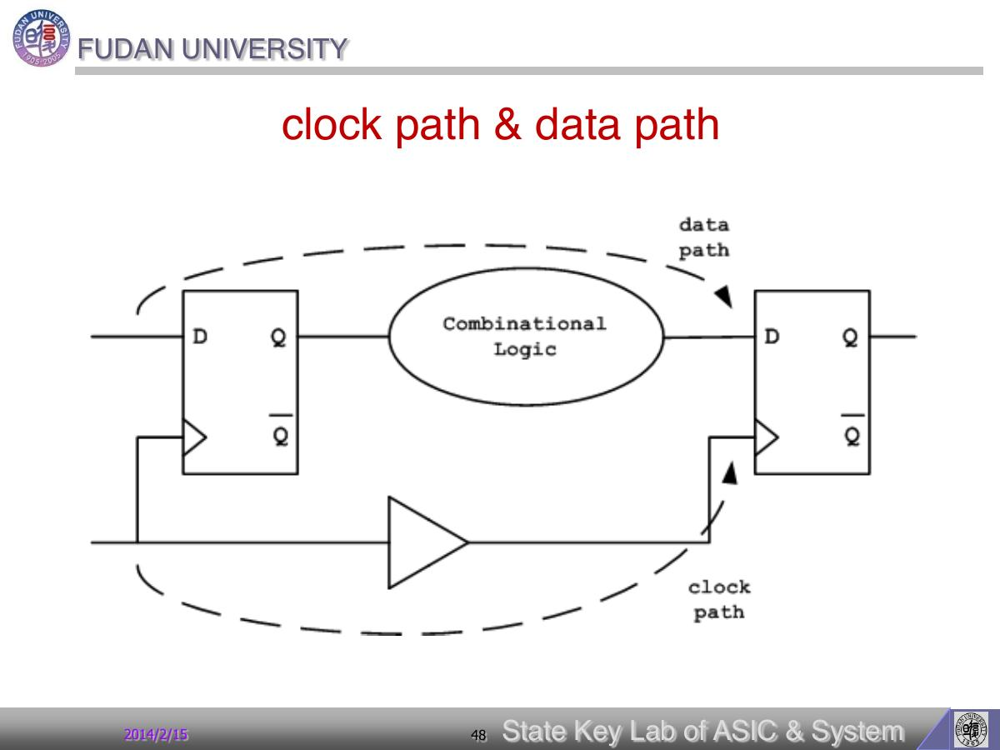

## 页面定位

- **页码**：48/112
- **所属阶段**：约束建模：设计规则、时序、面积和优先级
- **本页角色**：流程节点说明
- **阅读问题**：本页要回答：这个概念/命令在流程中解决什么问题？
- **前后关系**：这部分回答“工具必须满足什么”：硬性 design rule 与优化目标要分清。

## 原文要点

> clock path & data path

## 原文解读

本页区分 clock path 和 data path。STA 中 arrival/required 的计算就是围绕这两类路径展开。

本页关联的关键对象/命令：本页以概念/图示为主，重点看标题和图中对象关系。

## 我的理解

我的理解是：data path 决定数据什么时候到，clock path 决定什么时候采样；setup/hold 的本质是二者之间的相对关系。

把它放回完整 DC 流程里看，本页不是孤立知识点，而是在帮助我们更准确地描述“设计、环境、约束、优化结果”中的一个环节。读这一页时，我会优先问：它改变的是 DC 数据库里的哪个对象？它会让 compile 的优化空间变大还是变小？它最终应该在什么报告里被验证？

## 实操提醒

读时序图时先用两种颜色标出 clock path 和 data path。

## 本页小结

本页的核心收获：clock path & data path 这一页应被理解为“流程节点说明”的读书笔记节点；掌握它的标准不是背下标题，而是能说明它如何影响后续约束、优化或 timing 报告。

## 导航

- 上一页：[Page 047](pages/page-047.md)
- 下一页：[Page 049](pages/page-049.md)

# Page 049 - set_max_capacitance

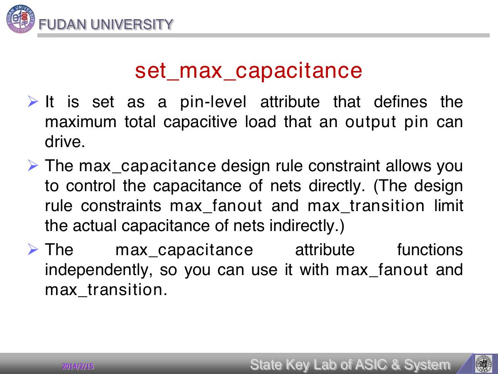

## 页面定位

- **页码**：49/112
- **所属阶段**：约束建模：设计规则、时序、面积和优先级
- **本页角色**：建模输出负载
- **阅读问题**：本页要回答：输出端外部负载如何建模？
- **前后关系**：这部分回答“工具必须满足什么”：硬性 design rule 与优化目标要分清。

## 原文要点

> set_max_capacitance
> - It is set as a pin-level attribute that defines the
> maximum total capacitive load that an output pin can
> drive.
> - The max_capacitance design rule constraint allows you
> to control the capacitance of nets directly. (The design
> rule constraints max_fanout and max_transition limit
> the actual capacitance of nets indirectly.)
> - The max_capacitance attribute functions
> independently, so you can use it with max_fanout and
> max_transition.

## 原文解读

本页讲输出负载建模。`set_load` 给端口或 net 设置电容负载，影响输出 cell sizing、transition 和 delay。

本页关联的关键对象/命令：`set_max_capacitance`

## 我的理解

我的理解是：输出端连接了外部逻辑，DC 必须知道要推动多重的负载；负载估小会得到乐观时序，估大会增加面积和功耗压力。

把它放回完整 DC 流程里看，本页不是孤立知识点，而是在帮助我们更准确地描述“设计、环境、约束、优化结果”中的一个环节。读这一页时，我会优先问：它改变的是 DC 数据库里的哪个对象？它会让 compile 的优化空间变大还是变小？它最终应该在什么报告里被验证？

## 实操提醒

对 output port 写约束时，把 pad、下游输入 pin、电容预算分别核清楚。

## 本页小结

本页的核心收获：set_max_capacitance 这一页应被理解为“建模输出负载”的读书笔记节点；掌握它的标准不是背下标题，而是能说明它如何影响后续约束、优化或 timing 报告。

## 导航

- 上一页：[Page 048](pages/page-048.md)
- 下一页：[Page 050](pages/page-050.md)

# Page 050 - set_max_capacitance

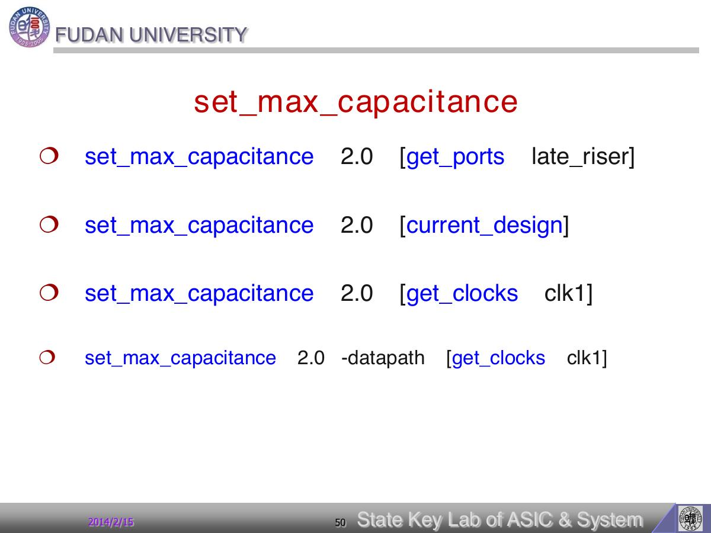

## 页面定位

- **页码**：50/112
- **所属阶段**：约束建模：设计规则、时序、面积和优先级
- **本页角色**：建模输出负载
- **阅读问题**：本页要回答：输出端外部负载如何建模？
- **前后关系**：这部分回答“工具必须满足什么”：硬性 design rule 与优化目标要分清。

## 原文要点

> set_max_capacitance
> - set_max_capacitance 2.0 [get_ports late_riser]
> - set_max_capacitance 2.0 [current_design]
> - set_max_capacitance 2.0 [get_clocks clk1]
> - set_max_capacitance 2.0 -datapath [get_clocks clk1]

## 原文解读

本页讲输出负载建模。`set_load` 给端口或 net 设置电容负载，影响输出 cell sizing、transition 和 delay。

本页关联的关键对象/命令：`set_max_capacitance`

## 我的理解

我的理解是：输出端连接了外部逻辑，DC 必须知道要推动多重的负载；负载估小会得到乐观时序，估大会增加面积和功耗压力。

把它放回完整 DC 流程里看，本页不是孤立知识点，而是在帮助我们更准确地描述“设计、环境、约束、优化结果”中的一个环节。读这一页时，我会优先问：它改变的是 DC 数据库里的哪个对象？它会让 compile 的优化空间变大还是变小？它最终应该在什么报告里被验证？

## 实操提醒

对 output port 写约束时，把 pad、下游输入 pin、电容预算分别核清楚。

## 本页小结

本页的核心收获：set_max_capacitance 这一页应被理解为“建模输出负载”的读书笔记节点；掌握它的标准不是背下标题，而是能说明它如何影响后续约束、优化或 timing 报告。

## 导航

- 上一页：[Page 049](pages/page-049.md)
- 下一页：[Page 051](pages/page-051.md)

# Page 051 - Summary of Design Rule Commands and

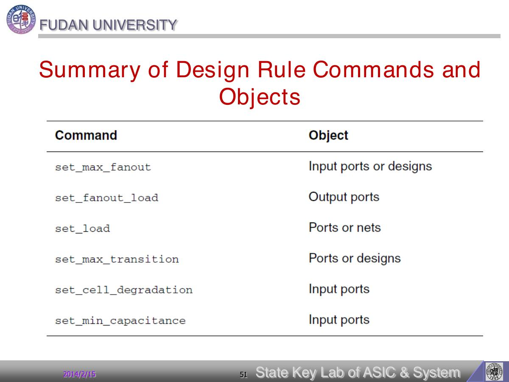

## 页面定位

- **页码**：51/112
- **所属阶段**：约束建模：设计规则、时序、面积和优先级
- **本页角色**：设置设计规则底线
- **阅读问题**：本页要回答：哪些约束是工艺规则底线，不能为了面积/速度牺牲？
- **前后关系**：这部分回答“工具必须满足什么”：硬性 design rule 与优化目标要分清。

## 原文要点

> Summary of Design Rule Commands and
> Objects

## 原文解读

本页讲 design rule constraints。max transition、max capacitance、max fanout 这类约束通常来自工艺库限制，优先级高于面积/速度目标。

本页关联的关键对象/命令：本页以概念/图示为主，重点看标题和图中对象关系。

## 我的理解

我的理解是：design rule 是“不能违反”的底线，不是优化偏好。DC 会优先修 DRC，即使这让面积变大或局部时序变差。

把它放回完整 DC 流程里看，本页不是孤立知识点，而是在帮助我们更准确地描述“设计、环境、约束、优化结果”中的一个环节。读这一页时，我会优先问：它改变的是 DC 数据库里的哪个对象？它会让 compile 的优化空间变大还是变小？它最终应该在什么报告里被验证？

## 实操提醒

报告中若有 transition/cap/fanout violation，先修规则，再讨论 timing/area trade-off。

## 本页小结

本页的核心收获：Summary of Design Rule Commands and 这一页应被理解为“设置设计规则底线”的读书笔记节点；掌握它的标准不是背下标题，而是能说明它如何影响后续约束、优化或 timing 报告。

## 导航

- 上一页：[Page 050](pages/page-050.md)
- 下一页：[Page 052](pages/page-052.md)

# Page 052 - Optimization Constraints

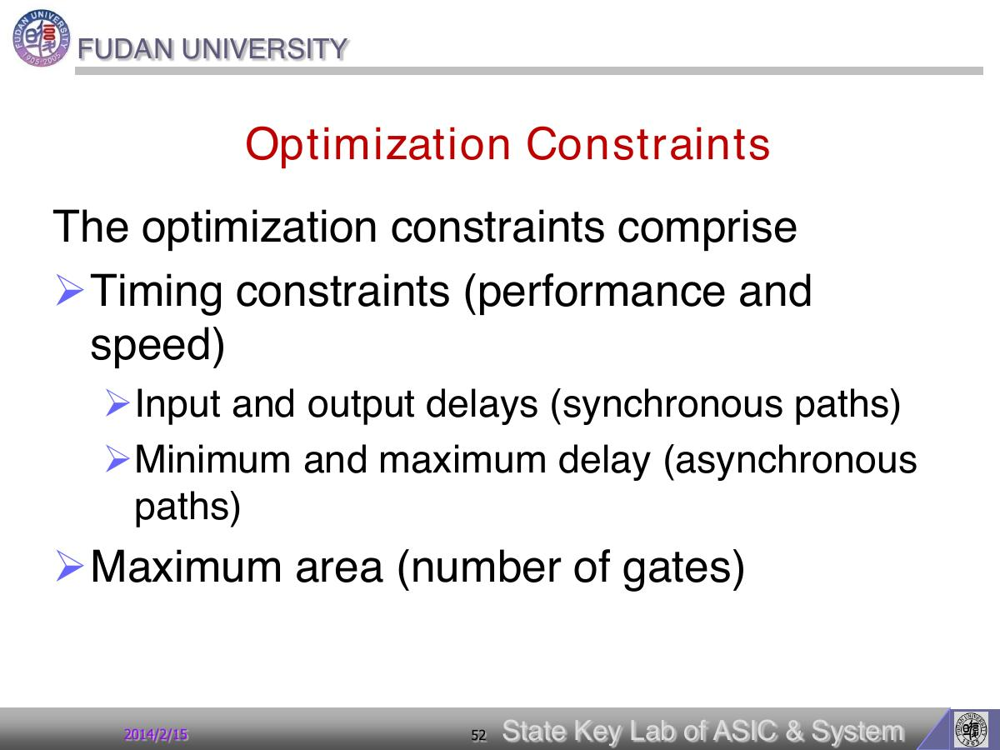

## 页面定位

- **页码**：52/112
- **所属阶段**：约束建模：设计规则、时序、面积和优先级
- **本页角色**：理解优化目标和优先级
- **阅读问题**：本页要回答：这个概念/命令在流程中解决什么问题？
- **前后关系**：这部分回答“工具必须满足什么”：硬性 design rule 与优化目标要分清。

## 原文要点

> Optimization Constraints
> The optimization constraints comprise
> -Timing constraints (performance and
> speed)
> -Input and output delays (synchronous paths)
> -Minimum and maximum delay (asynchronous
> paths)
> -Maximum area (number of gates)

## 原文解读

本页讲 area constraint 和约束优先级。DC 优化时会按优先级处理：设计规则约束优先，其次是时序，再到面积等目标。

本页关联的关键对象/命令：本页以概念/图示为主，重点看标题和图中对象关系。

## 我的理解

我的理解是：面积约束不是孤立目标，它总是在 DRC 和 timing 之后被权衡。若时序很紧，面积增长往往是工具换取速度的代价。

把它放回完整 DC 流程里看，本页不是孤立知识点，而是在帮助我们更准确地描述“设计、环境、约束、优化结果”中的一个环节。读这一页时，我会优先问：它改变的是 DC 数据库里的哪个对象？它会让 compile 的优化空间变大还是变小？它最终应该在什么报告里被验证？

## 实操提醒

看 compile 结果时，不要只看 area 是否下降，也要同时确认 DRC 和 timing 是否已经满足。

## 本页小结

本页的核心收获：Optimization Constraints 这一页应被理解为“理解优化目标和优先级”的读书笔记节点；掌握它的标准不是背下标题，而是能说明它如何影响后续约束、优化或 timing 报告。

## 导航

- 上一页：[Page 051](pages/page-051.md)
- 下一页：[Page 053](pages/page-053.md)

# Page 053 - Timing Constraints

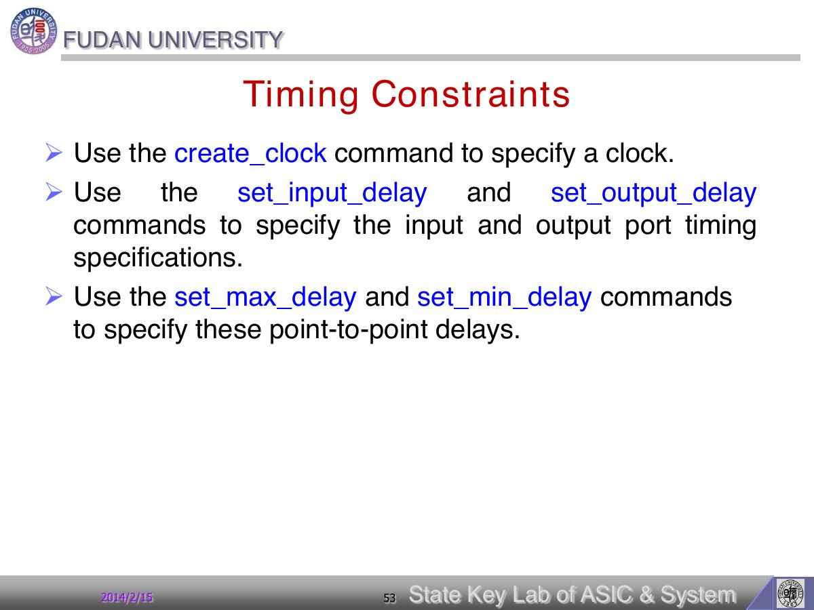

## 页面定位

- **页码**：53/112
- **所属阶段**：约束建模：设计规则、时序、面积和优先级
- **本页角色**：设置时序预算
- **阅读问题**：本页要回答：时钟和 I/O 时间预算如何写进 DC？
- **前后关系**：这部分回答“工具必须满足什么”：硬性 design rule 与优化目标要分清。

## 原文要点

> Timing Constraints
> - Use the create_clock command to specify a clock.
> - Use the set_input_delay and set_output_delay
> commands to specify the input and output port timing
> specifications.
> - Use the set_max_delay and set_min_delay commands
> to specify these point-to-point delays.

## 原文解读

本页讲 timing constraint。`create_clock` 建立时序坐标系，`set_input_delay/set_output_delay` 描述模块边界外部逻辑占用的时间，`set_max_delay/set_min_delay` 可直接约束路径。

本页关联的关键对象/命令：`create_clock`, `set_input_delay`, `set_output_delay`, `set_max_delay`, `set_min_delay`

## 我的理解

我的理解是：时序约束的本质是分配时间预算。DC 优化的是“当前模块内部还能使用多少时间”，而不是凭空知道系统级时序。

把它放回完整 DC 流程里看，本页不是孤立知识点，而是在帮助我们更准确地描述“设计、环境、约束、优化结果”中的一个环节。读这一页时，我会优先问：它改变的是 DC 数据库里的哪个对象？它会让 compile 的优化空间变大还是变小？它最终应该在什么报告里被验证？

## 实操提醒

写 I/O delay 时要明确 launch/capture clock、外部组合逻辑、setup/hold 关系，避免把外部预算留给内部使用。

## 本页小结

本页的核心收获：Timing Constraints 这一页应被理解为“设置时序预算”的读书笔记节点；掌握它的标准不是背下标题，而是能说明它如何影响后续约束、优化或 timing 报告。

## 导航

- 上一页：[Page 052](pages/page-052.md)
- 下一页：[Page 054](pages/page-054.md)

# Page 054 - create_clock

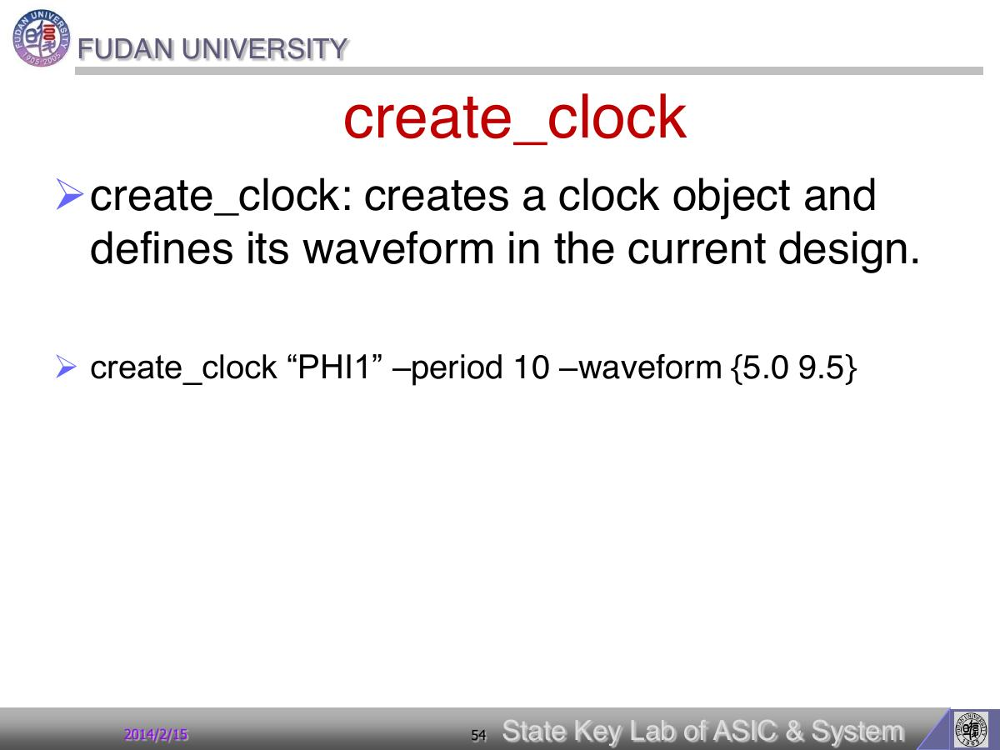

## 页面定位

- **页码**：54/112
- **所属阶段**：约束建模：设计规则、时序、面积和优先级
- **本页角色**：设置时序预算
- **阅读问题**：本页要回答：时钟和 I/O 时间预算如何写进 DC？
- **前后关系**：这部分回答“工具必须满足什么”：硬性 design rule 与优化目标要分清。

## 原文要点

> create_clock
> -create_clock: creates a clock object and
> defines its waveform in the current design.
> - create_clock “PHI1” –period 10 –waveform {5.0 9.5}

## 原文解读

本页讲 timing constraint。`create_clock` 建立时序坐标系，`set_input_delay/set_output_delay` 描述模块边界外部逻辑占用的时间，`set_max_delay/set_min_delay` 可直接约束路径。

本页关联的关键对象/命令：`create_clock`

## 我的理解

我的理解是：时序约束的本质是分配时间预算。DC 优化的是“当前模块内部还能使用多少时间”，而不是凭空知道系统级时序。

把它放回完整 DC 流程里看，本页不是孤立知识点，而是在帮助我们更准确地描述“设计、环境、约束、优化结果”中的一个环节。读这一页时，我会优先问：它改变的是 DC 数据库里的哪个对象？它会让 compile 的优化空间变大还是变小？它最终应该在什么报告里被验证？

## 实操提醒

写 I/O delay 时要明确 launch/capture clock、外部组合逻辑、setup/hold 关系，避免把外部预算留给内部使用。

## 本页小结

本页的核心收获：create_clock 这一页应被理解为“设置时序预算”的读书笔记节点；掌握它的标准不是背下标题，而是能说明它如何影响后续约束、优化或 timing 报告。

## 导航

- 上一页：[Page 053](pages/page-053.md)
- 下一页：[Page 055](pages/page-055.md)

# Page 055 - set_input_delay

## 页面定位

- **页码**：55/112
- **所属阶段**：约束建模：设计规则、时序、面积和优先级
- **本页角色**：设置时序预算
- **阅读问题**：本页要回答：时钟和 I/O 时间预算如何写进 DC？
- **前后关系**：这部分回答“工具必须满足什么”：硬性 design rule 与优化目标要分清。

## 原文要点

> set_input_delay

## 原文解读

本页用图说明 `set_input_delay`：外部 launch 触发器到当前模块输入端之间已经消耗了 `Tclk-q + TM`，这些时间要从周期预算中扣掉。

本页关联的关键对象/命令：`set_input_delay`

## 我的理解

我的理解是：input delay 不是当前模块内部延迟，而是模块外部已经花掉的时间。设得太小会让内部预算虚高，设得太大会让优化压力变大。

把它放回完整 DC 流程里看，本页不是孤立知识点，而是在帮助我们更准确地描述“设计、环境、约束、优化结果”中的一个环节。读这一页时，我会优先问：它改变的是 DC 数据库里的哪个对象？它会让 compile 的优化空间变大还是变小？它最终应该在什么报告里被验证？

## 实操提醒

对输入端口约束时，要确认外部寄存器、外部组合逻辑和 capture clock 是否与图中一致。

## 本页小结

本页的核心收获：set_input_delay 这一页应被理解为“设置时序预算”的读书笔记节点；掌握它的标准不是背下标题，而是能说明它如何影响后续约束、优化或 timing 报告。

## 导航

- 上一页：[Page 054](pages/page-054.md)
- 下一页：[Page 056](pages/page-056.md)

# Page 056 - set_output_delay

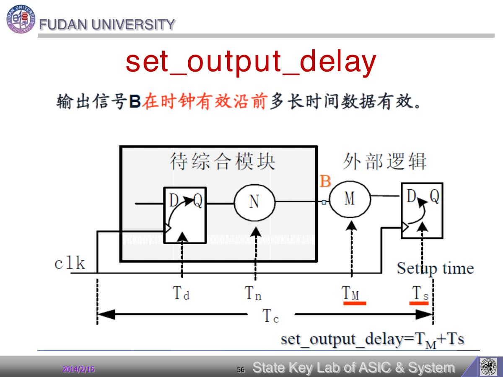

## 页面定位

- **页码**：56/112
- **所属阶段**：约束建模：设计规则、时序、面积和优先级
- **本页角色**：设置时序预算
- **阅读问题**：本页要回答：时钟和 I/O 时间预算如何写进 DC？
- **前后关系**：这部分回答“工具必须满足什么”：硬性 design rule 与优化目标要分清。

## 原文要点

> set_output_delay

## 原文解读

本页用图说明 `set_output_delay`：当前模块输出到下游寄存器之间还需要预留外部逻辑和 setup 时间。

本页关联的关键对象/命令：`set_output_delay`

## 我的理解

我的理解是：output delay 告诉 DC 不能把整个周期都花在当前模块内部，必须给下游逻辑和采样要求留时间。

把它放回完整 DC 流程里看，本页不是孤立知识点，而是在帮助我们更准确地描述“设计、环境、约束、优化结果”中的一个环节。读这一页时，我会优先问：它改变的是 DC 数据库里的哪个对象？它会让 compile 的优化空间变大还是变小？它最终应该在什么报告里被验证？

## 实操提醒

对输出端口约束时，要确认下游模块的 setup、外部组合逻辑和 capture edge。

## 本页小结

本页的核心收获：set_output_delay 这一页应被理解为“设置时序预算”的读书笔记节点；掌握它的标准不是背下标题，而是能说明它如何影响后续约束、优化或 timing 报告。

## 导航

- 上一页：[Page 055](pages/page-055.md)
- 下一页：[Page 057](pages/page-057.md)

# Page 057 - set_max_delay & set_min_delay

## 页面定位

- **页码**：57/112
- **所属阶段**：约束建模：设计规则、时序、面积和优先级
- **本页角色**：设置时序预算
- **阅读问题**：本页要回答：时钟和 I/O 时间预算如何写进 DC？
- **前后关系**：这部分回答“工具必须满足什么”：硬性 design rule 与优化目标要分清。

## 原文要点

> set_max_delay & set_min_delay
> -set_max_delay: Specifies a maximum
> delay target for path in the current design.
> -set_max_delay 10.0 -to {Y}
> -set_max_delay 15.0 -from {ff1a ff1b} \
> -through {u1} -to {ff2e}
> -set_max_delay 8.5 -to [get_clocks PHI2]
> -set_min_delay 12.5 –through U1 –to Y
> -set_min_delay 4.0 –from {A1 A2} –to Z5

## 原文解读

本页讲 timing constraint。`create_clock` 建立时序坐标系，`set_input_delay/set_output_delay` 描述模块边界外部逻辑占用的时间，`set_max_delay/set_min_delay` 可直接约束路径。

本页关联的关键对象/命令：`set_max_delay`, `set_min_delay`

## 我的理解

我的理解是：时序约束的本质是分配时间预算。DC 优化的是“当前模块内部还能使用多少时间”，而不是凭空知道系统级时序。

把它放回完整 DC 流程里看，本页不是孤立知识点，而是在帮助我们更准确地描述“设计、环境、约束、优化结果”中的一个环节。读这一页时，我会优先问：它改变的是 DC 数据库里的哪个对象？它会让 compile 的优化空间变大还是变小？它最终应该在什么报告里被验证？

## 实操提醒

写 I/O delay 时要明确 launch/capture clock、外部组合逻辑、setup/hold 关系，避免把外部预算留给内部使用。

## 本页小结

本页的核心收获：set_max_delay & set_min_delay 这一页应被理解为“设置时序预算”的读书笔记节点；掌握它的标准不是背下标题，而是能说明它如何影响后续约束、优化或 timing 报告。

## 导航

- 上一页：[Page 056](pages/page-056.md)
- 下一页：[Page 058](pages/page-058.md)

# Page 058 - Optimization Constraints

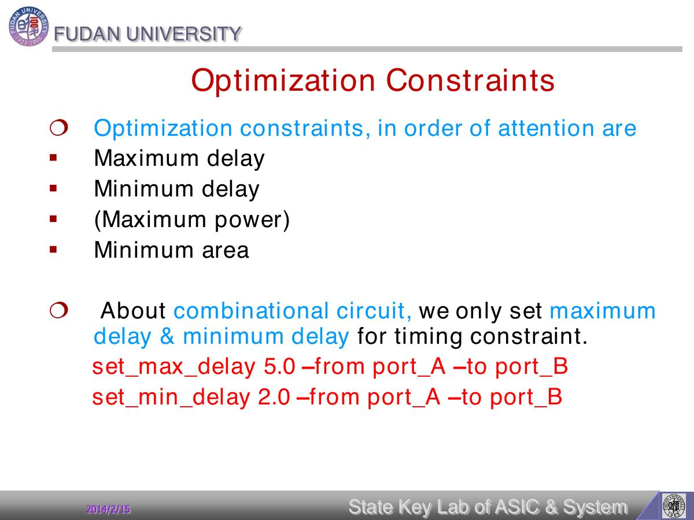

## 页面定位

- **页码**：58/112
- **所属阶段**：约束建模：设计规则、时序、面积和优先级
- **本页角色**：设置时序预算
- **阅读问题**：本页要回答：时钟和 I/O 时间预算如何写进 DC？
- **前后关系**：这部分回答“工具必须满足什么”：硬性 design rule 与优化目标要分清。

## 原文要点

> Optimization Constraints
> - Optimization constraints, in order of attention are
> - Maximum delay
> - Minimum delay
> - (Maximum power)
> - Minimum area
> - About combinational circuit, we only set maximum
> delay & minimum delay for timing constraint.
> set_max_delay 5.0 –from port_A –to port_B
> set_min_delay 2.0 –from port_A –to port_B

## 原文解读

本页讲 timing constraint。`create_clock` 建立时序坐标系，`set_input_delay/set_output_delay` 描述模块边界外部逻辑占用的时间，`set_max_delay/set_min_delay` 可直接约束路径。

本页关联的关键对象/命令：`set_max_delay`, `set_min_delay`

## 我的理解

我的理解是：时序约束的本质是分配时间预算。DC 优化的是“当前模块内部还能使用多少时间”，而不是凭空知道系统级时序。

把它放回完整 DC 流程里看，本页不是孤立知识点，而是在帮助我们更准确地描述“设计、环境、约束、优化结果”中的一个环节。读这一页时，我会优先问：它改变的是 DC 数据库里的哪个对象？它会让 compile 的优化空间变大还是变小？它最终应该在什么报告里被验证？

## 实操提醒

写 I/O delay 时要明确 launch/capture clock、外部组合逻辑、setup/hold 关系，避免把外部预算留给内部使用。

## 本页小结

本页的核心收获：Optimization Constraints 这一页应被理解为“设置时序预算”的读书笔记节点；掌握它的标准不是背下标题，而是能说明它如何影响后续约束、优化或 timing 报告。

## 导航

- 上一页：[Page 057](pages/page-057.md)
- 下一页：[Page 059](pages/page-059.md)

# Page 059 - Timing Constraints for Sequential

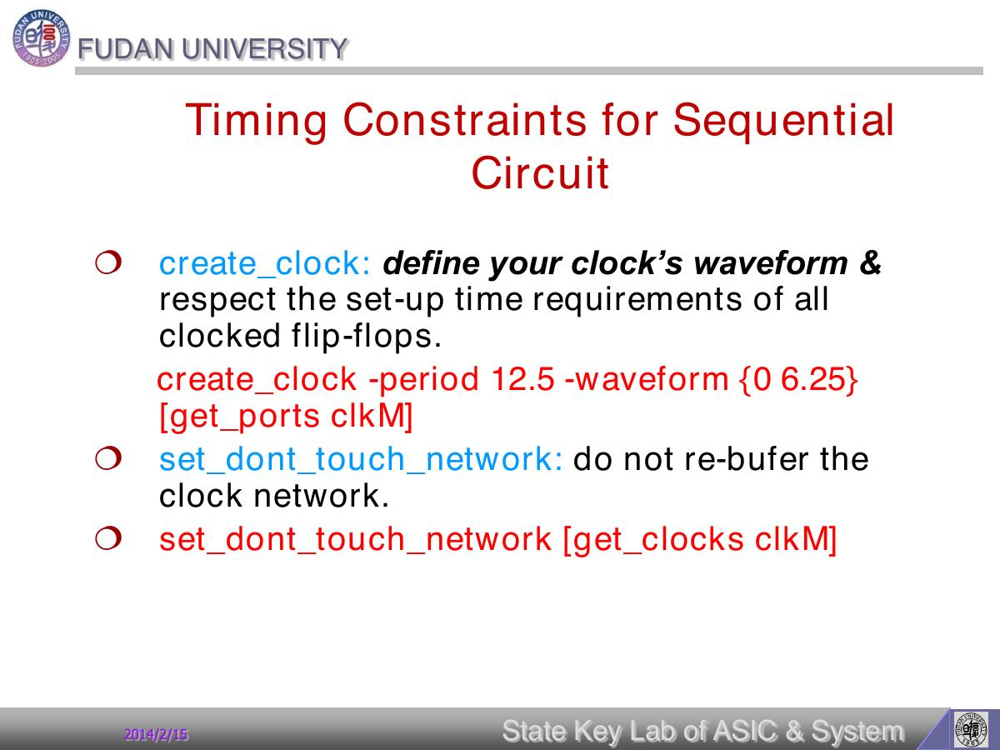

## 页面定位

- **页码**：59/112
- **所属阶段**：约束建模：设计规则、时序、面积和优先级
- **本页角色**：设置时序预算
- **阅读问题**：本页要回答：时钟和 I/O 时间预算如何写进 DC？
- **前后关系**：这部分回答“工具必须满足什么”：硬性 design rule 与优化目标要分清。

## 原文要点

> Timing Constraints for Sequential
> Circuit
> - create_clock: define your clock’s waveform &
> respect the set-up time requirements of all
> clocked flip-flops.
> create_clock -period 12.5 -waveform {0 6.25}
> [get_ports clkM]
> - set_dont_touch_network: do not re-bufer the
> clock network.
> - set_dont_touch_network [get_clocks clkM]

## 原文解读

本页讲 timing constraint。`create_clock` 建立时序坐标系，`set_input_delay/set_output_delay` 描述模块边界外部逻辑占用的时间，`set_max_delay/set_min_delay` 可直接约束路径。

本页关联的关键对象/命令：`create_clock`

## 我的理解

我的理解是：时序约束的本质是分配时间预算。DC 优化的是“当前模块内部还能使用多少时间”，而不是凭空知道系统级时序。

把它放回完整 DC 流程里看，本页不是孤立知识点，而是在帮助我们更准确地描述“设计、环境、约束、优化结果”中的一个环节。读这一页时，我会优先问：它改变的是 DC 数据库里的哪个对象？它会让 compile 的优化空间变大还是变小？它最终应该在什么报告里被验证？

## 实操提醒

写 I/O delay 时要明确 launch/capture clock、外部组合逻辑、setup/hold 关系，避免把外部预算留给内部使用。

## 本页小结

本页的核心收获：Timing Constraints for Sequential 这一页应被理解为“设置时序预算”的读书笔记节点；掌握它的标准不是背下标题，而是能说明它如何影响后续约束、优化或 timing 报告。

## 导航

- 上一页：[Page 058](pages/page-058.md)
- 下一页：[Page 060](pages/page-060.md)

# Page 060 - Setting Area Constraint

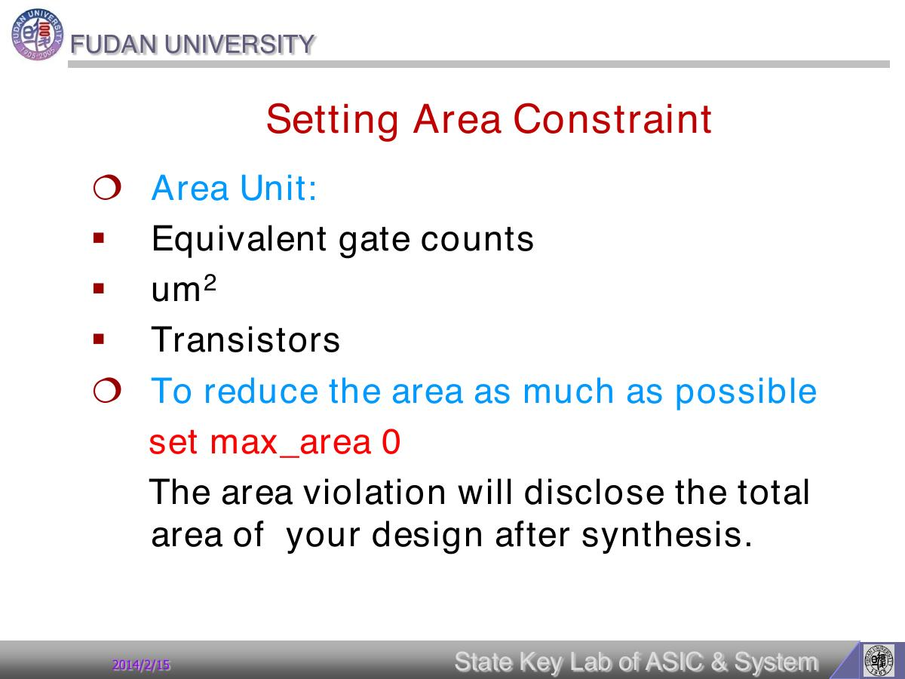

## 页面定位

- **页码**：60/112
- **所属阶段**：约束建模：设计规则、时序、面积和优先级
- **本页角色**：理解优化目标和优先级
- **阅读问题**：本页要回答：这个概念/命令在流程中解决什么问题？
- **前后关系**：这部分回答“工具必须满足什么”：硬性 design rule 与优化目标要分清。

## 原文要点

> Setting Area Constraint
> - Area Unit:
> - Equivalent gate counts
> - um2
> - Transistors
> - To reduce the area as much as possible
> set max_area 0
> The area violation will disclose the total
> area of your design after synthesis.

## 原文解读

本页讲 area constraint 和约束优先级。DC 优化时会按优先级处理：设计规则约束优先，其次是时序，再到面积等目标。

本页关联的关键对象/命令：本页以概念/图示为主，重点看标题和图中对象关系。

## 我的理解

我的理解是：面积约束不是孤立目标，它总是在 DRC 和 timing 之后被权衡。若时序很紧，面积增长往往是工具换取速度的代价。

把它放回完整 DC 流程里看，本页不是孤立知识点，而是在帮助我们更准确地描述“设计、环境、约束、优化结果”中的一个环节。读这一页时，我会优先问：它改变的是 DC 数据库里的哪个对象？它会让 compile 的优化空间变大还是变小？它最终应该在什么报告里被验证？

## 实操提醒

看 compile 结果时，不要只看 area 是否下降，也要同时确认 DRC 和 timing 是否已经满足。

## 本页小结

本页的核心收获：Setting Area Constraint 这一页应被理解为“理解优化目标和优先级”的读书笔记节点；掌握它的标准不是背下标题，而是能说明它如何影响后续约束、优化或 timing 报告。

## 导航

- 上一页：[Page 059](pages/page-059.md)
- 下一页：[Page 061](pages/page-061.md)

# Page 061 - Constraints Priority

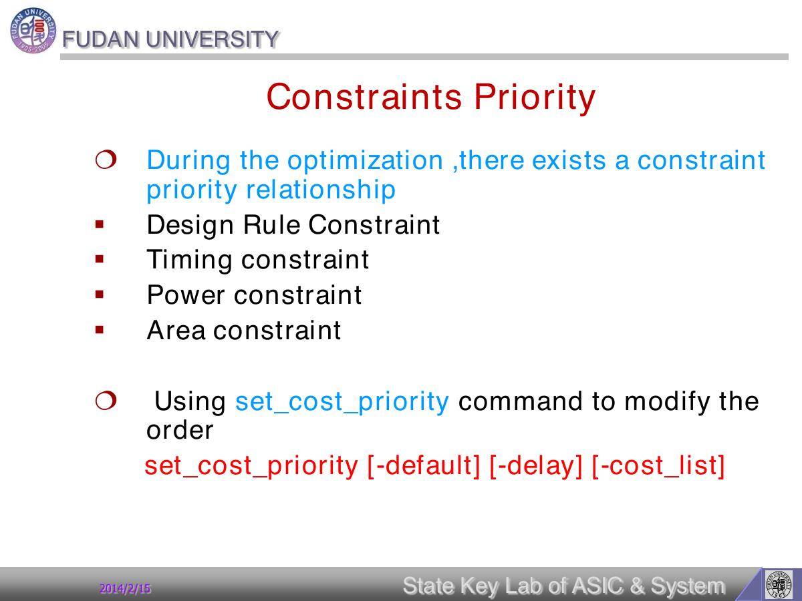

## 页面定位

- **页码**：61/112
- **所属阶段**：约束建模：设计规则、时序、面积和优先级
- **本页角色**：设置设计规则底线
- **阅读问题**：本页要回答：哪些约束是工艺规则底线，不能为了面积/速度牺牲？
- **前后关系**：这部分回答“工具必须满足什么”：硬性 design rule 与优化目标要分清。

## 原文要点

> Constraints Priority
> - During the optimization ,there exists a constraint
> priority relationship
> - Design Rule Constraint
> - Timing constraint
> - Power constraint
> - Area constraint
> - Using set_cost_priority command to modify the
> order
> set_cost_priority [-default] [-delay] [-cost_list]

## 原文解读

本页讲 design rule constraints。max transition、max capacitance、max fanout 这类约束通常来自工艺库限制，优先级高于面积/速度目标。

本页关联的关键对象/命令：本页以概念/图示为主，重点看标题和图中对象关系。

## 我的理解

我的理解是：design rule 是“不能违反”的底线，不是优化偏好。DC 会优先修 DRC，即使这让面积变大或局部时序变差。

把它放回完整 DC 流程里看，本页不是孤立知识点，而是在帮助我们更准确地描述“设计、环境、约束、优化结果”中的一个环节。读这一页时，我会优先问：它改变的是 DC 数据库里的哪个对象？它会让 compile 的优化空间变大还是变小？它最终应该在什么报告里被验证？

## 实操提醒

报告中若有 transition/cap/fanout violation，先修规则，再讨论 timing/area trade-off。

## 本页小结

本页的核心收获：Constraints Priority 这一页应被理解为“设置设计规则底线”的读书笔记节点；掌握它的标准不是背下标题，而是能说明它如何影响后续约束、优化或 timing 报告。

## 导航

- 上一页：[Page 060](pages/page-060.md)
- 下一页：[Page 062](pages/page-062.md)

# Page 062 - Mapping and optimization transition

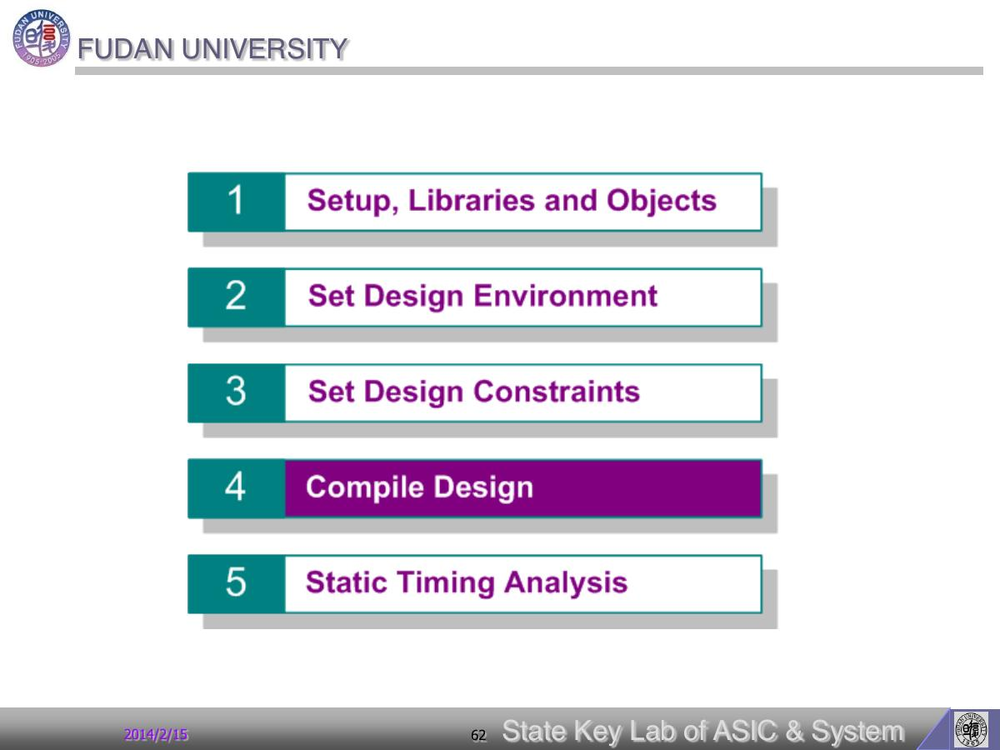

## 页面定位

- **页码**：62/112
- **所属阶段**：约束建模：设计规则、时序、面积和优先级
- **本页角色**：执行优化和映射
- **阅读问题**：本页要回答：DC 如何从逻辑表达变成目标库门级实现？
- **前后关系**：这部分回答“工具必须满足什么”：硬性 design rule 与优化目标要分清。

## 原文要点

> 本页 OCR 可抽取文本为空或很少，解读主要依据页面标题、页码位置和单页图像。

## 原文解读

这页承接约束优先级，转入“如何 map 和 optimize”。

本页关联的关键对象/命令：本页以概念/图示为主，重点看标题和图中对象关系。

## 我的理解

我的理解是：约束只是目标声明，真正改变电路结构的是后续 compile/mapping/optimization。

把它放回完整 DC 流程里看，本页不是孤立知识点，而是在帮助我们更准确地描述“设计、环境、约束、优化结果”中的一个环节。读这一页时，我会优先问：它改变的是 DC 数据库里的哪个对象？它会让 compile 的优化空间变大还是变小？它最终应该在什么报告里被验证？

## 实操提醒

改 compile 选项前先读 timing/area/report_design，确认瓶颈是在逻辑结构、门级映射还是约束本身。

## 本页小结

本页的核心收获：Mapping and optimization transition 这一页应被理解为“执行优化和映射”的读书笔记节点；掌握它的标准不是背下标题，而是能说明它如何影响后续约束、优化或 timing 报告。

## 导航

- 上一页：[Page 061](pages/page-061.md)
- 下一页：[Page 063](pages/page-063.md)

# Page 063 - How to map and optimize a design

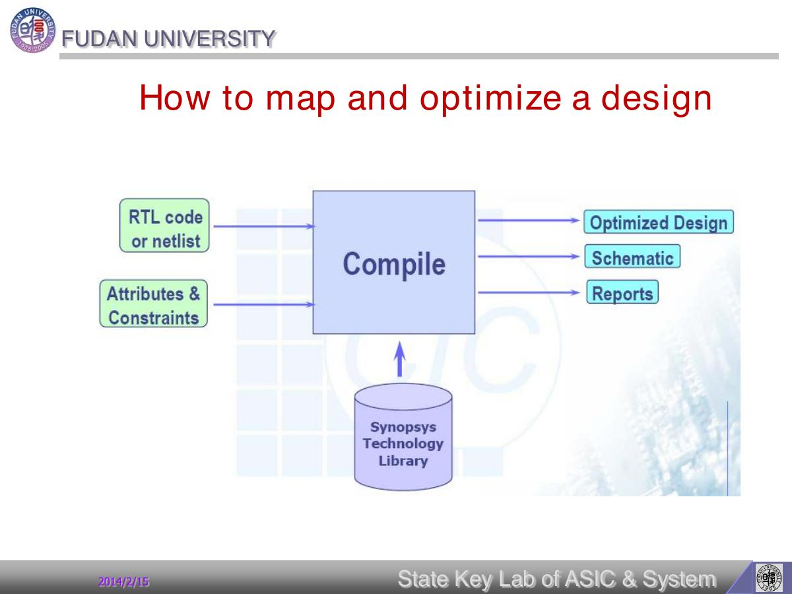

## 页面定位

- **页码**：63/112
- **所属阶段**：综合优化：逻辑优化、映射、compile 与报告
- **本页角色**：流程节点说明
- **阅读问题**：本页要回答：这个概念/命令在流程中解决什么问题？
- **前后关系**：这部分回答“DC 如何改变电路”：从布尔级、门级到时序驱动优化。

## 原文要点

> How to map and optimize a design

## 原文解读

本页承接前后章节，提供一个具体概念、命令或图示。阅读时要把标题、对象、命令作用和后续报告联系起来。

本页关联的关键对象/命令：本页以概念/图示为主，重点看标题和图中对象关系。

## 我的理解

我的理解是：这页虽然信息量不一定大，但它仍然是流程中的一个节点；跳过会让后面命令缺少上下文。

把它放回完整 DC 流程里看，本页不是孤立知识点，而是在帮助我们更准确地描述“设计、环境、约束、优化结果”中的一个环节。读这一页时，我会优先问：它改变的是 DC 数据库里的哪个对象？它会让 compile 的优化空间变大还是变小？它最终应该在什么报告里被验证？

## 实操提醒

把本页标题写成一个问题，再用原文里的命令或图示回答它。

## 本页小结

本页的核心收获：How to map and optimize a design 这一页应被理解为“流程节点说明”的读书笔记节点；掌握它的标准不是背下标题，而是能说明它如何影响后续约束、优化或 timing 报告。

## 导航

- 上一页：[Page 062](pages/page-062.md)
- 下一页：[Page 064](pages/page-064.md)

# Page 064 - Compile is the “art” of synthesis

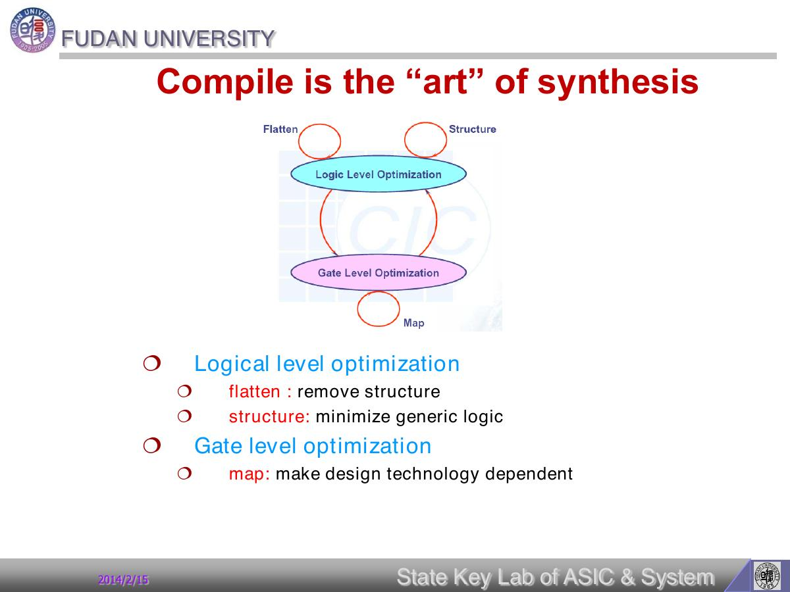

## 页面定位

- **页码**：64/112
- **所属阶段**：综合优化：逻辑优化、映射、compile 与报告
- **本页角色**：执行优化和映射
- **阅读问题**：本页要回答：DC 如何从逻辑表达变成目标库门级实现？
- **前后关系**：这部分回答“DC 如何改变电路”：从布尔级、门级到时序驱动优化。

## 原文要点

> Compile is the “art” of synthesis
> - Logical level optimization
> - flatten : remove structure
> - structure: minimize generic logic
> - Gate level optimization
> - map: make design technology dependent

## 原文解读

本页讲综合优化与映射。逻辑级优化处理布尔结构，gate-level optimization 在目标库单元中选择实现；structure/flatten 会改变中间层次和表达形式。

本页关联的关键对象/命令：`compile`

## 我的理解

我的理解是：compile 是 DC 把约束转化为电路结构变化的核心步骤。`map_effort` 越高，可能带来更长运行时间和更激进的关键路径重综合。

把它放回完整 DC 流程里看，本页不是孤立知识点，而是在帮助我们更准确地描述“设计、环境、约束、优化结果”中的一个环节。读这一页时，我会优先问：它改变的是 DC 数据库里的哪个对象？它会让 compile 的优化空间变大还是变小？它最终应该在什么报告里被验证？

## 实操提醒

改 compile 选项前先读 timing/area/report_design，确认瓶颈是在逻辑结构、门级映射还是约束本身。

## 本页小结

本页的核心收获：Compile is the “art” of synthesis 这一页应被理解为“执行优化和映射”的读书笔记节点；掌握它的标准不是背下标题，而是能说明它如何影响后续约束、优化或 timing 报告。

## 导航

- 上一页：[Page 063](pages/page-063.md)
- 下一页：[Page 065](pages/page-065.md)

# Page 065 - Logical Level Optimization

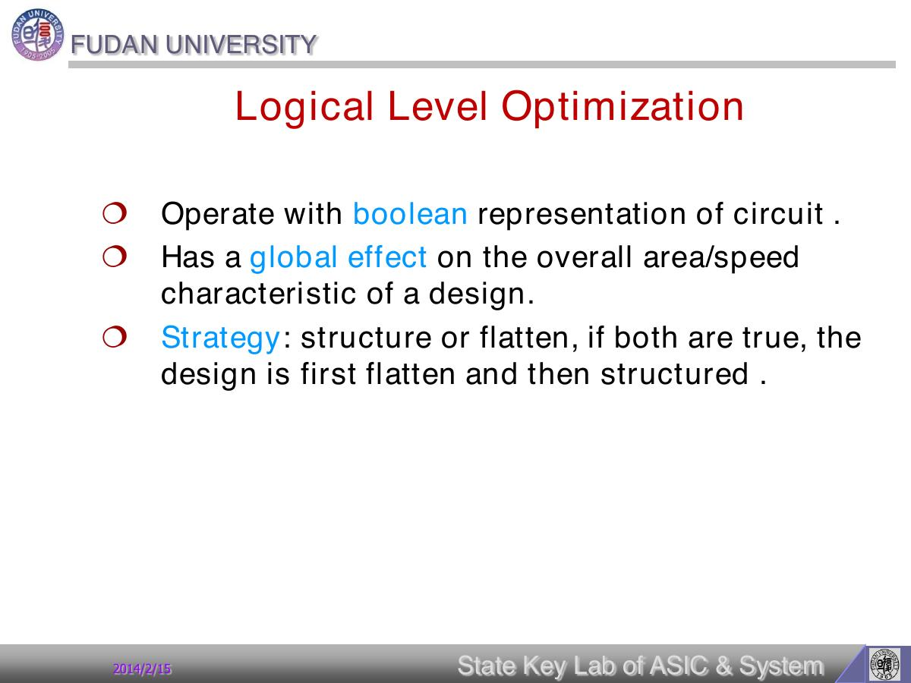

## 页面定位

- **页码**：65/112
- **所属阶段**：综合优化：逻辑优化、映射、compile 与报告
- **本页角色**：理解优化目标和优先级
- **阅读问题**：本页要回答：这个概念/命令在流程中解决什么问题？
- **前后关系**：这部分回答“DC 如何改变电路”：从布尔级、门级到时序驱动优化。

## 原文要点

> Logical Level Optimization
> - Operate with boolean representation of circuit .
> - Has a global effect on the overall area/speed
> characteristic of a design.
> - Strategy: structure or flatten, if both are true, the
> design is first flatten and then structured .

## 原文解读

本页讲 area constraint 和约束优先级。DC 优化时会按优先级处理：设计规则约束优先，其次是时序，再到面积等目标。

本页关联的关键对象/命令：本页以概念/图示为主，重点看标题和图中对象关系。

## 我的理解

我的理解是：面积约束不是孤立目标，它总是在 DRC 和 timing 之后被权衡。若时序很紧，面积增长往往是工具换取速度的代价。

把它放回完整 DC 流程里看，本页不是孤立知识点，而是在帮助我们更准确地描述“设计、环境、约束、优化结果”中的一个环节。读这一页时，我会优先问：它改变的是 DC 数据库里的哪个对象？它会让 compile 的优化空间变大还是变小？它最终应该在什么报告里被验证？

## 实操提醒

看 compile 结果时，不要只看 area 是否下降，也要同时确认 DRC 和 timing 是否已经满足。

## 本页小结

本页的核心收获：Logical Level Optimization 这一页应被理解为“理解优化目标和优先级”的读书笔记节点；掌握它的标准不是背下标题，而是能说明它如何影响后续约束、优化或 timing 报告。

## 导航

- 上一页：[Page 064](pages/page-064.md)
- 下一页：[Page 066](pages/page-066.md)

# Page 066 - Structure

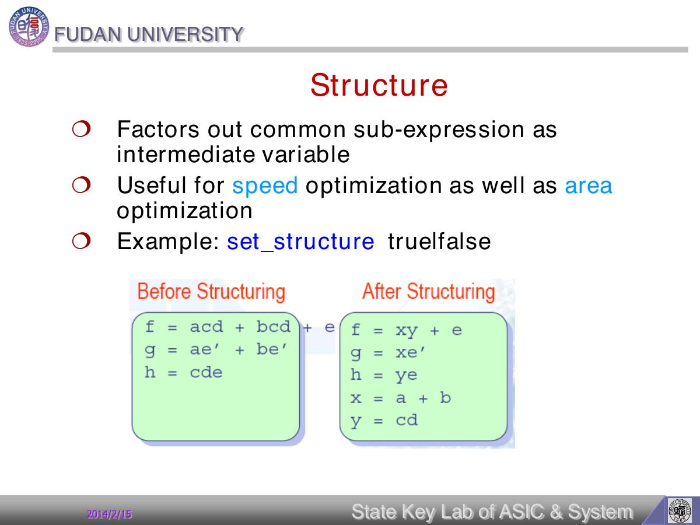

## 页面定位

- **页码**：66/112
- **所属阶段**：综合优化：逻辑优化、映射、compile 与报告
- **本页角色**：理解优化目标和优先级
- **阅读问题**：本页要回答：这个概念/命令在流程中解决什么问题？
- **前后关系**：这部分回答“DC 如何改变电路”：从布尔级、门级到时序驱动优化。

## 原文要点

> Structure
> - Factors out common sub-expression as
> intermediate variable
> - Useful for speed optimization as well as area
> optimization
> - Example: set_structure true|false

## 原文解读

本页讲 area constraint 和约束优先级。DC 优化时会按优先级处理：设计规则约束优先，其次是时序，再到面积等目标。

本页关联的关键对象/命令：本页以概念/图示为主，重点看标题和图中对象关系。

## 我的理解

我的理解是：面积约束不是孤立目标，它总是在 DRC 和 timing 之后被权衡。若时序很紧，面积增长往往是工具换取速度的代价。

把它放回完整 DC 流程里看，本页不是孤立知识点，而是在帮助我们更准确地描述“设计、环境、约束、优化结果”中的一个环节。读这一页时，我会优先问：它改变的是 DC 数据库里的哪个对象？它会让 compile 的优化空间变大还是变小？它最终应该在什么报告里被验证？

## 实操提醒

看 compile 结果时，不要只看 area 是否下降，也要同时确认 DRC 和 timing 是否已经满足。

## 本页小结

本页的核心收获：Structure 这一页应被理解为“理解优化目标和优先级”的读书笔记节点；掌握它的标准不是背下标题，而是能说明它如何影响后续约束、优化或 timing 报告。

## 导航

- 上一页：[Page 065](pages/page-065.md)
- 下一页：[Page 067](pages/page-067.md)

# Page 067 - Flatten

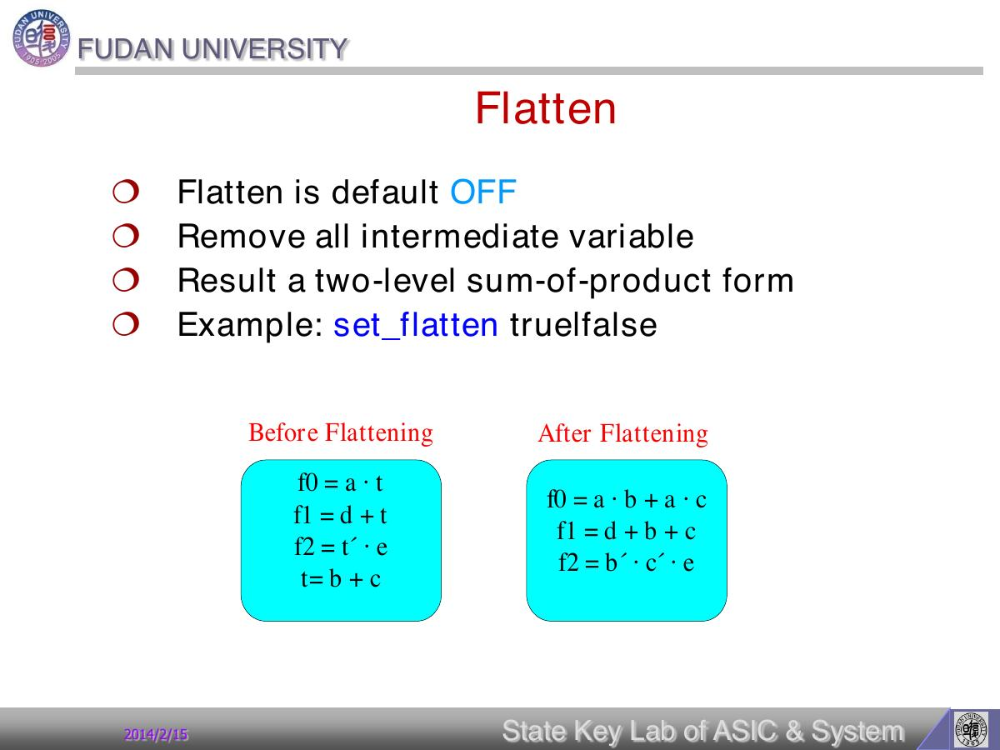

## 页面定位

- **页码**：67/112
- **所属阶段**：综合优化：逻辑优化、映射、compile 与报告
- **本页角色**：执行优化和映射
- **阅读问题**：本页要回答：DC 如何从逻辑表达变成目标库门级实现？
- **前后关系**：这部分回答“DC 如何改变电路”：从布尔级、门级到时序驱动优化。

## 原文要点

> Flatten
> - Flatten is default OFF
> - Remove all intermediate variable
> - Result a two-level sum-of-product form
> - Example: set_flatten true|false
> f0 = a · t
> f1 = d + t
> f2 = t´ · e
> t= b + c
> f0 = a · b + a · c
> f1 = d + b + c
> f2 = b´ · c´ · e
> Before Flattening After Flattening

## 原文解读

本页讲综合优化与映射。逻辑级优化处理布尔结构，gate-level optimization 在目标库单元中选择实现；structure/flatten 会改变中间层次和表达形式。

本页关联的关键对象/命令：本页以概念/图示为主，重点看标题和图中对象关系。

## 我的理解

我的理解是：compile 是 DC 把约束转化为电路结构变化的核心步骤。`map_effort` 越高，可能带来更长运行时间和更激进的关键路径重综合。

把它放回完整 DC 流程里看，本页不是孤立知识点，而是在帮助我们更准确地描述“设计、环境、约束、优化结果”中的一个环节。读这一页时，我会优先问：它改变的是 DC 数据库里的哪个对象？它会让 compile 的优化空间变大还是变小？它最终应该在什么报告里被验证？

## 实操提醒

改 compile 选项前先读 timing/area/report_design，确认瓶颈是在逻辑结构、门级映射还是约束本身。

## 本页小结

本页的核心收获：Flatten 这一页应被理解为“执行优化和映射”的读书笔记节点；掌握它的标准不是背下标题，而是能说明它如何影响后续约束、优化或 timing 报告。

## 导航

- 上一页：[Page 066](pages/page-066.md)
- 下一页：[Page 068](pages/page-068.md)

# Page 068 - Gate Level Optimization

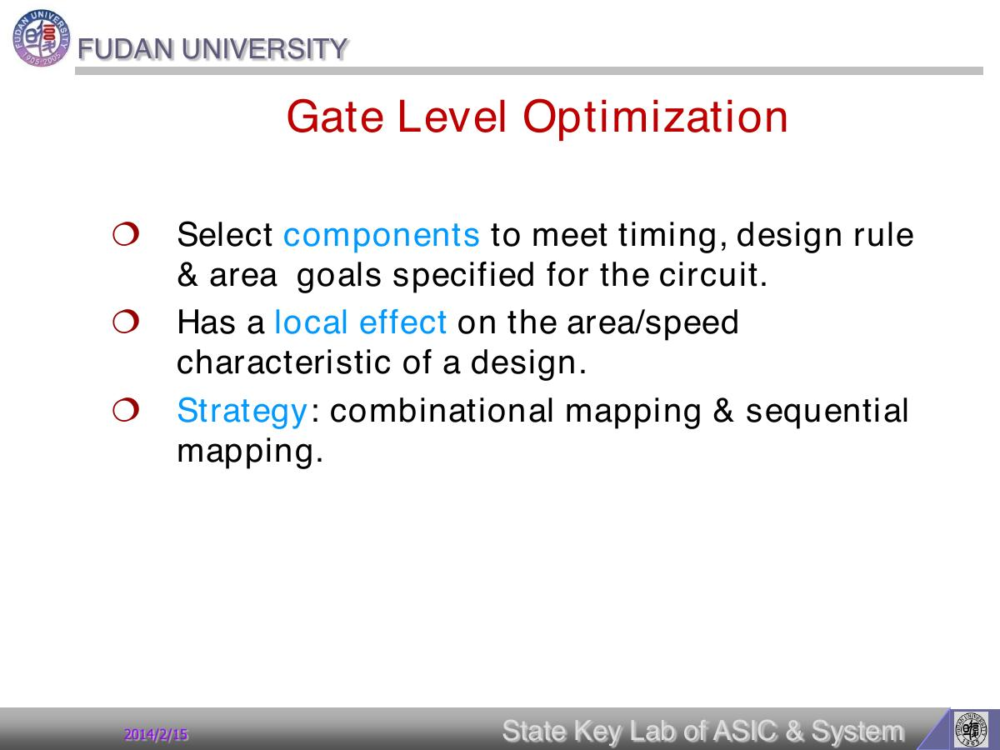

## 页面定位

- **页码**：68/112
- **所属阶段**：综合优化：逻辑优化、映射、compile 与报告
- **本页角色**：设置设计规则底线
- **阅读问题**：本页要回答：哪些约束是工艺规则底线，不能为了面积/速度牺牲？
- **前后关系**：这部分回答“DC 如何改变电路”：从布尔级、门级到时序驱动优化。

## 原文要点

> Gate Level Optimization
> - Select components to meet timing, design rule
> & area goals specified for the circuit.
> - Has a local effect on the area/speed
> characteristic of a design.
> - Strategy: combinational mapping & sequential
> mapping.

## 原文解读

本页讲 design rule constraints。max transition、max capacitance、max fanout 这类约束通常来自工艺库限制，优先级高于面积/速度目标。

本页关联的关键对象/命令：本页以概念/图示为主，重点看标题和图中对象关系。

## 我的理解

我的理解是：design rule 是“不能违反”的底线，不是优化偏好。DC 会优先修 DRC，即使这让面积变大或局部时序变差。

把它放回完整 DC 流程里看，本页不是孤立知识点，而是在帮助我们更准确地描述“设计、环境、约束、优化结果”中的一个环节。读这一页时，我会优先问：它改变的是 DC 数据库里的哪个对象？它会让 compile 的优化空间变大还是变小？它最终应该在什么报告里被验证？

## 实操提醒

报告中若有 transition/cap/fanout violation，先修规则，再讨论 timing/area trade-off。

## 本页小结

本页的核心收获：Gate Level Optimization 这一页应被理解为“设置设计规则底线”的读书笔记节点；掌握它的标准不是背下标题，而是能说明它如何影响后续约束、优化或 timing 报告。

## 导航

- 上一页：[Page 067](pages/page-067.md)
- 下一页：[Page 069](pages/page-069.md)

# Page 069 - Combinational Mapping

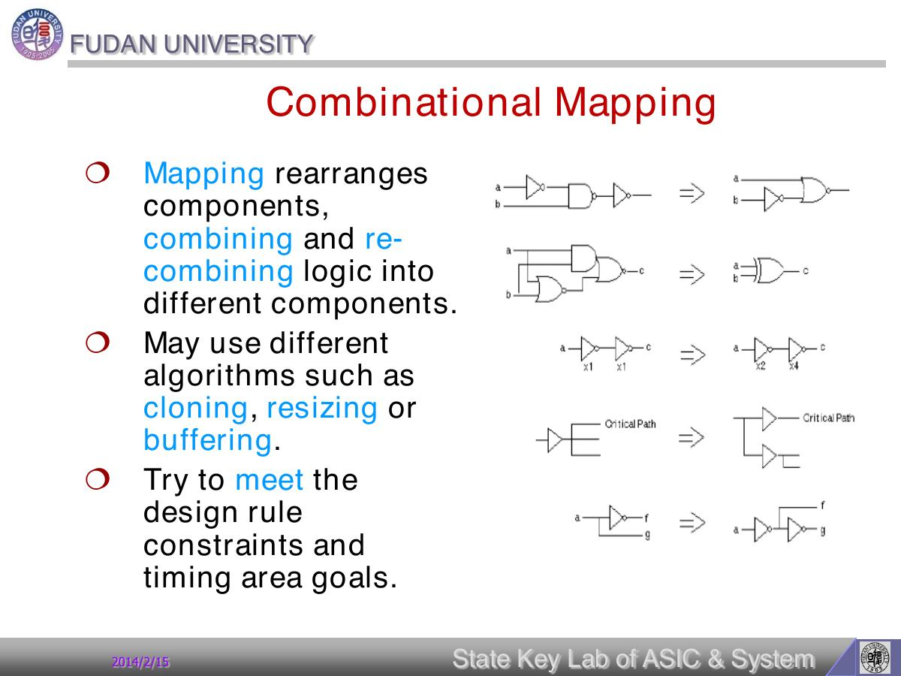

## 页面定位

- **页码**：69/112
- **所属阶段**：综合优化：逻辑优化、映射、compile 与报告
- **本页角色**：设置设计规则底线
- **阅读问题**：本页要回答：哪些约束是工艺规则底线，不能为了面积/速度牺牲？
- **前后关系**：这部分回答“DC 如何改变电路”：从布尔级、门级到时序驱动优化。

## 原文要点

> Combinational Mapping
> - Mapping rearranges
> components,
> combining and re-
> combining logic into
> different components.
> - May use different
> algorithms such as
> cloning, resizing or
> buffering.
> - Try to meet the
> design rule
> constraints and
> timing area goals.

## 原文解读

本页讲 design rule constraints。max transition、max capacitance、max fanout 这类约束通常来自工艺库限制，优先级高于面积/速度目标。

本页关联的关键对象/命令：本页以概念/图示为主，重点看标题和图中对象关系。

## 我的理解

我的理解是：design rule 是“不能违反”的底线，不是优化偏好。DC 会优先修 DRC，即使这让面积变大或局部时序变差。

把它放回完整 DC 流程里看，本页不是孤立知识点，而是在帮助我们更准确地描述“设计、环境、约束、优化结果”中的一个环节。读这一页时，我会优先问：它改变的是 DC 数据库里的哪个对象？它会让 compile 的优化空间变大还是变小？它最终应该在什么报告里被验证？

## 实操提醒

报告中若有 transition/cap/fanout violation，先修规则，再讨论 timing/area trade-off。

## 本页小结

本页的核心收获：Combinational Mapping 这一页应被理解为“设置设计规则底线”的读书笔记节点；掌握它的标准不是背下标题，而是能说明它如何影响后续约束、优化或 timing 报告。

## 导航

- 上一页：[Page 068](pages/page-068.md)
- 下一页：[Page 070](pages/page-070.md)

# Page 070 - Sequential Mapping

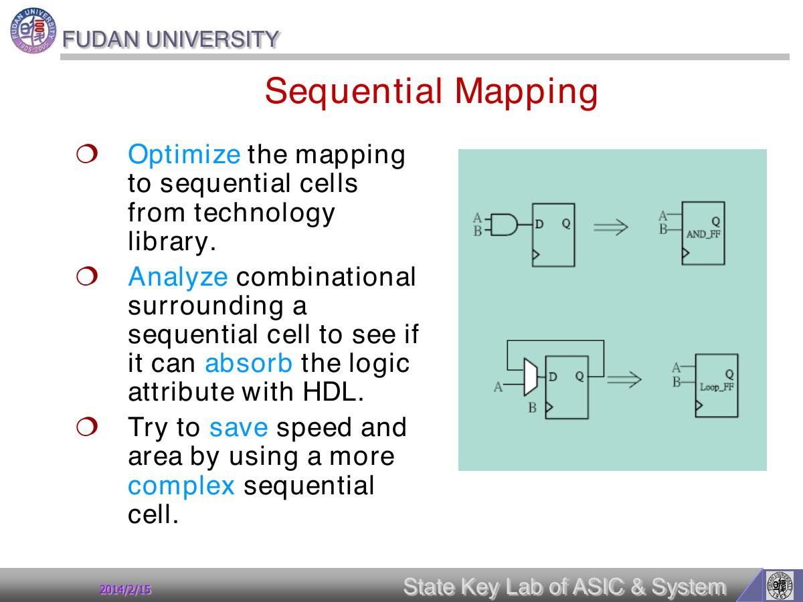

## 页面定位

- **页码**：70/112
- **所属阶段**：综合优化：逻辑优化、映射、compile 与报告
- **本页角色**：执行优化和映射
- **阅读问题**：本页要回答：DC 如何从逻辑表达变成目标库门级实现？
- **前后关系**：这部分回答“DC 如何改变电路”：从布尔级、门级到时序驱动优化。

## 原文要点

> Sequential Mapping
> - Optimize the mapping
> to sequential cells
> from technology
> library.
> - Analyze combinational
> surrounding a
> sequential cell to see if
> it can absorb the logic
> attribute with HDL.
> - Try to save speed and
> area by using a more
> complex sequential
> cell.

## 原文解读

本页讲 sequential mapping。DC 会把时序单元周围的组合逻辑与工艺库中的复杂 sequential cell 做匹配，尝试把部分逻辑吸收到触发器或时序单元中，以节省速度和面积。

本页关联的关键对象/命令：`analyze`

## 我的理解

我的理解是：sequential mapping 不是单纯替换触发器，而是在保持功能等价的前提下，利用库里更复杂的时序单元重构局部逻辑。它体现了 compile 在 gate-level optimization 中的局部优化能力。

把它放回完整 DC 流程里看，本页不是孤立知识点，而是在帮助我们更准确地描述“设计、环境、约束、优化结果”中的一个环节。读这一页时，我会优先问：它改变的是 DC 数据库里的哪个对象？它会让 compile 的优化空间变大还是变小？它最终应该在什么报告里被验证？

## 实操提醒

如果 sequential mapping 后网表结构变化明显，要用等价性检查和 timing report 确认功能与时序收益，而不是只看 cell 数减少。

## 本页小结

本页的核心收获：Sequential Mapping 这一页应被理解为“执行优化和映射”的读书笔记节点；掌握它的标准不是背下标题，而是能说明它如何影响后续约束、优化或 timing 报告。

## 导航

- 上一页：[Page 069](pages/page-069.md)
- 下一页：[Page 071](pages/page-071.md)

# Page 071 - Compile Command and Options

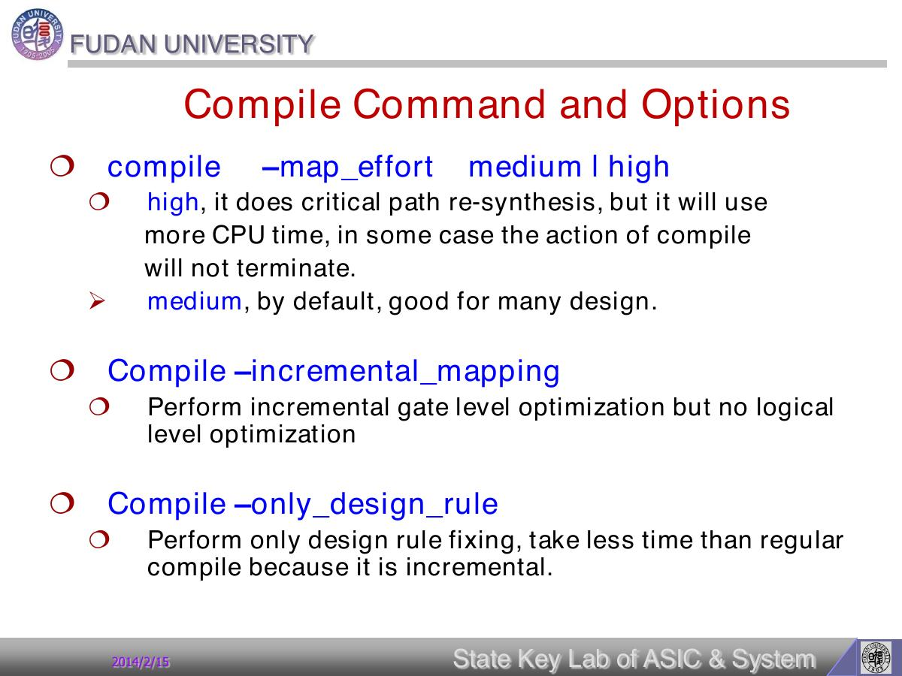

## 页面定位

- **页码**：71/112
- **所属阶段**：综合优化：逻辑优化、映射、compile 与报告
- **本页角色**：设置设计规则底线
- **阅读问题**：本页要回答：哪些约束是工艺规则底线，不能为了面积/速度牺牲？
- **前后关系**：这部分回答“DC 如何改变电路”：从布尔级、门级到时序驱动优化。

## 原文要点

> Compile Command and Options
> - compile –map_effort medium | high
> - high, it does critical path re-synthesis, but it will use
> more CPU time, in some case the action of compile
> will not terminate.
> - medium, by default, good for many design.
> - Compile –incremental_mapping
> - Perform incremental gate level optimization but no logical
> level optimization
> - Compile –only_design_rule
> - Perform only design rule fixing, take less time than regular
> compile because it is incremental.

## 原文解读

本页讲 design rule constraints。max transition、max capacitance、max fanout 这类约束通常来自工艺库限制，优先级高于面积/速度目标。

本页关联的关键对象/命令：`compile`

## 我的理解

我的理解是：design rule 是“不能违反”的底线，不是优化偏好。DC 会优先修 DRC，即使这让面积变大或局部时序变差。

把它放回完整 DC 流程里看，本页不是孤立知识点，而是在帮助我们更准确地描述“设计、环境、约束、优化结果”中的一个环节。读这一页时，我会优先问：它改变的是 DC 数据库里的哪个对象？它会让 compile 的优化空间变大还是变小？它最终应该在什么报告里被验证？

## 实操提醒

报告中若有 transition/cap/fanout violation，先修规则，再讨论 timing/area trade-off。

## 本页小结

本页的核心收获：Compile Command and Options 这一页应被理解为“设置设计规则底线”的读书笔记节点；掌握它的标准不是背下标题，而是能说明它如何影响后续约束、优化或 timing 报告。

## 导航

- 上一页：[Page 070](pages/page-070.md)
- 下一页：[Page 072](pages/page-072.md)

# Page 072 - How to generate results and report

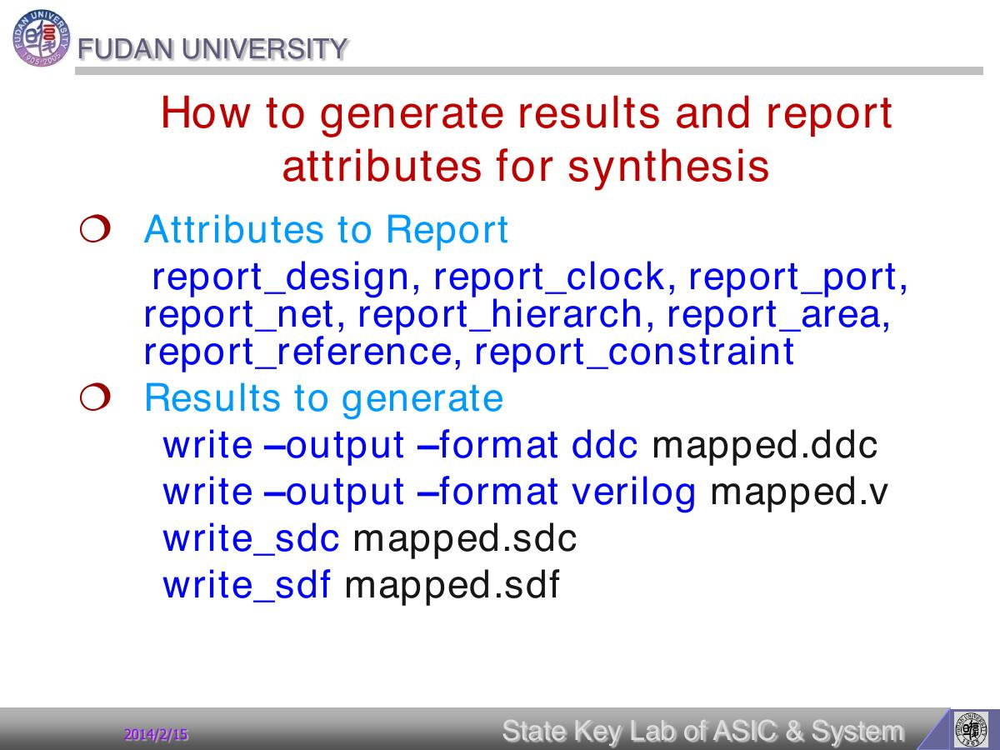

## 页面定位

- **页码**：72/112
- **所属阶段**：综合优化：逻辑优化、映射、compile 与报告
- **本页角色**：理解优化目标和优先级
- **阅读问题**：本页要回答：这个概念/命令在流程中解决什么问题？
- **前后关系**：这部分回答“DC 如何改变电路”：从布尔级、门级到时序驱动优化。

## 原文要点

> How to generate results and report
> attributes for synthesis
> - Attributes to Report
> report_design, report_clock, report_port,
> report_net, report_hierarch, report_area,
> report_reference, report_constraint
> - Results to generate
> write –output –format ddc mapped.ddc
> write –output –format verilog mapped.v
> write_sdc mapped.sdc
> write_sdf mapped.sdf

## 原文解读

本页讲 area constraint 和约束优先级。DC 优化时会按优先级处理：设计规则约束优先，其次是时序，再到面积等目标。

本页关联的关键对象/命令：本页以概念/图示为主，重点看标题和图中对象关系。

## 我的理解

我的理解是：面积约束不是孤立目标，它总是在 DRC 和 timing 之后被权衡。若时序很紧，面积增长往往是工具换取速度的代价。

把它放回完整 DC 流程里看，本页不是孤立知识点，而是在帮助我们更准确地描述“设计、环境、约束、优化结果”中的一个环节。读这一页时，我会优先问：它改变的是 DC 数据库里的哪个对象？它会让 compile 的优化空间变大还是变小？它最终应该在什么报告里被验证？

## 实操提醒

看 compile 结果时，不要只看 area 是否下降，也要同时确认 DRC 和 timing 是否已经满足。

## 本页小结

本页的核心收获：How to generate results and report 这一页应被理解为“理解优化目标和优先级”的读书笔记节点；掌握它的标准不是背下标题，而是能说明它如何影响后续约束、优化或 timing 报告。

## 导航

- 上一页：[Page 071](pages/page-071.md)
- 下一页：[Page 073](pages/page-073.md)

# Page 073 - STA transition

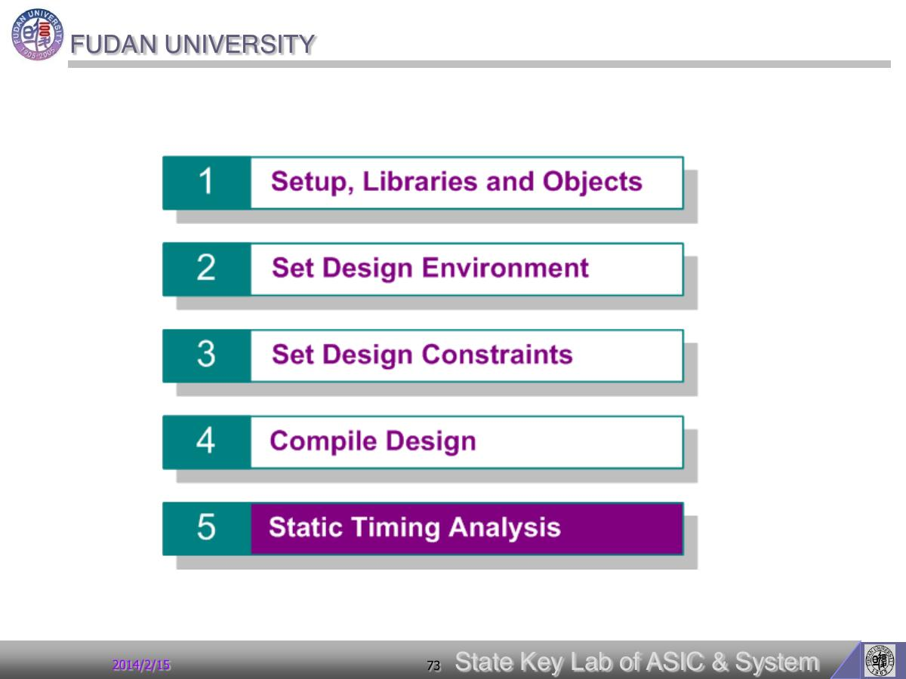

## 页面定位

- **页码**：73/112
- **所属阶段**：STA 与时序报告：路径、clock model、I/O 约束和 slack
- **本页角色**：流程节点说明
- **阅读问题**：本页要回答：这个概念/命令在流程中解决什么问题？
- **前后关系**：这部分回答“如何判断结果是否真的满足时序”：看路径、看 required/arrival、看 slack。

## 原文要点

> 本页 OCR 可抽取文本为空或很少，解读主要依据页面标题、页码位置和单页图像。

## 原文解读

这页是进入 STA 章节的过渡页。前面讲生成和报告，后面专门讲如何读 timing。

本页关联的关键对象/命令：本页以概念/图示为主，重点看标题和图中对象关系。

## 我的理解

综合是否成功，最终要落在 timing path 上看 arrival、required 和 slack。

把它放回完整 DC 流程里看，本页不是孤立知识点，而是在帮助我们更准确地描述“设计、环境、约束、优化结果”中的一个环节。读这一页时，我会优先问：它改变的是 DC 数据库里的哪个对象？它会让 compile 的优化空间变大还是变小？它最终应该在什么报告里被验证？

## 实操提醒

把本页标题写成一个问题，再用原文里的命令或图示回答它。

## 本页小结

本页的核心收获：STA transition 这一页应被理解为“流程节点说明”的读书笔记节点；掌握它的标准不是背下标题，而是能说明它如何影响后续约束、优化或 timing 报告。

## 导航

- 上一页：[Page 072](pages/page-072.md)
- 下一页：[Page 074](pages/page-074.md)

# Page 074 - Basic Conceptions of STA

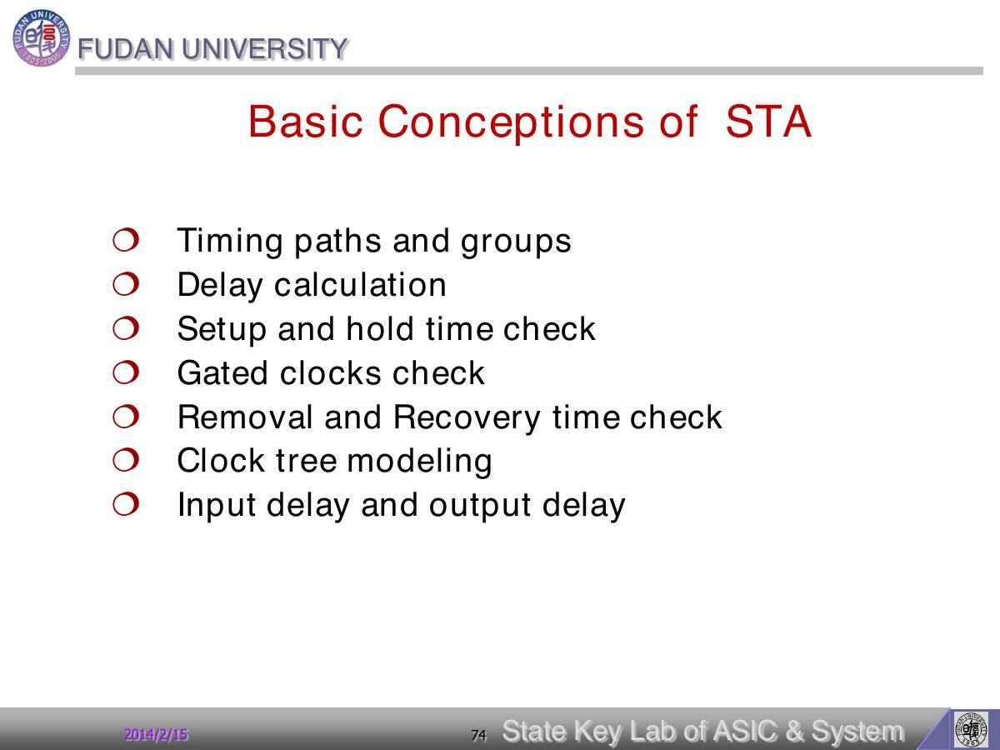

## 页面定位

- **页码**：74/112
- **所属阶段**：STA 与时序报告：路径、clock model、I/O 约束和 slack
- **本页角色**：建立 STA 基本概念
- **阅读问题**：本页要回答：一条 timing path 如何被定义、分组和检查？
- **前后关系**：这部分回答“如何判断结果是否真的满足时序”：看路径、看 required/arrival、看 slack。

## 原文要点

> Basic Conceptions of STA
> - Timing paths and groups
> - Delay calculation
> - Setup and hold time check
> - Gated clocks check
> - Removal and Recovery time check
> - Clock tree modeling
> - Input delay and output delay

## 原文解读

本页讲 STA 基础概念：路径类型、path group、delay calculation、setup/hold check。STA 把电路拆成 timing arc，分别累加 cell delay 和 net delay。

本页关联的关键对象/命令：本页以概念/图示为主，重点看标题和图中对象关系。

## 我的理解

我的理解是：STA 是综合质量的判卷系统。setup 看最大数据路径能否在下一采样边沿前稳定；hold 看最小数据路径会不会太快破坏当前采样。

把它放回完整 DC 流程里看，本页不是孤立知识点，而是在帮助我们更准确地描述“设计、环境、约束、优化结果”中的一个环节。读这一页时，我会优先问：它改变的是 DC 数据库里的哪个对象？它会让 compile 的优化空间变大还是变小？它最终应该在什么报告里被验证？

## 实操提醒

读路径时先标出 startpoint、endpoint、path group、path type，再看 arrival/required/slack。

## 本页小结

本页的核心收获：Basic Conceptions of STA 这一页应被理解为“建立 STA 基本概念”的读书笔记节点；掌握它的标准不是背下标题，而是能说明它如何影响后续约束、优化或 timing 报告。

## 导航

- 上一页：[Page 073](pages/page-073.md)
- 下一页：[Page 075](pages/page-075.md)

# Page 075 - Timing Paths in Design Compiler

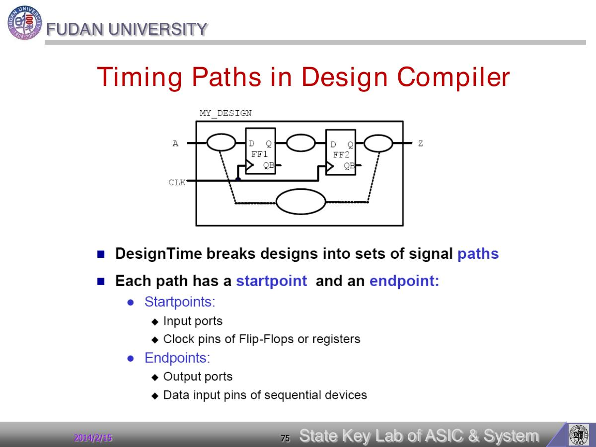

## 页面定位

- **页码**：75/112
- **所属阶段**：STA 与时序报告：路径、clock model、I/O 约束和 slack
- **本页角色**：执行优化和映射
- **阅读问题**：本页要回答：DC 如何从逻辑表达变成目标库门级实现？
- **前后关系**：这部分回答“如何判断结果是否真的满足时序”：看路径、看 required/arrival、看 slack。

## 原文要点

> Timing Paths in Design Compiler

## 原文解读

本页讲综合优化与映射。逻辑级优化处理布尔结构，gate-level optimization 在目标库单元中选择实现；structure/flatten 会改变中间层次和表达形式。

本页关联的关键对象/命令：`compile`

## 我的理解

我的理解是：compile 是 DC 把约束转化为电路结构变化的核心步骤。`map_effort` 越高，可能带来更长运行时间和更激进的关键路径重综合。

把它放回完整 DC 流程里看，本页不是孤立知识点，而是在帮助我们更准确地描述“设计、环境、约束、优化结果”中的一个环节。读这一页时，我会优先问：它改变的是 DC 数据库里的哪个对象？它会让 compile 的优化空间变大还是变小？它最终应该在什么报告里被验证？

## 实操提醒

改 compile 选项前先读 timing/area/report_design，确认瓶颈是在逻辑结构、门级映射还是约束本身。

## 本页小结

本页的核心收获：Timing Paths in Design Compiler 这一页应被理解为“执行优化和映射”的读书笔记节点；掌握它的标准不是背下标题，而是能说明它如何影响后续约束、优化或 timing 报告。

## 导航

- 上一页：[Page 074](pages/page-074.md)
- 下一页：[Page 076](pages/page-076.md)

# Page 076 - - Input Paths

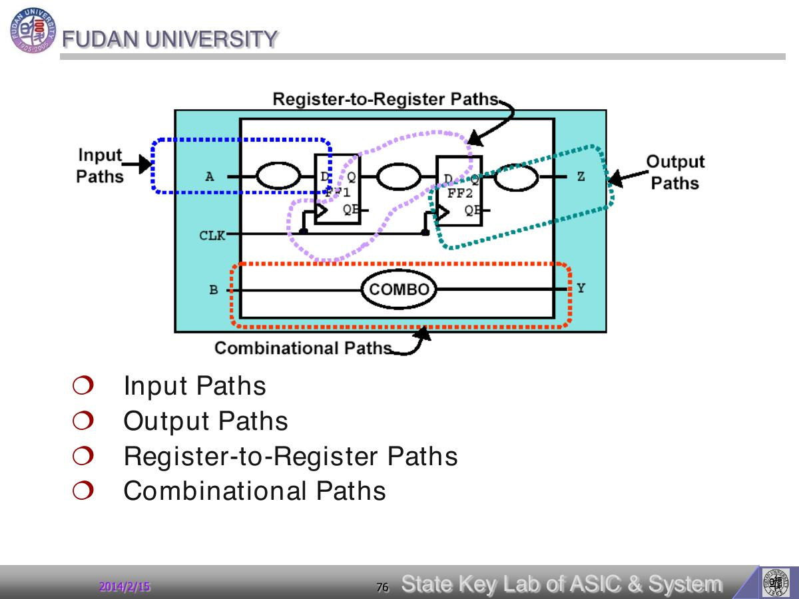

## 页面定位

- **页码**：76/112
- **所属阶段**：STA 与时序报告：路径、clock model、I/O 约束和 slack
- **本页角色**：建立 STA 基本概念
- **阅读问题**：本页要回答：一条 timing path 如何被定义、分组和检查？
- **前后关系**：这部分回答“如何判断结果是否真的满足时序”：看路径、看 required/arrival、看 slack。

## 原文要点

> - Input Paths
> - Output Paths
> - Register-to-Register Paths
> - Combinational Paths

## 原文解读

本页讲 STA 基础概念：路径类型、path group、delay calculation、setup/hold check。STA 把电路拆成 timing arc，分别累加 cell delay 和 net delay。

本页关联的关键对象/命令：本页以概念/图示为主，重点看标题和图中对象关系。

## 我的理解

我的理解是：STA 是综合质量的判卷系统。setup 看最大数据路径能否在下一采样边沿前稳定；hold 看最小数据路径会不会太快破坏当前采样。

把它放回完整 DC 流程里看，本页不是孤立知识点，而是在帮助我们更准确地描述“设计、环境、约束、优化结果”中的一个环节。读这一页时，我会优先问：它改变的是 DC 数据库里的哪个对象？它会让 compile 的优化空间变大还是变小？它最终应该在什么报告里被验证？

## 实操提醒

读路径时先标出 startpoint、endpoint、path group、path type，再看 arrival/required/slack。

## 本页小结

本页的核心收获：- Input Paths 这一页应被理解为“建立 STA 基本概念”的读书笔记节点；掌握它的标准不是背下标题，而是能说明它如何影响后续约束、优化或 timing 报告。

## 导航

- 上一页：[Page 075](pages/page-075.md)
- 下一页：[Page 077](pages/page-077.md)

# Page 077 - Timing Groups

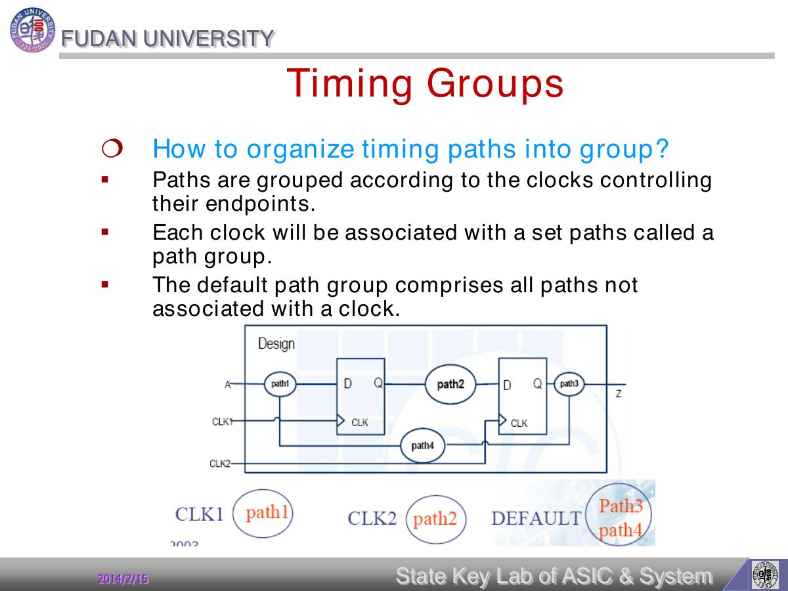

## 页面定位

- **页码**：77/112
- **所属阶段**：STA 与时序报告：路径、clock model、I/O 约束和 slack
- **本页角色**：建立 STA 基本概念
- **阅读问题**：本页要回答：一条 timing path 如何被定义、分组和检查？
- **前后关系**：这部分回答“如何判断结果是否真的满足时序”：看路径、看 required/arrival、看 slack。

## 原文要点

> Timing Groups
> - How to organize timing paths into group?
> - Paths are grouped according to the clocks controlling
> their endpoints.
> - Each clock will be associated with a set paths called a
> path group.
> - The default path group comprises all paths not
> associated with a clock.

## 原文解读

本页讲 STA 基础概念：路径类型、path group、delay calculation、setup/hold check。STA 把电路拆成 timing arc，分别累加 cell delay 和 net delay。

本页关联的关键对象/命令：本页以概念/图示为主，重点看标题和图中对象关系。

## 我的理解

我的理解是：STA 是综合质量的判卷系统。setup 看最大数据路径能否在下一采样边沿前稳定；hold 看最小数据路径会不会太快破坏当前采样。

把它放回完整 DC 流程里看，本页不是孤立知识点，而是在帮助我们更准确地描述“设计、环境、约束、优化结果”中的一个环节。读这一页时，我会优先问：它改变的是 DC 数据库里的哪个对象？它会让 compile 的优化空间变大还是变小？它最终应该在什么报告里被验证？

## 实操提醒

读路径时先标出 startpoint、endpoint、path group、path type，再看 arrival/required/slack。

## 本页小结

本页的核心收获：Timing Groups 这一页应被理解为“建立 STA 基本概念”的读书笔记节点；掌握它的标准不是背下标题，而是能说明它如何影响后续约束、优化或 timing 报告。

## 导航

- 上一页：[Page 076](pages/page-076.md)
- 下一页：[Page 078](pages/page-078.md)

# Page 078 - Timing Paths Exercise

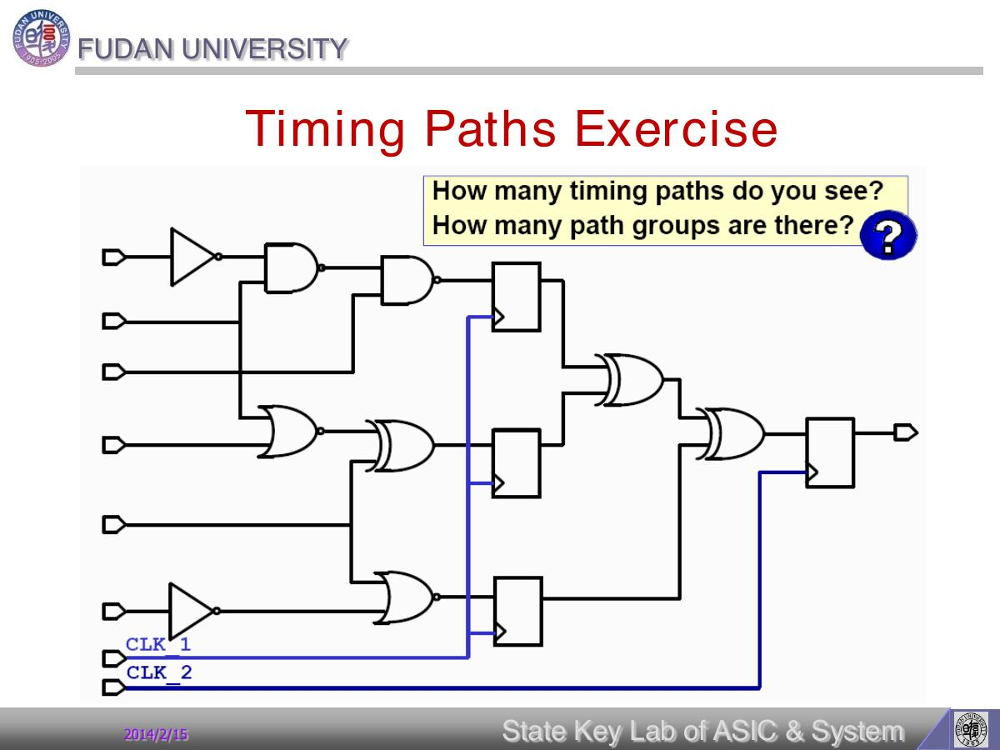

## 页面定位

- **页码**：78/112
- **所属阶段**：STA 与时序报告：路径、clock model、I/O 约束和 slack
- **本页角色**：建立 STA 基本概念
- **阅读问题**：本页要回答：一条 timing path 如何被定义、分组和检查？
- **前后关系**：这部分回答“如何判断结果是否真的满足时序”：看路径、看 required/arrival、看 slack。

## 原文要点

> Timing Paths Exercise

## 原文解读

本页讲 STA 基础概念：路径类型、path group、delay calculation、setup/hold check。STA 把电路拆成 timing arc，分别累加 cell delay 和 net delay。

本页关联的关键对象/命令：本页以概念/图示为主，重点看标题和图中对象关系。

## 我的理解

我的理解是：STA 是综合质量的判卷系统。setup 看最大数据路径能否在下一采样边沿前稳定；hold 看最小数据路径会不会太快破坏当前采样。

把它放回完整 DC 流程里看，本页不是孤立知识点，而是在帮助我们更准确地描述“设计、环境、约束、优化结果”中的一个环节。读这一页时，我会优先问：它改变的是 DC 数据库里的哪个对象？它会让 compile 的优化空间变大还是变小？它最终应该在什么报告里被验证？

## 实操提醒

读路径时先标出 startpoint、endpoint、path group、path type，再看 arrival/required/slack。

## 本页小结

本页的核心收获：Timing Paths Exercise 这一页应被理解为“建立 STA 基本概念”的读书笔记节点；掌握它的标准不是背下标题，而是能说明它如何影响后续约束、优化或 timing 报告。

## 导航

- 上一页：[Page 077](pages/page-077.md)
- 下一页：[Page 079](pages/page-079.md)

# Page 079 - Timing path exercise visual

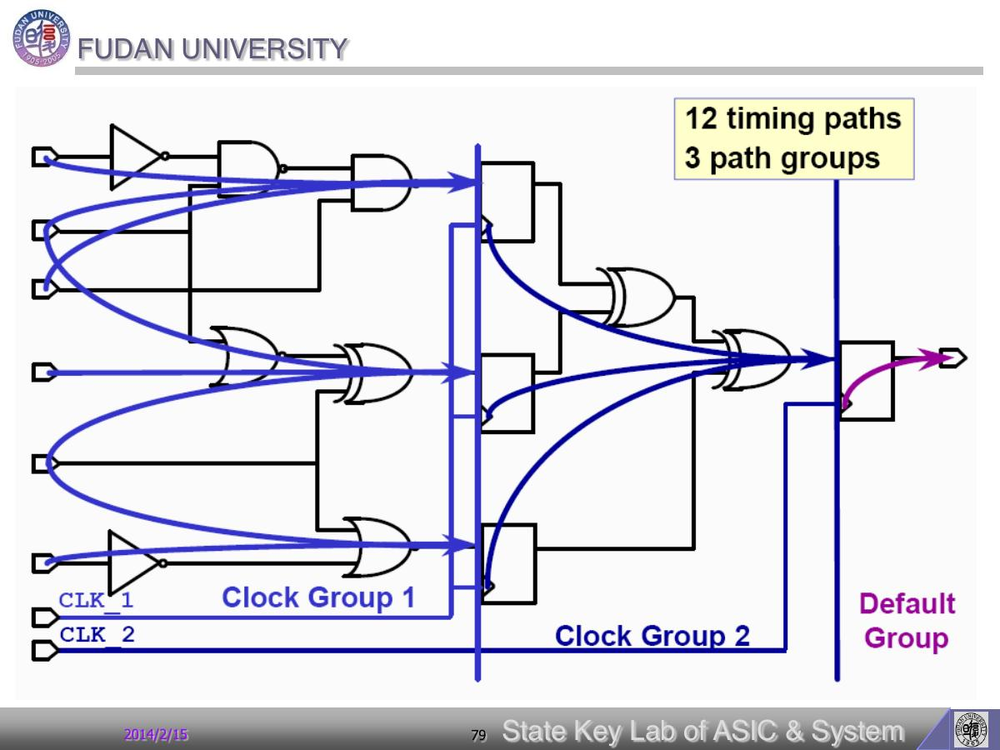

## 页面定位

- **页码**：79/112
- **所属阶段**：STA 与时序报告：路径、clock model、I/O 约束和 slack
- **本页角色**：建立 STA 基本概念
- **阅读问题**：本页要回答：一条 timing path 如何被定义、分组和检查？
- **前后关系**：这部分回答“如何判断结果是否真的满足时序”：看路径、看 required/arrival、看 slack。

## 原文要点

> 本页 OCR 可抽取文本为空或很少，解读主要依据页面标题、页码位置和单页图像。

## 原文解读

这页是 Timing Paths Exercise 的图示页，用来让读者识别输入路径、输出路径、寄存器到寄存器路径和组合路径。

本页关联的关键对象/命令：本页以概念/图示为主，重点看标题和图中对象关系。

## 我的理解

做这类练习时，先找 startpoint/endpoint，再判断路径是否受 clock 控制，最后决定应使用哪类约束。

把它放回完整 DC 流程里看，本页不是孤立知识点，而是在帮助我们更准确地描述“设计、环境、约束、优化结果”中的一个环节。读这一页时，我会优先问：它改变的是 DC 数据库里的哪个对象？它会让 compile 的优化空间变大还是变小？它最终应该在什么报告里被验证？

## 实操提醒

读路径时先标出 startpoint、endpoint、path group、path type，再看 arrival/required/slack。

## 本页小结

本页的核心收获：Timing path exercise visual 这一页应被理解为“建立 STA 基本概念”的读书笔记节点；掌握它的标准不是背下标题，而是能说明它如何影响后续约束、优化或 timing 报告。

## 导航

- 上一页：[Page 078](pages/page-078.md)
- 下一页：[Page 080](pages/page-080.md)

# Page 080 - Path Delay Calculation

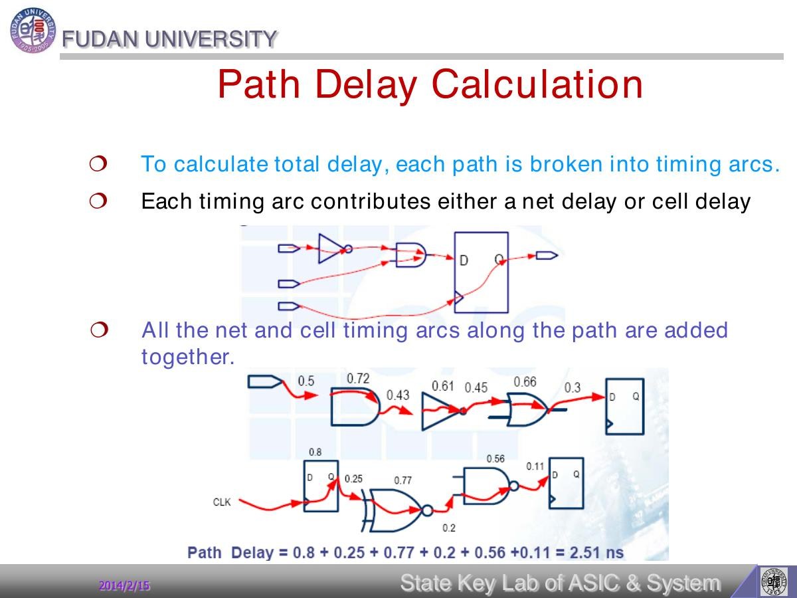

## 页面定位

- **页码**：80/112
- **所属阶段**：STA 与时序报告：路径、clock model、I/O 约束和 slack
- **本页角色**：估计互连延迟
- **阅读问题**：本页要回答：没有布局布线时，DC 如何估计 net delay？
- **前后关系**：这部分回答“如何判断结果是否真的满足时序”：看路径、看 required/arrival、看 slack。

## 原文要点

> Path Delay Calculation
> - To calculate total delay, each path is broken into timing arcs.
> - Each timing arc contributes either a net delay or cell delay
> - All the net and cell timing arcs along the path are added
> together.

## 原文解读

本页讲 wire load/net delay。早期综合没有真实布局布线，只能用 wire load model 按 fanout 和层次估计互连 RC。

本页关联的关键对象/命令：本页以概念/图示为主，重点看标题和图中对象关系。

## 我的理解

我的理解是：线延迟是综合阶段最大的近似之一。top/enclosed/segmented 模式不同，会改变跨层级 net 采用哪个 wire load model。

把它放回完整 DC 流程里看，本页不是孤立知识点，而是在帮助我们更准确地描述“设计、环境、约束、优化结果”中的一个环节。读这一页时，我会优先问：它改变的是 DC 数据库里的哪个对象？它会让 compile 的优化空间变大还是变小？它最终应该在什么报告里被验证？

## 实操提醒

层次设计里要特别检查跨 boundary net；wire load mode 选择会影响时序乐观/悲观程度。

## 本页小结

本页的核心收获：Path Delay Calculation 这一页应被理解为“估计互连延迟”的读书笔记节点；掌握它的标准不是背下标题，而是能说明它如何影响后续约束、优化或 timing 报告。

## 导航

- 上一页：[Page 079](pages/page-079.md)
- 下一页：[Page 081](pages/page-081.md)

# Page 081 - Setup and Hold Time Check

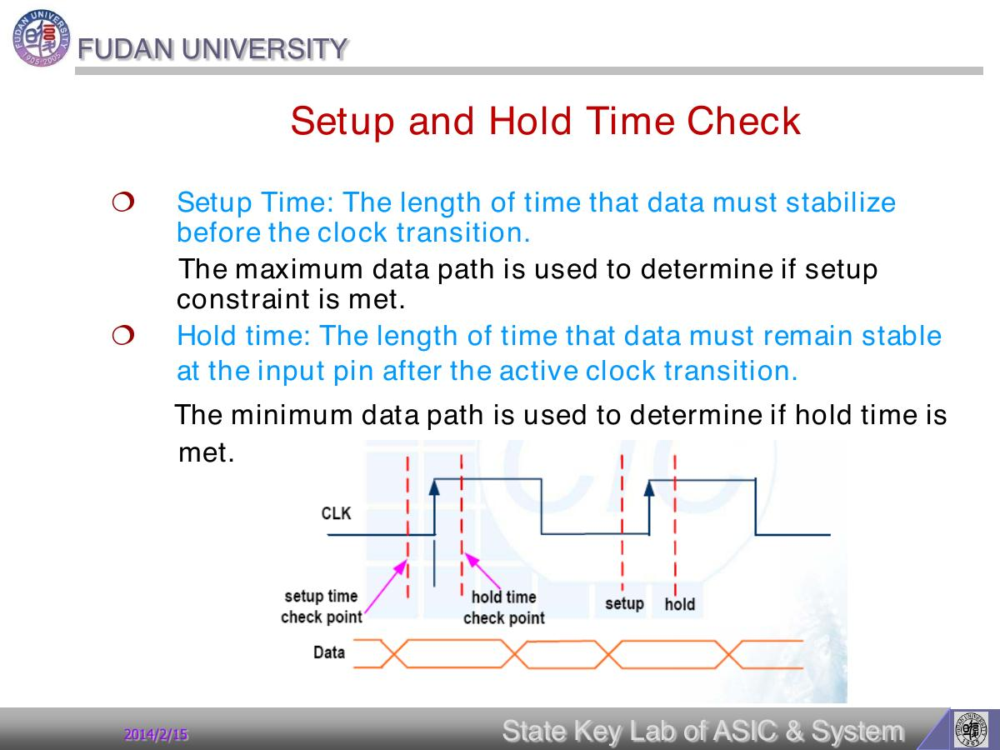

## 页面定位

- **页码**：81/112
- **所属阶段**：STA 与时序报告：路径、clock model、I/O 约束和 slack
- **本页角色**：建立 STA 基本概念
- **阅读问题**：本页要回答：一条 timing path 如何被定义、分组和检查？
- **前后关系**：这部分回答“如何判断结果是否真的满足时序”：看路径、看 required/arrival、看 slack。

## 原文要点

> Setup and Hold Time Check
> - Setup Time: The length of time that data must stabilize
> before the clock transition.
> The maximum data path is used to determine if setup
> constraint is met.
> - Hold time: The length of time that data must remain stable
> at the input pin after the active clock transition.
> The minimum data path is used to determine if hold time is
> met.

## 原文解读

本页讲 STA 基础概念：路径类型、path group、delay calculation、setup/hold check。STA 把电路拆成 timing arc，分别累加 cell delay 和 net delay。

本页关联的关键对象/命令：本页以概念/图示为主，重点看标题和图中对象关系。

## 我的理解

我的理解是：STA 是综合质量的判卷系统。setup 看最大数据路径能否在下一采样边沿前稳定；hold 看最小数据路径会不会太快破坏当前采样。

把它放回完整 DC 流程里看，本页不是孤立知识点，而是在帮助我们更准确地描述“设计、环境、约束、优化结果”中的一个环节。读这一页时，我会优先问：它改变的是 DC 数据库里的哪个对象？它会让 compile 的优化空间变大还是变小？它最终应该在什么报告里被验证？

## 实操提醒

读路径时先标出 startpoint、endpoint、path group、path type，再看 arrival/required/slack。

## 本页小结

本页的核心收获：Setup and Hold Time Check 这一页应被理解为“建立 STA 基本概念”的读书笔记节点；掌握它的标准不是背下标题，而是能说明它如何影响后续约束、优化或 timing 报告。

## 导航

- 上一页：[Page 080](pages/page-080.md)
- 下一页：[Page 082](pages/page-082.md)

# Page 082 - Clock tree modeling transition

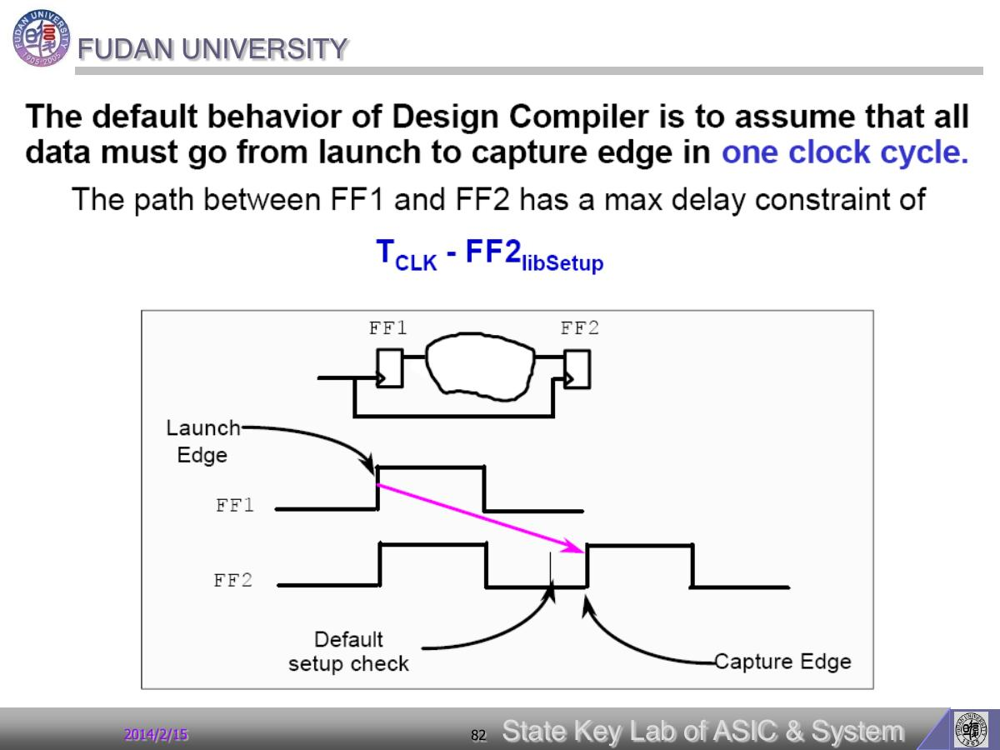

## 页面定位

- **页码**：82/112
- **所属阶段**：STA 与时序报告：路径、clock model、I/O 约束和 slack
- **本页角色**：建模时钟网络
- **阅读问题**：本页要回答：clock latency/uncertainty 如何影响 setup/hold？
- **前后关系**：这部分回答“如何判断结果是否真的满足时序”：看路径、看 required/arrival、看 slack。

## 原文要点

> 本页 OCR 可抽取文本为空或很少，解读主要依据页面标题、页码位置和单页图像。

## 原文解读

这页从 setup/hold 检查转入 clock tree modeling。

本页关联的关键对象/命令：本页以概念/图示为主，重点看标题和图中对象关系。

## 我的理解

理想 clock 只适合早期概念；真实工程必须考虑 clock latency、uncertainty 和 source latency。

把它放回完整 DC 流程里看，本页不是孤立知识点，而是在帮助我们更准确地描述“设计、环境、约束、优化结果”中的一个环节。读这一页时，我会优先问：它改变的是 DC 数据库里的哪个对象？它会让 compile 的优化空间变大还是变小？它最终应该在什么报告里被验证？

## 实操提醒

写 `set_clock_latency`、`set_clock_uncertainty` 时要区分 rise/fall、source/network、pre-CTS/post-CTS 语境。

## 本页小结

本页的核心收获：Clock tree modeling transition 这一页应被理解为“建模时钟网络”的读书笔记节点；掌握它的标准不是背下标题，而是能说明它如何影响后续约束、优化或 timing 报告。

## 导航

- 上一页：[Page 081](pages/page-081.md)
- 下一页：[Page 083](pages/page-083.md)

# Page 083 - Clock Tree Modeling

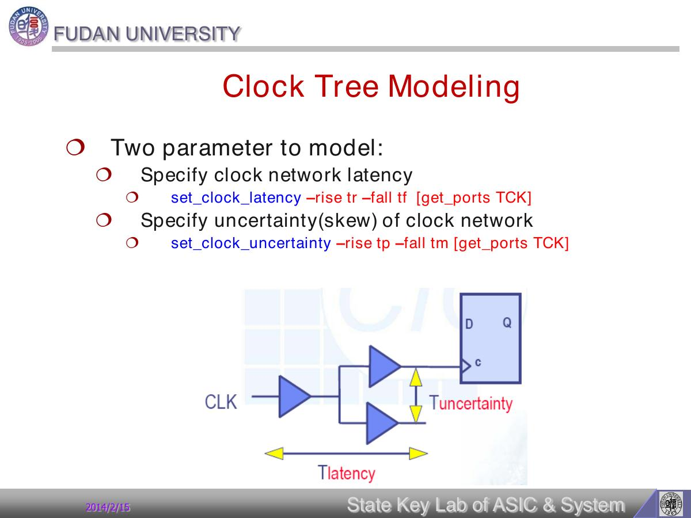

## 页面定位

- **页码**：83/112
- **所属阶段**：STA 与时序报告：路径、clock model、I/O 约束和 slack
- **本页角色**：建模时钟网络
- **阅读问题**：本页要回答：clock latency/uncertainty 如何影响 setup/hold？
- **前后关系**：这部分回答“如何判断结果是否真的满足时序”：看路径、看 required/arrival、看 slack。

## 原文要点

> Clock Tree Modeling
> - Two parameter to model:
> - Specify clock network latency
> - set_clock_latency –rise tr –fall tf [get_ports TCK]
> - Specify uncertainty(skew) of clock network
> - set_clock_uncertainty –rise tp –fall tm [get_ports TCK]

## 原文解读

本页讲 clock tree modeling。clock latency、uncertainty、source latency 用来描述时钟从源头到触发器的延迟、偏差和不确定性。

本页关联的关键对象/命令：`set_clock_latency`, `set_clock_uncertainty`

## 我的理解

我的理解是：clock 不是理想同时到达的信号。setup 和 hold 对 clock latency/uncertainty 的敏感方向不同，所以同一个 clock model 会同时影响最大/最小路径判断。

把它放回完整 DC 流程里看，本页不是孤立知识点，而是在帮助我们更准确地描述“设计、环境、约束、优化结果”中的一个环节。读这一页时，我会优先问：它改变的是 DC 数据库里的哪个对象？它会让 compile 的优化空间变大还是变小？它最终应该在什么报告里被验证？

## 实操提醒

写 `set_clock_latency`、`set_clock_uncertainty` 时要区分 rise/fall、source/network、pre-CTS/post-CTS 语境。

## 本页小结

本页的核心收获：Clock Tree Modeling 这一页应被理解为“建模时钟网络”的读书笔记节点；掌握它的标准不是背下标题，而是能说明它如何影响后续约束、优化或 timing 报告。

## 导航

- 上一页：[Page 082](pages/page-082.md)
- 下一页：[Page 084](pages/page-084.md)

# Page 084 - Clock Tree Modeling Example

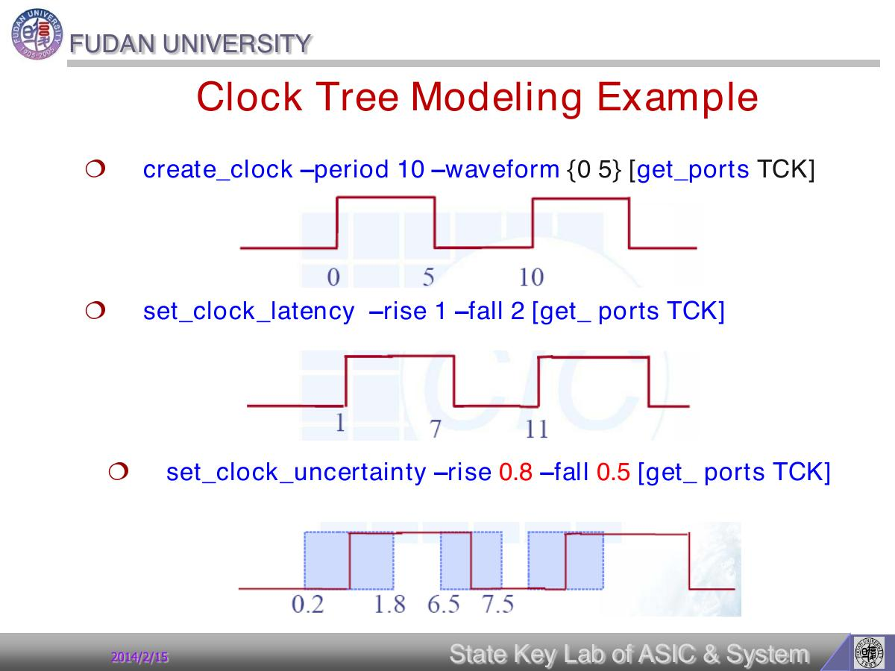

## 页面定位

- **页码**：84/112
- **所属阶段**：STA 与时序报告：路径、clock model、I/O 约束和 slack
- **本页角色**：建模时钟网络
- **阅读问题**：本页要回答：clock latency/uncertainty 如何影响 setup/hold？
- **前后关系**：这部分回答“如何判断结果是否真的满足时序”：看路径、看 required/arrival、看 slack。

## 原文要点

> Clock Tree Modeling Example
> - create_clock –period 10 –waveform {0 5} [get_ports TCK]
> - set_clock_latency –rise 1 –fall 2 [get_ ports TCK]
> - set_clock_uncertainty –rise 0.8 –fall 0.5 [get_ ports TCK]

## 原文解读

本页给出 clock tree modeling 示例：先用 `create_clock` 定义 TCK，再用 `set_clock_latency` 指定 rise/fall clock latency，用 `set_clock_uncertainty` 描述时钟不确定性。它们共同影响 STA 中 clock path 和 required time。

本页关联的关键对象/命令：`create_clock`, `set_clock_latency`, `set_clock_uncertainty`

## 我的理解

我的理解是：这页不是普通 I/O timing constraint，而是在给理想时钟补上更真实的 clock tree 假设。latency 描述时钟到达延迟，uncertainty 描述偏差和裕量。

把它放回完整 DC 流程里看，本页不是孤立知识点，而是在帮助我们更准确地描述“设计、环境、约束、优化结果”中的一个环节。读这一页时，我会优先问：它改变的是 DC 数据库里的哪个对象？它会让 compile 的优化空间变大还是变小？它最终应该在什么报告里被验证？

## 实操提醒

写 clock model 时要区分 rise/fall latency 和 uncertainty；这些值会同时影响 setup 与 hold 分析。

## 本页小结

本页的核心收获：Clock Tree Modeling Example 这一页应被理解为“建模时钟网络”的读书笔记节点；掌握它的标准不是背下标题，而是能说明它如何影响后续约束、优化或 timing 报告。

## 导航

- 上一页：[Page 083](pages/page-083.md)
- 下一页：[Page 085](pages/page-085.md)

# Page 085 - Effect of Clock Tree Modeling on Setup

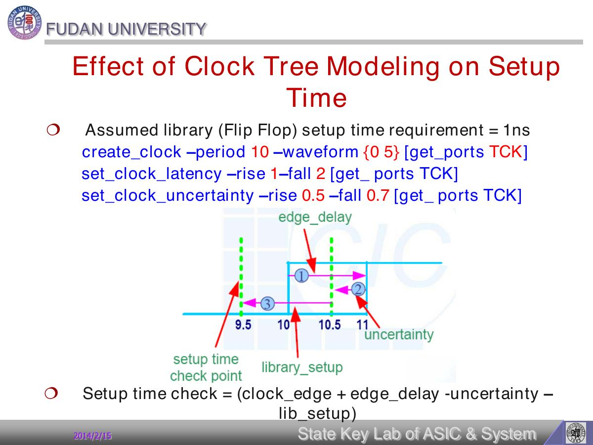

## 页面定位

- **页码**：85/112
- **所属阶段**：STA 与时序报告：路径、clock model、I/O 约束和 slack
- **本页角色**：建模时钟网络
- **阅读问题**：本页要回答：clock latency/uncertainty 如何影响 setup/hold？
- **前后关系**：这部分回答“如何判断结果是否真的满足时序”：看路径、看 required/arrival、看 slack。

## 原文要点

> Effect of Clock Tree Modeling on Setup
> Time
> - Assumed library (Flip Flop) setup time requirement = 1ns
> create_clock –period 10 –waveform {0 5} [get_ports TCK]
> set_clock_latency –rise 1–fall 2 [get_ ports TCK]
> set_clock_uncertainty –rise 0.5 –fall 0.7 [get_ ports TCK]
> - Setup time check = (clock_edge + edge_delay -uncertainty –
> lib_setup)

## 原文解读

本页讲 clock tree modeling 对 setup check 的影响。setup required time 通常会从 capture clock edge 出发，加入 edge delay/latency，再扣除 clock uncertainty 和 library setup time。uncertainty 越大，可用 setup 时间越少。

本页关联的关键对象/命令：`create_clock`, `set_clock_latency`, `set_clock_uncertainty`

## 我的理解

我的理解是：setup 分析关心数据最晚能什么时候到。clock latency、uncertainty 和 library setup requirement 都会改变 required time；因此 clock model 写得越保守，setup 收敛压力越大。

把它放回完整 DC 流程里看，本页不是孤立知识点，而是在帮助我们更准确地描述“设计、环境、约束、优化结果”中的一个环节。读这一页时，我会优先问：它改变的是 DC 数据库里的哪个对象？它会让 compile 的优化空间变大还是变小？它最终应该在什么报告里被验证？

## 实操提醒

调 setup violation 时，不只看 data path，也要检查 clock latency、uncertainty 和 library setup 是否按当前阶段合理建模。

## 本页小结

本页的核心收获：Effect of Clock Tree Modeling on Setup 这一页应被理解为“建模时钟网络”的读书笔记节点；掌握它的标准不是背下标题，而是能说明它如何影响后续约束、优化或 timing 报告。

## 导航

- 上一页：[Page 084](pages/page-084.md)
- 下一页：[Page 086](pages/page-086.md)

# Page 086 - Effect of Clock Tree Modeling on Hold

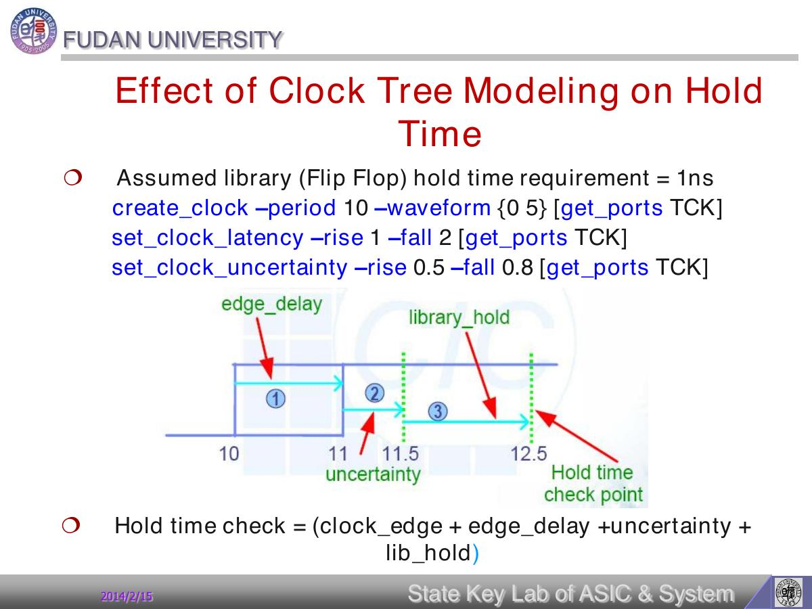

## 页面定位

- **页码**：86/112
- **所属阶段**：STA 与时序报告：路径、clock model、I/O 约束和 slack
- **本页角色**：建模时钟网络
- **阅读问题**：本页要回答：clock latency/uncertainty 如何影响 setup/hold？
- **前后关系**：这部分回答“如何判断结果是否真的满足时序”：看路径、看 required/arrival、看 slack。

## 原文要点

> Effect of Clock Tree Modeling on Hold
> Time
> - Assumed library (Flip Flop) hold time requirement = 1ns
> create_clock –period 10 –waveform {0 5} [get_ports TCK]
> set_clock_latency –rise 1 –fall 2 [get_ports TCK]
> set_clock_uncertainty –rise 0.5 –fall 0.8 [get_ports TCK]
> - Hold time check = (clock_edge + edge_delay +uncertainty +
> lib_hold)

## 原文解读

本页讲 clock tree modeling 对 hold check 的影响。hold check 关注数据是否过早变化，公式中 uncertainty 和 library hold time 会提高保持要求，因此 hold 分析与 setup 分析的方向不同。

本页关联的关键对象/命令：`create_clock`, `set_clock_latency`, `set_clock_uncertainty`

## 我的理解

我的理解是：hold 分析看的是最小路径，很多时候不是路径太慢，而是数据太快。clock latency 和 uncertainty 的设置会改变 hold required time，所以同一套 clock model 对 setup/hold 的影响不能混为一谈。

把它放回完整 DC 流程里看，本页不是孤立知识点，而是在帮助我们更准确地描述“设计、环境、约束、优化结果”中的一个环节。读这一页时，我会优先问：它改变的是 DC 数据库里的哪个对象？它会让 compile 的优化空间变大还是变小？它最终应该在什么报告里被验证？

## 实操提醒

调 hold violation 时先确认 `Path Type: min`，再检查 clock uncertainty、latency 和 library hold requirement；不要用 setup 的直觉去解释 hold。

## 本页小结

本页的核心收获：Effect of Clock Tree Modeling on Hold 这一页应被理解为“建模时钟网络”的读书笔记节点；掌握它的标准不是背下标题，而是能说明它如何影响后续约束、优化或 timing 报告。

## 导航

- 上一页：[Page 085](pages/page-085.md)
- 下一页：[Page 087](pages/page-087.md)

# Page 087 - Modeling Source Latency

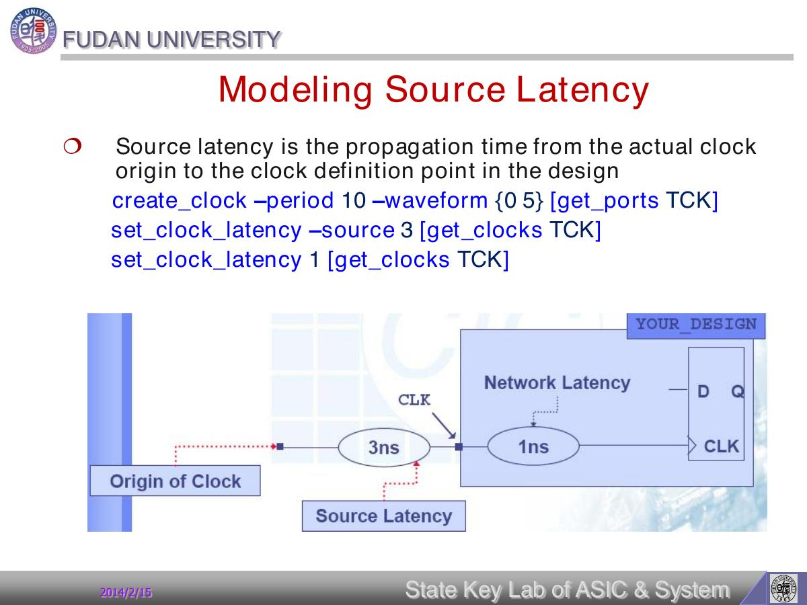

## 页面定位

- **页码**：87/112
- **所属阶段**：STA 与时序报告：路径、clock model、I/O 约束和 slack
- **本页角色**：建模时钟网络
- **阅读问题**：本页要回答：source latency 和普通 clock latency 有什么区别？
- **前后关系**：这部分回答“如何判断结果是否真的满足时序”：看路径、看 required/arrival、看 slack。

## 原文要点

> Modeling Source Latency
> - Source latency is the propagation time from the actual clock
> origin to the clock definition point in the design
> create_clock –period 10 –waveform {0 5} [get_ports TCK]
> set_clock_latency –source 3 [get_clocks TCK]
> set_clock_latency 1 [get_clocks TCK]

## 原文解读

本页讲 source latency：它表示真实 clock origin 到设计中 clock definition point 的传播时间。示例中 `set_clock_latency -source 3 [get_clocks TCK]` 设置源延迟，普通 `set_clock_latency 1` 则描述后续网络延迟。

本页关联的关键对象/命令：`create_clock`, `set_clock_latency`

## 我的理解

我的理解是：source latency 把芯片外部或时钟源到定义点之前的时间纳入模型；network latency 则更偏向定义点之后的时钟网络。区分二者有助于把系统级时钟路径和设计内部 clock tree 分开。

把它放回完整 DC 流程里看，本页不是孤立知识点，而是在帮助我们更准确地描述“设计、环境、约束、优化结果”中的一个环节。读这一页时，我会优先问：它改变的是 DC 数据库里的哪个对象？它会让 compile 的优化空间变大还是变小？它最终应该在什么报告里被验证？

## 实操提醒

建模 clock latency 时标清 source latency 与 network latency 的边界，避免把同一段时钟延迟重复计算。

## 本页小结

本页的核心收获：Modeling Source Latency 这一页应被理解为“建模时钟网络”的读书笔记节点；掌握它的标准不是背下标题，而是能说明它如何影响后续约束、优化或 timing 报告。

## 导航

- 上一页：[Page 086](pages/page-086.md)
- 下一页：[Page 088](pages/page-088.md)

# Page 088 - Constraining the Input Paths

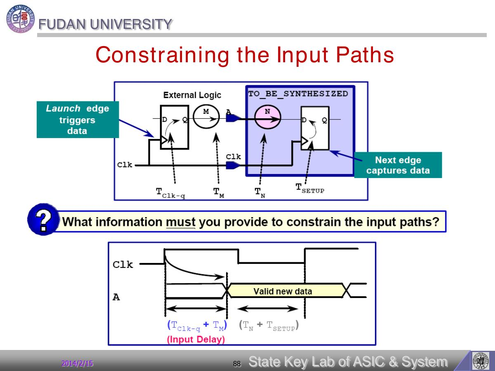

## 页面定位

- **页码**：88/112
- **所属阶段**：STA 与时序报告：路径、clock model、I/O 约束和 slack
- **本页角色**：约束模块 I/O 路径
- **阅读问题**：本页要回答：模块边界外部时间预算如何折算成 I/O delay？
- **前后关系**：这部分回答“如何判断结果是否真的满足时序”：看路径、看 required/arrival、看 slack。

## 原文要点

> Constraining the Input Paths

## 原文解读

本页提出输入路径约束问题：外部逻辑 launch 数据，当前待综合模块内还有一段逻辑，下一采样边沿 capture 数据。

本页关联的关键对象/命令：本页以概念/图示为主，重点看标题和图中对象关系。

## 我的理解

我的理解是：输入路径约束要提供外部已经消耗的时间，也就是 `(Tclk-q + TM)`；DC 才能优化模块内 `TN` 并满足 setup。

把它放回完整 DC 流程里看，本页不是孤立知识点，而是在帮助我们更准确地描述“设计、环境、约束、优化结果”中的一个环节。读这一页时，我会优先问：它改变的是 DC 数据库里的哪个对象？它会让 compile 的优化空间变大还是变小？它最终应该在什么报告里被验证？

## 实操提醒

用 `set_input_delay -max/-min` 分别约束 setup/hold 相关预算。

## 本页小结

本页的核心收获：Constraining the Input Paths 这一页应被理解为“约束模块 I/O 路径”的读书笔记节点；掌握它的标准不是背下标题，而是能说明它如何影响后续约束、优化或 timing 报告。

## 导航

- 上一页：[Page 087](pages/page-087.md)
- 下一页：[Page 089](pages/page-089.md)

# Page 089 - Constraining the Input Paths

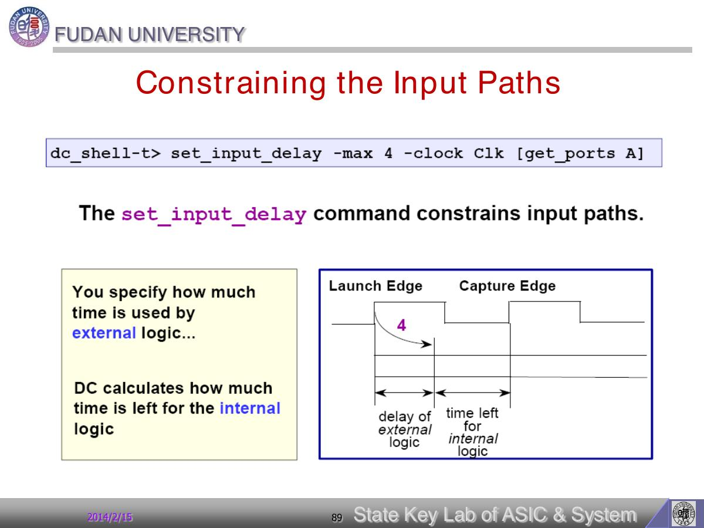

## 页面定位

- **页码**：89/112
- **所属阶段**：STA 与时序报告：路径、clock model、I/O 约束和 slack
- **本页角色**：约束模块 I/O 路径
- **阅读问题**：本页要回答：模块边界外部时间预算如何折算成 I/O delay？
- **前后关系**：这部分回答“如何判断结果是否真的满足时序”：看路径、看 required/arrival、看 slack。

## 原文要点

> Constraining the Input Paths

## 原文解读

本页继续输入路径约束，通常会把图中的时间预算落到具体 `set_input_delay` 命令。

本页关联的关键对象/命令：本页以概念/图示为主，重点看标题和图中对象关系。

## 我的理解

我的理解是：同一输入端口可能同时需要 max 和 min；max 用于 setup，min 用于 hold，二者不能互相替代。

把它放回完整 DC 流程里看，本页不是孤立知识点，而是在帮助我们更准确地描述“设计、环境、约束、优化结果”中的一个环节。读这一页时，我会优先问：它改变的是 DC 数据库里的哪个对象？它会让 compile 的优化空间变大还是变小？它最终应该在什么报告里被验证？

## 实操提醒

检查输入 delay 时，不要只写 max 而漏掉 min。

## 本页小结

本页的核心收获：Constraining the Input Paths 这一页应被理解为“约束模块 I/O 路径”的读书笔记节点；掌握它的标准不是背下标题，而是能说明它如何影响后续约束、优化或 timing 报告。

## 导航

- 上一页：[Page 088](pages/page-088.md)
- 下一页：[Page 090](pages/page-090.md)

# Page 090 - Constraining the Output Paths

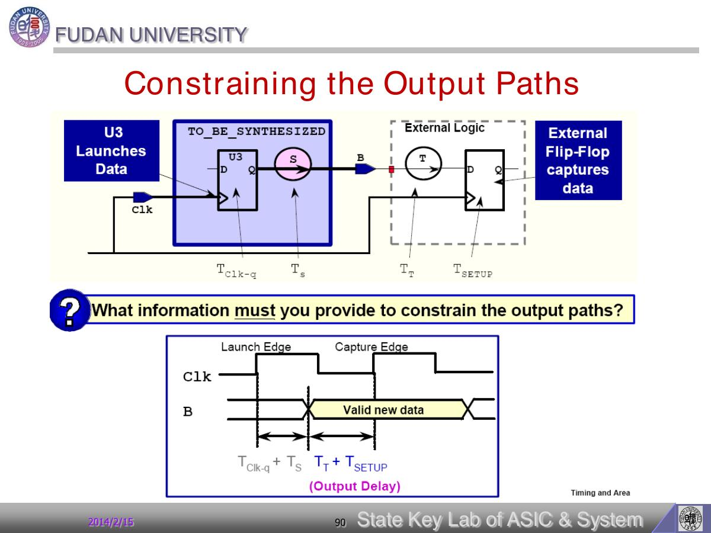

## 页面定位

- **页码**：90/112
- **所属阶段**：STA 与时序报告：路径、clock model、I/O 约束和 slack
- **本页角色**：约束模块 I/O 路径
- **阅读问题**：本页要回答：模块边界外部时间预算如何折算成 I/O delay？
- **前后关系**：这部分回答“如何判断结果是否真的满足时序”：看路径、看 required/arrival、看 slack。

## 原文要点

> Constraining the Output Paths

## 原文解读

本页提出输出路径约束问题：当前模块内部逻辑之后，输出端还会经过外部逻辑再到下游寄存器。

本页关联的关键对象/命令：本页以概念/图示为主，重点看标题和图中对象关系。

## 我的理解

我的理解是：输出约束的核心是“给外部和下游 setup 留多少时间”。DC 优化当前模块时，会把这部分从周期预算中扣除。

把它放回完整 DC 流程里看，本页不是孤立知识点，而是在帮助我们更准确地描述“设计、环境、约束、优化结果”中的一个环节。读这一页时，我会优先问：它改变的是 DC 数据库里的哪个对象？它会让 compile 的优化空间变大还是变小？它最终应该在什么报告里被验证？

## 实操提醒

用 `set_output_delay` 描述下游需求，而不是把输出端当成没有外部负载的终点。

## 本页小结

本页的核心收获：Constraining the Output Paths 这一页应被理解为“约束模块 I/O 路径”的读书笔记节点；掌握它的标准不是背下标题，而是能说明它如何影响后续约束、优化或 timing 报告。

## 导航

- 上一页：[Page 089](pages/page-089.md)
- 下一页：[Page 091](pages/page-091.md)

# Page 091 - Constraining the Output Paths

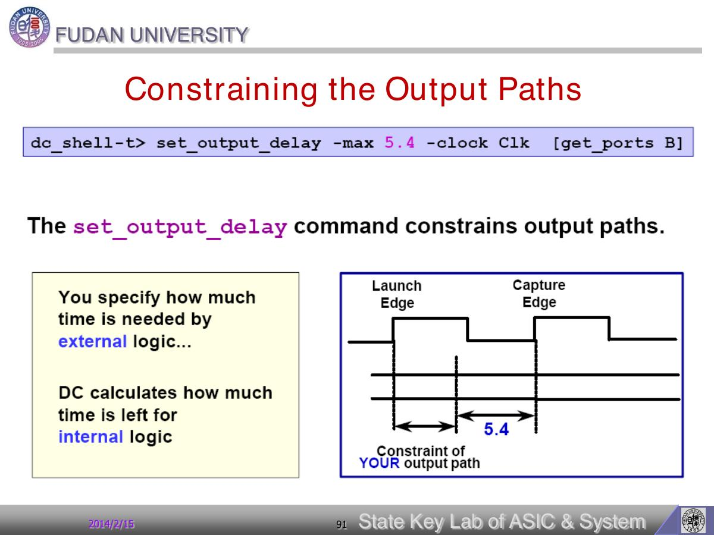

## 页面定位

- **页码**：91/112
- **所属阶段**：STA 与时序报告：路径、clock model、I/O 约束和 slack
- **本页角色**：约束模块 I/O 路径
- **阅读问题**：本页要回答：模块边界外部时间预算如何折算成 I/O delay？
- **前后关系**：这部分回答“如何判断结果是否真的满足时序”：看路径、看 required/arrival、看 slack。

## 原文要点

> Constraining the Output Paths

## 原文解读

本页继续输出路径约束，帮助把图示关系转成命令和预算。

本页关联的关键对象/命令：本页以概念/图示为主，重点看标题和图中对象关系。

## 我的理解

我的理解是：output delay 本质上是模块接口契约；上游模块不能占用下游模块需要的时间。

把它放回完整 DC 流程里看，本页不是孤立知识点，而是在帮助我们更准确地描述“设计、环境、约束、优化结果”中的一个环节。读这一页时，我会优先问：它改变的是 DC 数据库里的哪个对象？它会让 compile 的优化空间变大还是变小？它最终应该在什么报告里被验证？

## 实操提醒

多时钟输出端口要确认使用的 reference clock，避免约束落到错误 clock domain。

## 本页小结

本页的核心收获：Constraining the Output Paths 这一页应被理解为“约束模块 I/O 路径”的读书笔记节点；掌握它的标准不是背下标题，而是能说明它如何影响后续约束、优化或 timing 报告。

## 导航

- 上一页：[Page 090](pages/page-090.md)
- 下一页：[Page 092](pages/page-092.md)

# Page 092 - DC Timing Reports

## 页面定位

- **页码**：92/112
- **所属阶段**：STA 与时序报告：路径、clock model、I/O 约束和 slack
- **本页角色**：拆解 timing report
- **阅读问题**：本页要回答：timing report 每一段数字从哪里来，slack 如何形成？
- **前后关系**：这部分回答“如何判断结果是否真的满足时序”：看路径、看 required/arrival、看 slack。

## 原文要点

> DC Timing Reports
> - Use the report_timing command to access the
> timing reports.

## 原文解读

本页讲综合结果和属性报告。report_design、report_clock、report_port、report_timing 等命令用于验证 DC 当前数据库中的对象和约束。

本页关联的关键对象/命令：`report_timing`

## 我的理解

我的理解是：报告不是最后才看的成果物，而是每个阶段的反馈回路。读入后、约束后、compile 后都应该报告一次。

把它放回完整 DC 流程里看，本页不是孤立知识点，而是在帮助我们更准确地描述“设计、环境、约束、优化结果”中的一个环节。读这一页时，我会优先问：它改变的是 DC 数据库里的哪个对象？它会让 compile 的优化空间变大还是变小？它最终应该在什么报告里被验证？

## 实操提醒

建立脚本习惯：每个关键阶段输出 log/report，便于比较前后状态。

## 本页小结

本页的核心收获：DC Timing Reports 这一页应被理解为“拆解 timing report”的读书笔记节点；掌握它的标准不是背下标题，而是能说明它如何影响后续约束、优化或 timing 报告。

## 导航

- 上一页：[Page 091](pages/page-091.md)
- 下一页：[Page 093](pages/page-093.md)

# Page 093 - Startpoint: ARM7TDMI/debuger/tms_latch_reg/CKN

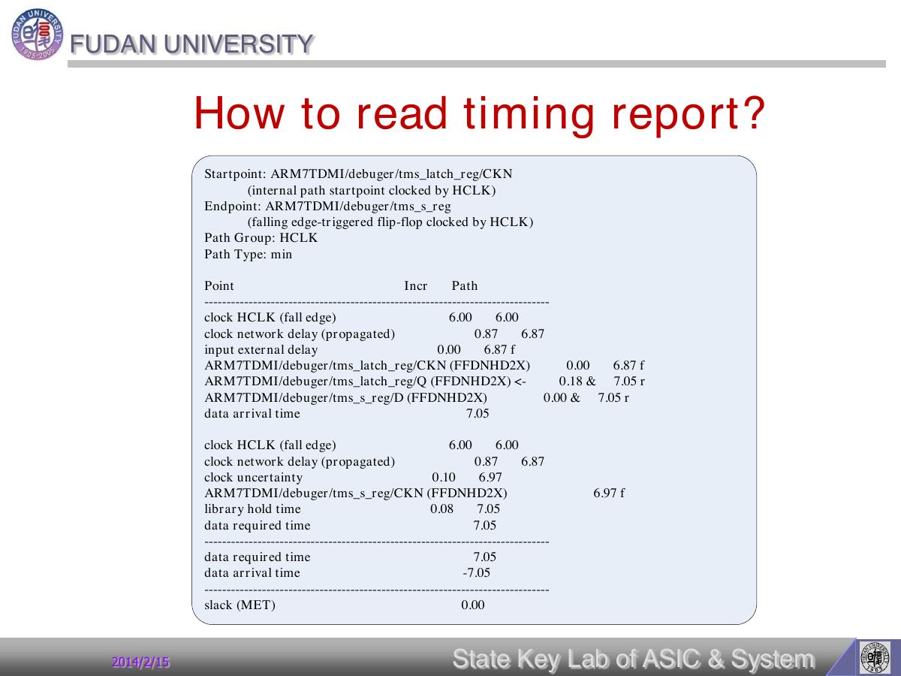

## 页面定位

- **页码**：93/112
- **所属阶段**：STA 与时序报告：路径、clock model、I/O 约束和 slack
- **本页角色**：拆解 timing report
- **阅读问题**：本页要回答：timing report 每一段数字从哪里来，slack 如何形成？
- **前后关系**：这部分回答“如何判断结果是否真的满足时序”：看路径、看 required/arrival、看 slack。

## 原文要点

> Startpoint: ARM7TDMI/debuger/tms_latch_reg/CKN
> (internal path startpoint clocked by HCLK)
> Endpoint: ARM7TDMI/debuger/tms_s_reg
> (falling edge-triggered flip-flop clocked by HCLK)
> Path Group: HCLK
> Path Type: min
> Point Incr Path
> ------------------------------------------------------------------------------
> clock HCLK (fall edge) 6.00 6.00
> clock network delay (propagated) 0.87 6.87
> input external delay 0.00 6.87 f
> ARM7TDMI/debuger/tms_latch_reg/CKN (FFDNHD2X) 0.00 6.87 f
> ARM7TDMI/debuger/tms_latch_reg/Q (FFDNHD2X) <- 0.18 & 7.05 r
> ARM7TDMI/debuger/tms_s_reg/D (FFDNHD2X) 0.00 & 7.05 r
> ...

## 原文解读

本页给出完整 timing report 示例。前半段是 data arrival：从 HCLK fall edge、clock network delay、外部 delay，到 startpoint/endpoint 的数据路径；后半段是 data required：同一 clock 边沿、clock network delay、uncertainty、library hold time，最后得到 slack。

本页关联的关键对象/命令：本页以概念/图示为主，重点看标题和图中对象关系。

## 我的理解

我的理解是：这是一个 min/hold 类型路径，slack 为 0.00 且 MET，说明刚好满足 hold 要求。读这页不能把它当作普通文本，而要逐行追踪 arrival 和 required 两条账。

把它放回完整 DC 流程里看，本页不是孤立知识点，而是在帮助我们更准确地描述“设计、环境、约束、优化结果”中的一个环节。读这一页时，我会优先问：它改变的是 DC 数据库里的哪个对象？它会让 compile 的优化空间变大还是变小？它最终应该在什么报告里被验证？

## 实操提醒

调试 report_timing 时先看 `Path Type: min/max`，再决定是在分析 hold 还是 setup。

## 本页小结

本页的核心收获：Startpoint: ARM7TDMI/debuger/tms_latch_reg/CKN 这一页应被理解为“拆解 timing report”的读书笔记节点；掌握它的标准不是背下标题，而是能说明它如何影响后续约束、优化或 timing 报告。

## 导航

- 上一页：[Page 092](pages/page-092.md)
- 下一页：[Page 094](pages/page-094.md)

# Page 094 - Timing Report: Path Information Section

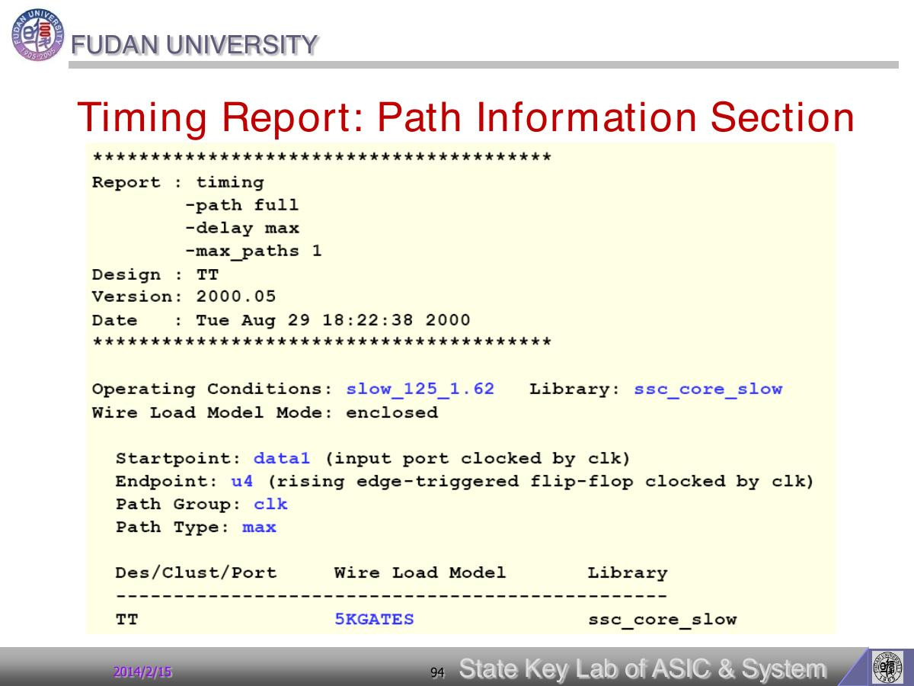

## 页面定位

- **页码**：94/112
- **所属阶段**：STA 与时序报告：路径、clock model、I/O 约束和 slack
- **本页角色**：拆解 timing report
- **阅读问题**：本页要回答：timing report 每一段数字从哪里来，slack 如何形成？
- **前后关系**：这部分回答“如何判断结果是否真的满足时序”：看路径、看 required/arrival、看 slack。

## 原文要点

> Timing Report: Path Information Section

## 原文解读

本页聚焦 timing report 的 Path Information Section：Startpoint、Endpoint、Path Group、Path Type 先告诉你这条路径是谁到谁、属于哪个 clock group、分析 max 还是 min。

本页关联的关键对象/命令：本页以概念/图示为主，重点看标题和图中对象关系。

## 我的理解

我的理解是：如果这一段没读懂，后面的数字没有意义。很多误判来自把 min path 当成 setup，或把 path group/clock domain 看错。

把它放回完整 DC 流程里看，本页不是孤立知识点，而是在帮助我们更准确地描述“设计、环境、约束、优化结果”中的一个环节。读这一页时，我会优先问：它改变的是 DC 数据库里的哪个对象？它会让 compile 的优化空间变大还是变小？它最终应该在什么报告里被验证？

## 实操提醒

读报告第一步只做身份确认，不急着看 slack。

## 本页小结

本页的核心收获：Timing Report: Path Information Section 这一页应被理解为“拆解 timing report”的读书笔记节点；掌握它的标准不是背下标题，而是能说明它如何影响后续约束、优化或 timing 报告。

## 导航

- 上一页：[Page 093](pages/page-093.md)
- 下一页：[Page 095](pages/page-095.md)

# Page 095 - Timing Report: Path Delay Section

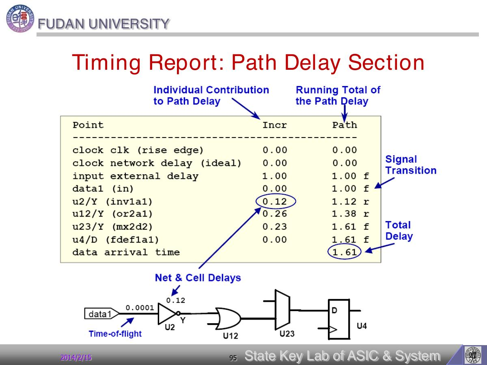

## 页面定位

- **页码**：95/112
- **所属阶段**：STA 与时序报告：路径、clock model、I/O 约束和 slack
- **本页角色**：拆解 timing report
- **阅读问题**：本页要回答：timing report 每一段数字从哪里来，slack 如何形成？
- **前后关系**：这部分回答“如何判断结果是否真的满足时序”：看路径、看 required/arrival、看 slack。

## 原文要点

> Timing Report: Path Delay Section

## 原文解读

本页聚焦 Path Delay Section：Point/Incr/Path 列表展示每个 pin/net/cell 对 arrival time 的增量贡献。

本页关联的关键对象/命令：本页以概念/图示为主，重点看标题和图中对象关系。

## 我的理解

我的理解是：优化关键路径时，真正能动刀的是这一段。Incr 大的 cell 或 net 往往对应 sizing、buffer、重构逻辑或物理布局问题。

把它放回完整 DC 流程里看，本页不是孤立知识点，而是在帮助我们更准确地描述“设计、环境、约束、优化结果”中的一个环节。读这一页时，我会优先问：它改变的是 DC 数据库里的哪个对象？它会让 compile 的优化空间变大还是变小？它最终应该在什么报告里被验证？

## 实操提醒

用这段找最大增量和异常 transition/load，而不是只盯 summary。

## 本页小结

本页的核心收获：Timing Report: Path Delay Section 这一页应被理解为“拆解 timing report”的读书笔记节点；掌握它的标准不是背下标题，而是能说明它如何影响后续约束、优化或 timing 报告。

## 导航

- 上一页：[Page 094](pages/page-094.md)
- 下一页：[Page 096](pages/page-096.md)

# Page 096 - Timing Report: Path Required Section

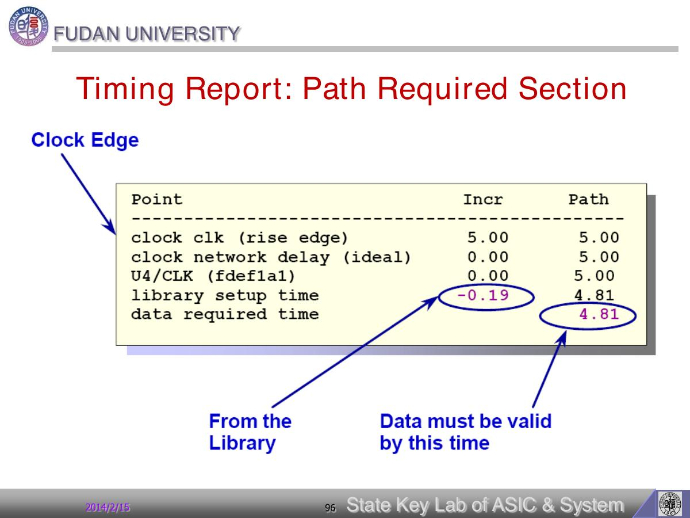

## 页面定位

- **页码**：96/112
- **所属阶段**：STA 与时序报告：路径、clock model、I/O 约束和 slack
- **本页角色**：拆解 timing report
- **阅读问题**：本页要回答：timing report 每一段数字从哪里来，slack 如何形成？
- **前后关系**：这部分回答“如何判断结果是否真的满足时序”：看路径、看 required/arrival、看 slack。

## 原文要点

> Timing Report: Path Required Section

## 原文解读

本页聚焦 Path Required Section：required time 会扣除 uncertainty、setup/hold 等要求，形成数据必须满足的边界。

本页关联的关键对象/命令：本页以概念/图示为主，重点看标题和图中对象关系。

## 我的理解

我的理解是：required time 不是凭空来的，它来自 capture clock、clock network、uncertainty 和库时序要求。理解这一段才能解释 slack 为什么紧。

把它放回完整 DC 流程里看，本页不是孤立知识点，而是在帮助我们更准确地描述“设计、环境、约束、优化结果”中的一个环节。读这一页时，我会优先问：它改变的是 DC 数据库里的哪个对象？它会让 compile 的优化空间变大还是变小？它最终应该在什么报告里被验证？

## 实操提醒

当 slack 异常时，检查 uncertainty、latency、setup/hold requirement 是否建模正确。

## 本页小结

本页的核心收获：Timing Report: Path Required Section 这一页应被理解为“拆解 timing report”的读书笔记节点；掌握它的标准不是背下标题，而是能说明它如何影响后续约束、优化或 timing 报告。

## 导航

- 上一页：[Page 095](pages/page-095.md)
- 下一页：[Page 097](pages/page-097.md)

# Page 097 - Timing Report: Summary Section

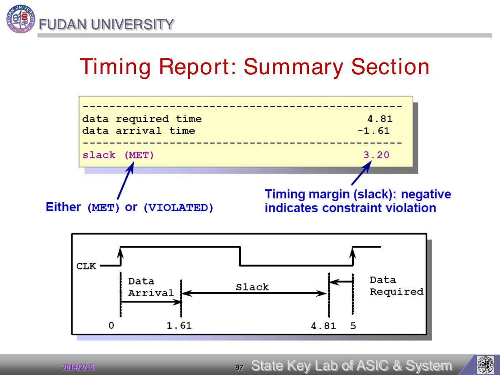

## 页面定位

- **页码**：97/112
- **所属阶段**：STA 与时序报告：路径、clock model、I/O 约束和 slack
- **本页角色**：拆解 timing report
- **阅读问题**：本页要回答：timing report 每一段数字从哪里来，slack 如何形成？
- **前后关系**：这部分回答“如何判断结果是否真的满足时序”：看路径、看 required/arrival、看 slack。

## 原文要点

> Timing Report: Summary Section

## 原文解读

本页聚焦 Summary Section：`data required time - data arrival time = slack`，最后判断 MET 或 VIOLATED。

本页关联的关键对象/命令：本页以概念/图示为主，重点看标题和图中对象关系。

## 我的理解

我的理解是：summary 是结果，不是原因。真正的原因要回到 path delay 和 path required 两段找。

把它放回完整 DC 流程里看，本页不是孤立知识点，而是在帮助我们更准确地描述“设计、环境、约束、优化结果”中的一个环节。读这一页时，我会优先问：它改变的是 DC 数据库里的哪个对象？它会让 compile 的优化空间变大还是变小？它最终应该在什么报告里被验证？

## 实操提醒

报告复盘时写清楚 slack 的方向、数值和主因。

## 本页小结

本页的核心收获：Timing Report: Summary Section 这一页应被理解为“拆解 timing report”的读书笔记节点；掌握它的标准不是背下标题，而是能说明它如何影响后续约束、优化或 timing 报告。

## 导航

- 上一页：[Page 096](pages/page-096.md)
- 下一页：[Page 098](pages/page-098.md)

# Page 098 - Timing report exercise visual

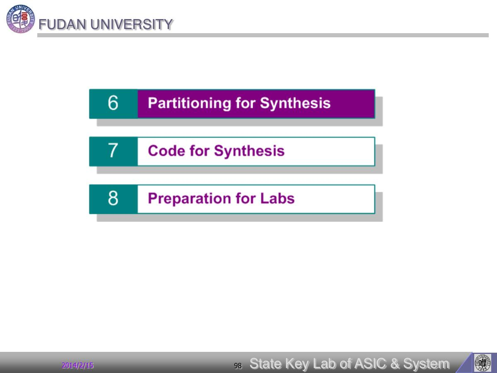

## 页面定位

- **页码**：98/112
- **所属阶段**：STA 与时序报告：路径、clock model、I/O 约束和 slack
- **本页角色**：拆解 timing report
- **阅读问题**：本页要回答：timing report 每一段数字从哪里来，slack 如何形成？
- **前后关系**：这部分回答“如何判断结果是否真的满足时序”：看路径、看 required/arrival、看 slack。

## 原文要点

> 本页 OCR 可抽取文本为空或很少，解读主要依据页面标题、页码位置和单页图像。

## 原文解读

这页是 timing report 章节的练习/过渡图示。

本页关联的关键对象/命令：本页以概念/图示为主，重点看标题和图中对象关系。

## 我的理解

读 timing report 不能只看最后 slack，必须能把 path information、path delay、required time 和 summary 分开。

把它放回完整 DC 流程里看，本页不是孤立知识点，而是在帮助我们更准确地描述“设计、环境、约束、优化结果”中的一个环节。读这一页时，我会优先问：它改变的是 DC 数据库里的哪个对象？它会让 compile 的优化空间变大还是变小？它最终应该在什么报告里被验证？

## 实操提醒

读报告时按四步：确认 path type，跟踪 data arrival，跟踪 data required，最后解释 slack。

## 本页小结

本页的核心收获：Timing report exercise visual 这一页应被理解为“拆解 timing report”的读书笔记节点；掌握它的标准不是背下标题，而是能说明它如何影响后续约束、优化或 timing 报告。

## 导航

- 上一页：[Page 097](pages/page-097.md)
- 下一页：[Page 099](pages/page-099.md)

# Page 099 - Timing report exercise visual

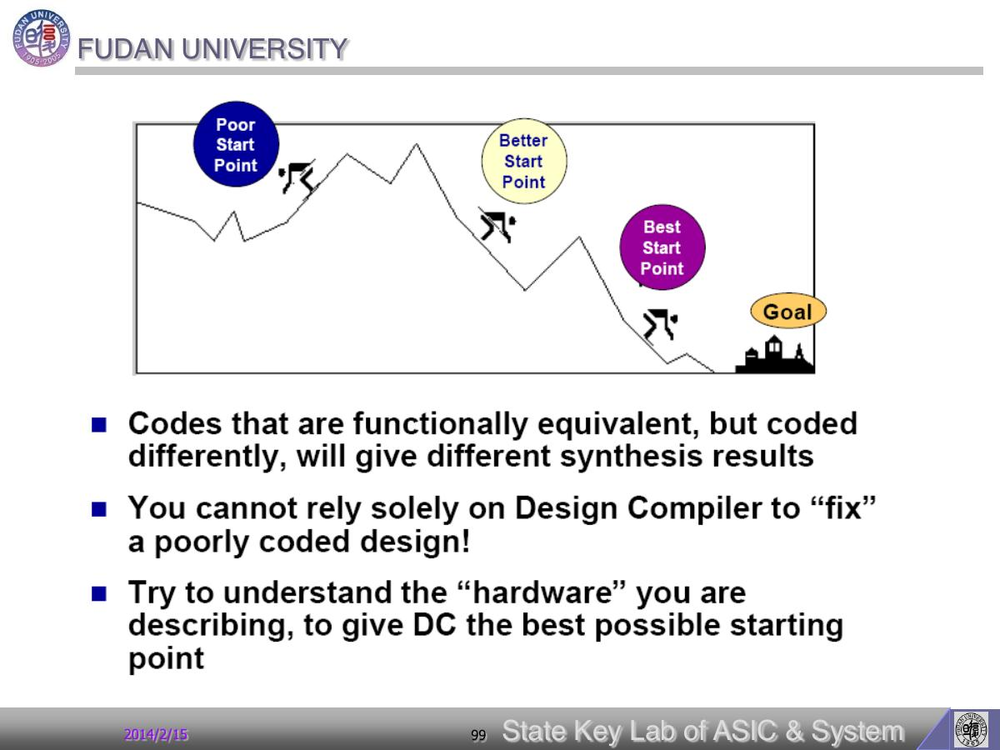

## 页面定位

- **页码**：99/112
- **所属阶段**：STA 与时序报告：路径、clock model、I/O 约束和 slack
- **本页角色**：拆解 timing report
- **阅读问题**：本页要回答：timing report 每一段数字从哪里来，slack 如何形成？
- **前后关系**：这部分回答“如何判断结果是否真的满足时序”：看路径、看 required/arrival、看 slack。

## 原文要点

> 本页 OCR 可抽取文本为空或很少，解读主要依据页面标题、页码位置和单页图像。

## 原文解读

这页继续作为 timing report 到 partitioning 的过渡。

本页关联的关键对象/命令：本页以概念/图示为主，重点看标题和图中对象关系。

## 我的理解

当报告暴露难收敛路径时，解决方案不总是调约束，也可能需要重新分区或调整层次。

把它放回完整 DC 流程里看，本页不是孤立知识点，而是在帮助我们更准确地描述“设计、环境、约束、优化结果”中的一个环节。读这一页时，我会优先问：它改变的是 DC 数据库里的哪个对象？它会让 compile 的优化空间变大还是变小？它最终应该在什么报告里被验证？

## 实操提醒

读报告时按四步：确认 path type，跟踪 data arrival，跟踪 data required，最后解释 slack。

## 本页小结

本页的核心收获：Timing report exercise visual 这一页应被理解为“拆解 timing report”的读书笔记节点；掌握它的标准不是背下标题，而是能说明它如何影响后续约束、优化或 timing 报告。

## 导航

- 上一页：[Page 098](pages/page-098.md)
- 下一页：[Page 100](pages/page-100.md)

# Page 100 - What is partitioning?

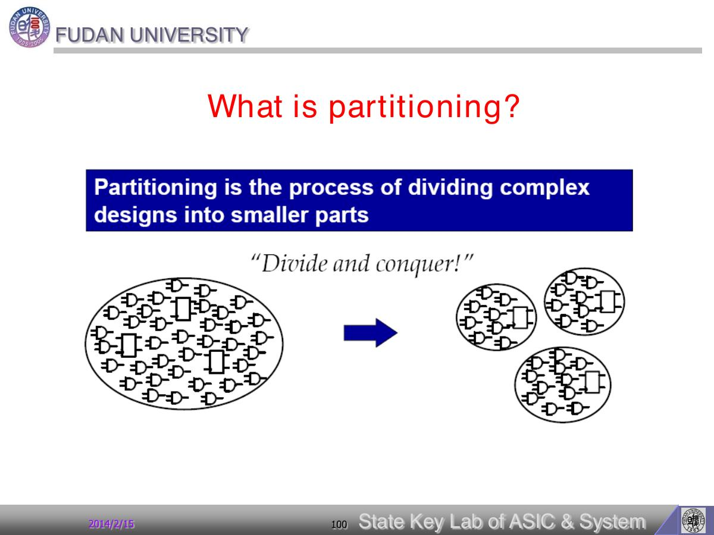

## 页面定位

- **页码**：100/112
- **所属阶段**：Partitioning：层次划分、glue logic 和工程边界
- **本页角色**：改进设计分区
- **阅读问题**：本页要回答：如何划分 block 才能减少跨层级复杂度？
- **前后关系**：这部分把综合从命令层拉回架构层：分区方式会直接决定脚本复杂度、可测性和可收敛性。

## 原文要点

> What is partitioning?

## 原文解读

`What is partitioning?` 开始把话题从命令转到工程结构。Partitioning 决定哪些逻辑作为一个 block 综合、哪些接口跨 block。

本页关联的关键对象/命令：`partitioning`

## 我的理解

我的理解是：分区是综合前的架构决策，不是后期整理文件。分区质量会影响时序收敛、约束复杂度和团队协作。

把它放回完整 DC 流程里看，本页不是孤立知识点，而是在帮助我们更准确地描述“设计、环境、约束、优化结果”中的一个环节。读这一页时，我会优先问：它改变的是 DC 数据库里的哪个对象？它会让 compile 的优化空间变大还是变小？它最终应该在什么报告里被验证？

## 实操提醒

遇到难收敛路径时，除了调 compile，也要问是不是 block 边界划错。

## 本页小结

本页的核心收获：What is partitioning? 这一页应被理解为“改进设计分区”的读书笔记节点；掌握它的标准不是背下标题，而是能说明它如何影响后续约束、优化或 timing 报告。

## 导航

- 上一页：[Page 099](pages/page-099.md)
- 下一页：[Page 101](pages/page-101.md)

# Page 101 - Partitioning visual note

## 页面定位

- **页码**：101/112
- **所属阶段**：Partitioning：层次划分、glue logic 和工程边界
- **本页角色**：改进设计分区
- **阅读问题**：本页要回答：如何划分 block 才能减少跨层级复杂度？
- **前后关系**：这部分把综合从命令层拉回架构层：分区方式会直接决定脚本复杂度、可测性和可收敛性。

## 原文要点

> 本页 OCR 可抽取文本为空或很少，解读主要依据页面标题、页码位置和单页图像。

## 原文解读

这页是 partitioning 的视觉说明页，强调 block 边界如何影响综合。

本页关联的关键对象/命令：`partitioning`

## 我的理解

好的分区让约束和报告更清楚；坏的分区会制造跨层级 glue logic 和不必要的时序压力。

把它放回完整 DC 流程里看，本页不是孤立知识点，而是在帮助我们更准确地描述“设计、环境、约束、优化结果”中的一个环节。读这一页时，我会优先问：它改变的是 DC 数据库里的哪个对象？它会让 compile 的优化空间变大还是变小？它最终应该在什么报告里被验证？

## 实操提醒

划分 block 时检查：接口逻辑是否过碎，glue logic 是否可移入某个 block，工艺相关单元是否应独立处理。

## 本页小结

本页的核心收获：Partitioning visual note 这一页应被理解为“改进设计分区”的读书笔记节点；掌握它的标准不是背下标题，而是能说明它如何影响后续约束、优化或 timing 报告。

## 导航

- 上一页：[Page 100](pages/page-100.md)
- 下一页：[Page 102](pages/page-102.md)

# Page 102 - Partitioning visual note

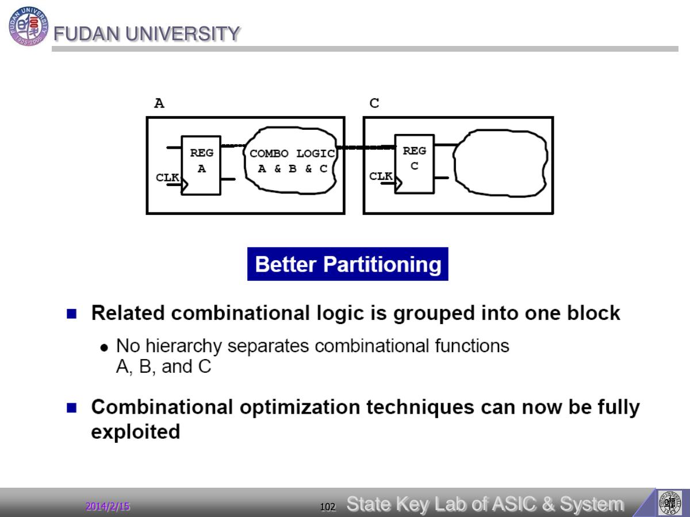

## 页面定位

- **页码**：102/112
- **所属阶段**：Partitioning：层次划分、glue logic 和工程边界
- **本页角色**：改进设计分区
- **阅读问题**：本页要回答：如何划分 block 才能减少跨层级复杂度？
- **前后关系**：这部分把综合从命令层拉回架构层：分区方式会直接决定脚本复杂度、可测性和可收敛性。

## 原文要点

> 本页 OCR 可抽取文本为空或很少，解读主要依据页面标题、页码位置和单页图像。

## 原文解读

这页继续解释 partitioning 的结构影响。

本页关联的关键对象/命令：`partitioning`

## 我的理解

我的理解是：partitioning 不是文档目录，而是决定综合单元、接口、时钟/复位边界和验证边界的工程设计。

把它放回完整 DC 流程里看，本页不是孤立知识点，而是在帮助我们更准确地描述“设计、环境、约束、优化结果”中的一个环节。读这一页时，我会优先问：它改变的是 DC 数据库里的哪个对象？它会让 compile 的优化空间变大还是变小？它最终应该在什么报告里被验证？

## 实操提醒

划分 block 时检查：接口逻辑是否过碎，glue logic 是否可移入某个 block，工艺相关单元是否应独立处理。

## 本页小结

本页的核心收获：Partitioning visual note 这一页应被理解为“改进设计分区”的读书笔记节点；掌握它的标准不是背下标题，而是能说明它如何影响后续约束、优化或 timing 报告。

## 导航

- 上一页：[Page 101](pages/page-101.md)
- 下一页：[Page 103](pages/page-103.md)

# Page 103 - Partitioning visual note

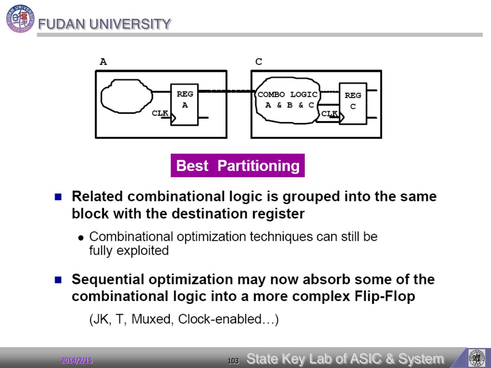

## 页面定位

- **页码**：103/112
- **所属阶段**：Partitioning：层次划分、glue logic 和工程边界
- **本页角色**：改进设计分区
- **阅读问题**：本页要回答：如何划分 block 才能减少跨层级复杂度？
- **前后关系**：这部分把综合从命令层拉回架构层：分区方式会直接决定脚本复杂度、可测性和可收敛性。

## 原文要点

> 本页 OCR 可抽取文本为空或很少，解读主要依据页面标题、页码位置和单页图像。

## 原文解读

这页作为分区示意，通常用于说明哪些逻辑应留在 block 内，哪些不应散落在边界。

本页关联的关键对象/命令：`partitioning`

## 我的理解

看这类图时要盯住接口两侧：若边界外有太多小逻辑，后续很可能形成 glue logic。

把它放回完整 DC 流程里看，本页不是孤立知识点，而是在帮助我们更准确地描述“设计、环境、约束、优化结果”中的一个环节。读这一页时，我会优先问：它改变的是 DC 数据库里的哪个对象？它会让 compile 的优化空间变大还是变小？它最终应该在什么报告里被验证？

## 实操提醒

划分 block 时检查：接口逻辑是否过碎，glue logic 是否可移入某个 block，工艺相关单元是否应独立处理。

## 本页小结

本页的核心收获：Partitioning visual note 这一页应被理解为“改进设计分区”的读书笔记节点；掌握它的标准不是背下标题，而是能说明它如何影响后续约束、优化或 timing 报告。

## 导航

- 上一页：[Page 102](pages/page-102.md)
- 下一页：[Page 104](pages/page-104.md)

# Page 104 - Avoid Glue Logic

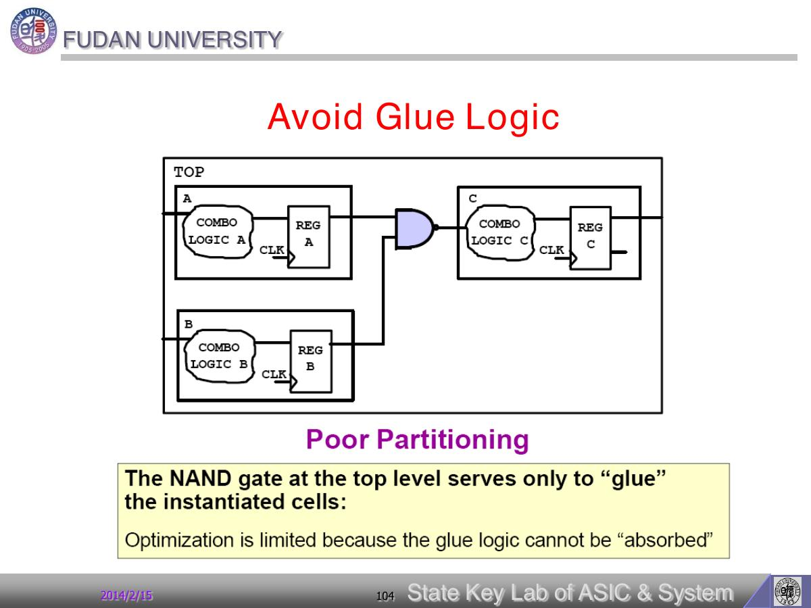

## 页面定位

- **页码**：104/112
- **所属阶段**：Partitioning：层次划分、glue logic 和工程边界
- **本页角色**：改进设计分区
- **阅读问题**：本页要回答：如何划分 block 才能减少跨层级复杂度？
- **前后关系**：这部分把综合从命令层拉回架构层：分区方式会直接决定脚本复杂度、可测性和可收敛性。

## 原文要点

> Avoid Glue Logic

## 原文解读

`Avoid Glue Logic` 强调避免在 block 边界之间残留零散组合逻辑。

本页关联的关键对象/命令：本页以概念/图示为主，重点看标题和图中对象关系。

## 我的理解

我的理解是：glue logic 会让接口时序和责任边界变模糊，既难约束也难 debug。它通常说明分区不干净。

把它放回完整 DC 流程里看，本页不是孤立知识点，而是在帮助我们更准确地描述“设计、环境、约束、优化结果”中的一个环节。读这一页时，我会优先问：它改变的是 DC 数据库里的哪个对象？它会让 compile 的优化空间变大还是变小？它最终应该在什么报告里被验证？

## 实操提醒

优先把 glue logic 合并进明确归属的 block，或重新定义接口。

## 本页小结

本页的核心收获：Avoid Glue Logic 这一页应被理解为“改进设计分区”的读书笔记节点；掌握它的标准不是背下标题，而是能说明它如何影响后续约束、优化或 timing 报告。

## 导航

- 上一页：[Page 103](pages/page-103.md)
- 下一页：[Page 105](pages/page-105.md)

# Page 105 - Remove Glue Logic Between Blocks

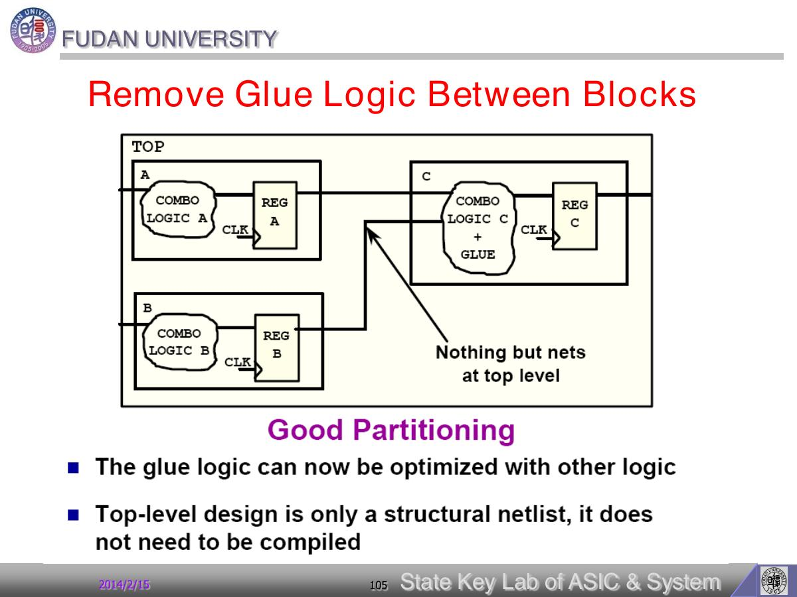

## 页面定位

- **页码**：105/112
- **所属阶段**：Partitioning：层次划分、glue logic 和工程边界
- **本页角色**：改进设计分区
- **阅读问题**：本页要回答：如何划分 block 才能减少跨层级复杂度？
- **前后关系**：这部分把综合从命令层拉回架构层：分区方式会直接决定脚本复杂度、可测性和可收敛性。

## 原文要点

> Remove Glue Logic Between Blocks

## 原文解读

本页讲移除 block 之间的 glue logic。目标是让 block 输出/输入边界更直接，减少跨层级优化依赖。

本页关联的关键对象/命令：本页以概念/图示为主，重点看标题和图中对象关系。

## 我的理解

我的理解是：跨 block 小逻辑看似无害，但会破坏层次化综合的独立性，增加约束和验证成本。

把它放回完整 DC 流程里看，本页不是孤立知识点，而是在帮助我们更准确地描述“设计、环境、约束、优化结果”中的一个环节。读这一页时，我会优先问：它改变的是 DC 数据库里的哪个对象？它会让 compile 的优化空间变大还是变小？它最终应该在什么报告里被验证？

## 实操提醒

检查顶层 netlist 时，关注 block 实例之间是否夹着大量小门。

## 本页小结

本页的核心收获：Remove Glue Logic Between Blocks 这一页应被理解为“改进设计分区”的读书笔记节点；掌握它的标准不是背下标题，而是能说明它如何影响后续约束、优化或 timing 报告。

## 导航

- 上一页：[Page 104](pages/page-104.md)
- 下一页：[Page 106](pages/page-106.md)

# Page 106 - This partitioning is recommended due to:

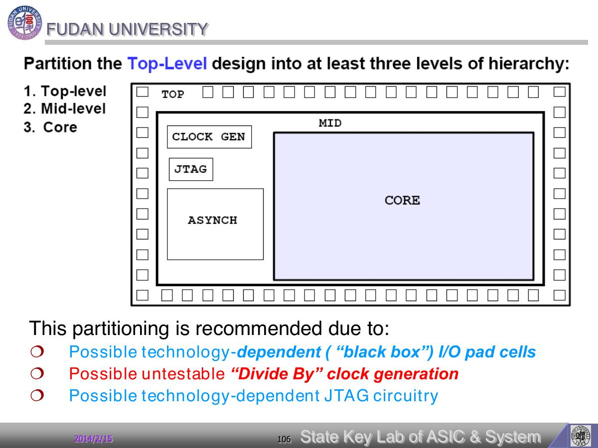

## 页面定位

- **页码**：106/112
- **所属阶段**：Partitioning：层次划分、glue logic 和工程边界
- **本页角色**：改进设计分区
- **阅读问题**：本页要回答：如何划分 block 才能减少跨层级复杂度？
- **前后关系**：这部分把综合从命令层拉回架构层：分区方式会直接决定脚本复杂度、可测性和可收敛性。

## 原文要点

> This partitioning is recommended due to:
> - Possible technology-dependent ( “black box”) I/O pad cells
> - Possible untestable “Divide By” clock generation
> - Possible technology-dependent JTAG circuitry

## 原文解读

本页解释推荐分区的原因：I/O pad 可能是工艺相关黑盒，分频时钟可能不可测，某些工艺相关单元不应混入普通逻辑。

本页关联的关键对象/命令：`partitioning`

## 我的理解

我的理解是：分区要尊重工艺、测试和时钟结构。不是所有逻辑都适合一起综合。

把它放回完整 DC 流程里看，本页不是孤立知识点，而是在帮助我们更准确地描述“设计、环境、约束、优化结果”中的一个环节。读这一页时，我会优先问：它改变的是 DC 数据库里的哪个对象？它会让 compile 的优化空间变大还是变小？它最终应该在什么报告里被验证？

## 实操提醒

对 pad、clock generation、test logic 建立单独处理策略。

## 本页小结

本页的核心收获：This partitioning is recommended due to: 这一页应被理解为“改进设计分区”的读书笔记节点；掌握它的标准不是背下标题，而是能说明它如何影响后续约束、优化或 timing 报告。

## 导航

- 上一页：[Page 105](pages/page-105.md)
- 下一页：[Page 107](pages/page-107.md)

# Page 107 - Partitioning visual note

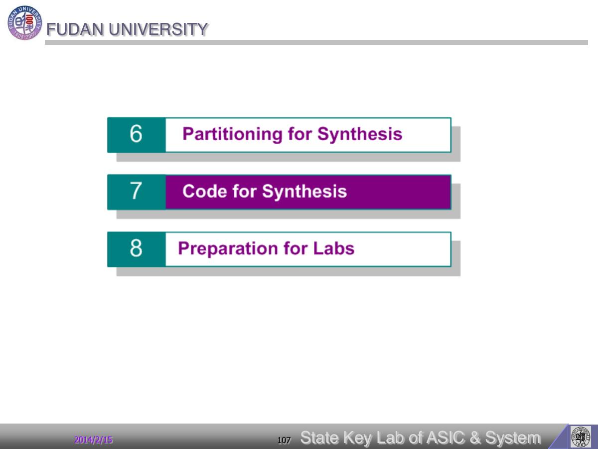

## 页面定位

- **页码**：107/112
- **所属阶段**：Partitioning：层次划分、glue logic 和工程边界
- **本页角色**：改进设计分区
- **阅读问题**：本页要回答：如何划分 block 才能减少跨层级复杂度？
- **前后关系**：这部分把综合从命令层拉回架构层：分区方式会直接决定脚本复杂度、可测性和可收敛性。

## 原文要点

> 本页 OCR 可抽取文本为空或很少，解读主要依据页面标题、页码位置和单页图像。

## 原文解读

这页属于 partitioning 建议的图示延续，强调推荐分区背后的工程原因。

本页关联的关键对象/命令：`partitioning`

## 我的理解

黑盒 I/O、不可测试分频时钟、工艺相关单元等内容都不适合被随意并入普通逻辑 block。

把它放回完整 DC 流程里看，本页不是孤立知识点，而是在帮助我们更准确地描述“设计、环境、约束、优化结果”中的一个环节。读这一页时，我会优先问：它改变的是 DC 数据库里的哪个对象？它会让 compile 的优化空间变大还是变小？它最终应该在什么报告里被验证？

## 实操提醒

划分 block 时检查：接口逻辑是否过碎，glue logic 是否可移入某个 block，工艺相关单元是否应独立处理。

## 本页小结

本页的核心收获：Partitioning visual note 这一页应被理解为“改进设计分区”的读书笔记节点；掌握它的标准不是背下标题，而是能说明它如何影响后续约束、优化或 timing 报告。

## 导航

- 上一页：[Page 106](pages/page-106.md)
- 下一页：[Page 108](pages/page-108.md)

# Page 108 - Partitioning visual note

## 页面定位

- **页码**：108/112
- **所属阶段**：Partitioning：层次划分、glue logic 和工程边界
- **本页角色**：改进设计分区
- **阅读问题**：本页要回答：如何划分 block 才能减少跨层级复杂度？
- **前后关系**：这部分把综合从命令层拉回架构层：分区方式会直接决定脚本复杂度、可测性和可收敛性。

## 原文要点

> 本页 OCR 可抽取文本为空或很少，解读主要依据页面标题、页码位置和单页图像。

## 原文解读

这页继续呈现工程分区中的边界问题。

本页关联的关键对象/命令：`partitioning`

## 我的理解

我的理解是：综合脚本的复杂度常常是分区质量的反映，边界越清楚，约束越容易写对。

把它放回完整 DC 流程里看，本页不是孤立知识点，而是在帮助我们更准确地描述“设计、环境、约束、优化结果”中的一个环节。读这一页时，我会优先问：它改变的是 DC 数据库里的哪个对象？它会让 compile 的优化空间变大还是变小？它最终应该在什么报告里被验证？

## 实操提醒

划分 block 时检查：接口逻辑是否过碎，glue logic 是否可移入某个 block，工艺相关单元是否应独立处理。

## 本页小结

本页的核心收获：Partitioning visual note 这一页应被理解为“改进设计分区”的读书笔记节点；掌握它的标准不是背下标题，而是能说明它如何影响后续约束、优化或 timing 报告。

## 导航

- 上一页：[Page 107](pages/page-107.md)
- 下一页：[Page 109](pages/page-109.md)

# Page 109 - Partitioning visual note

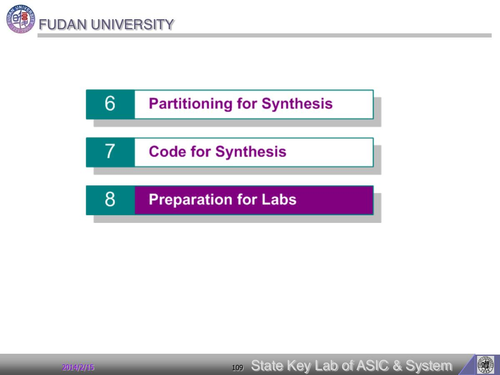

## 页面定位

- **页码**：109/112
- **所属阶段**：Partitioning：层次划分、glue logic 和工程边界
- **本页角色**：改进设计分区
- **阅读问题**：本页要回答：如何划分 block 才能减少跨层级复杂度？
- **前后关系**：这部分把综合从命令层拉回架构层：分区方式会直接决定脚本复杂度、可测性和可收敛性。

## 原文要点

> 本页 OCR 可抽取文本为空或很少，解读主要依据页面标题、页码位置和单页图像。

## 原文解读

这页是 partitioning 到实际启动 DC 的过渡页。

本页关联的关键对象/命令：`partitioning`

## 我的理解

课程在这里从“怎么划分设计”收束到“怎么组织工程并运行工具”。

把它放回完整 DC 流程里看，本页不是孤立知识点，而是在帮助我们更准确地描述“设计、环境、约束、优化结果”中的一个环节。读这一页时，我会优先问：它改变的是 DC 数据库里的哪个对象？它会让 compile 的优化空间变大还是变小？它最终应该在什么报告里被验证？

## 实操提醒

划分 block 时检查：接口逻辑是否过碎，glue logic 是否可移入某个 block，工艺相关单元是否应独立处理。

## 本页小结

本页的核心收获：Partitioning visual note 这一页应被理解为“改进设计分区”的读书笔记节点；掌握它的标准不是背下标题，而是能说明它如何影响后续约束、优化或 timing 报告。

## 导航

- 上一页：[Page 108](pages/page-108.md)
- 下一页：[Page 110](pages/page-110.md)

# Page 110 - How to start DC

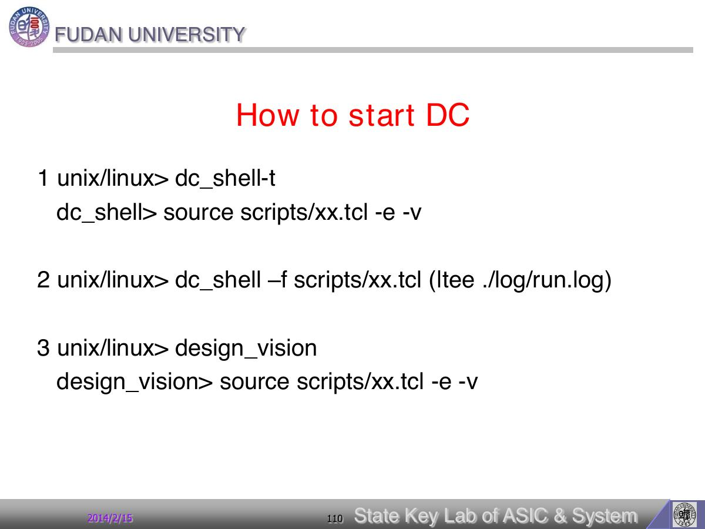

## 页面定位

- **页码**：110/112
- **所属阶段**：工程使用：启动 DC、项目目录和帮助系统
- **本页角色**：建立工程运行习惯
- **阅读问题**：本页要回答：如何把 DC 使用变成可复现、可查询的工程流程？
- **前后关系**：最后几页强调可复现工程习惯：脚本启动、目录组织、查帮助。

## 原文要点

> How to start DC
> 1 unix/linux> dc_shell-t
> dc_shell> source scripts/xx.tcl -e -v
> 2 unix/linux> dc_shell –f scripts/xx.tcl (|tee ./log/run.log)
> 3 unix/linux> design_vision
> design_vision> source scripts/xx.tcl -e -v

## 原文解读

本页讲启动 DC 的两种方式：交互进入 `dc_shell-t` 后 source 脚本，或直接 `dc_shell -f scripts/xx.tcl` 并 tee 日志。

本页关联的关键对象/命令：`dc_shell`

## 我的理解

我的理解是：学习可以交互式试命令，工程运行必须脚本化和日志化，否则结果不可复现。

把它放回完整 DC 流程里看，本页不是孤立知识点，而是在帮助我们更准确地描述“设计、环境、约束、优化结果”中的一个环节。读这一页时，我会优先问：它改变的是 DC 数据库里的哪个对象？它会让 compile 的优化空间变大还是变小？它最终应该在什么报告里被验证？

## 实操提醒

推荐固定入口脚本和 log 路径，保留每次 run 的报告。

## 本页小结

本页的核心收获：How to start DC 这一页应被理解为“建立工程运行习惯”的读书笔记节点；掌握它的标准不是背下标题，而是能说明它如何影响后续约束、优化或 timing 报告。

## 导航

- 上一页：[Page 109](pages/page-109.md)
- 下一页：[Page 111](pages/page-111.md)

# Page 111 - Project Directory

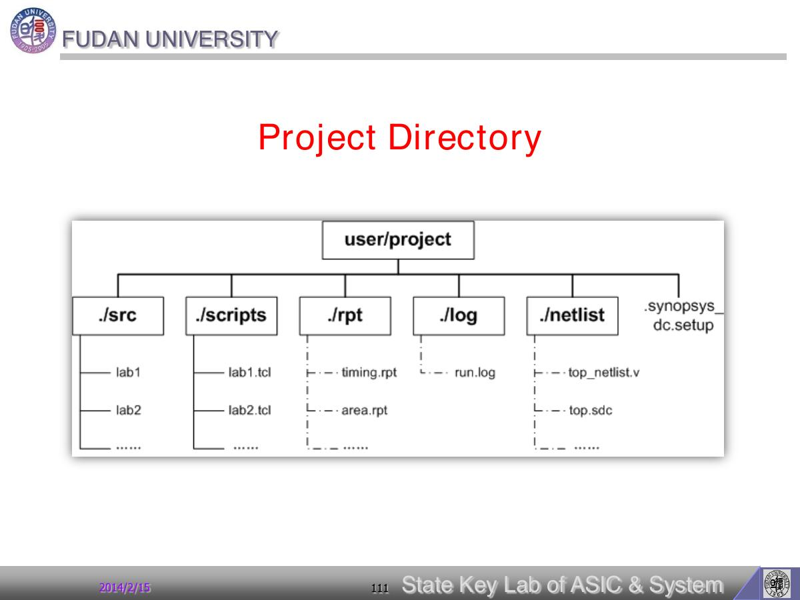

## 页面定位

- **页码**：111/112
- **所属阶段**：工程使用：启动 DC、项目目录和帮助系统
- **本页角色**：建立工程运行习惯
- **阅读问题**：本页要回答：如何把 DC 使用变成可复现、可查询的工程流程？
- **前后关系**：最后几页强调可复现工程习惯：脚本启动、目录组织、查帮助。

## 原文要点

> Project Directory

## 原文解读

`Project Directory` 强调工程目录组织。脚本、源文件、库、报告、日志和输出网表应有固定位置。

本页关联的关键对象/命令：本页以概念/图示为主，重点看标题和图中对象关系。

## 我的理解

我的理解是：目录结构是综合流程的一部分。目录乱会导致脚本不可移植、报告难追踪、多人协作容易出错。

把它放回完整 DC 流程里看，本页不是孤立知识点，而是在帮助我们更准确地描述“设计、环境、约束、优化结果”中的一个环节。读这一页时，我会优先问：它改变的是 DC 数据库里的哪个对象？它会让 compile 的优化空间变大还是变小？它最终应该在什么报告里被验证？

## 实操提醒

建立 `src/ scripts/ reports/ logs/ output/ lib/` 这类稳定目录约定。

## 本页小结

本页的核心收获：Project Directory 这一页应被理解为“建立工程运行习惯”的读书笔记节点；掌握它的标准不是背下标题，而是能说明它如何影响后续约束、优化或 timing 报告。

## 导航

- 上一页：[Page 110](pages/page-110.md)
- 下一页：[Page 112](pages/page-112.md)

# Page 112 - How Get Help?

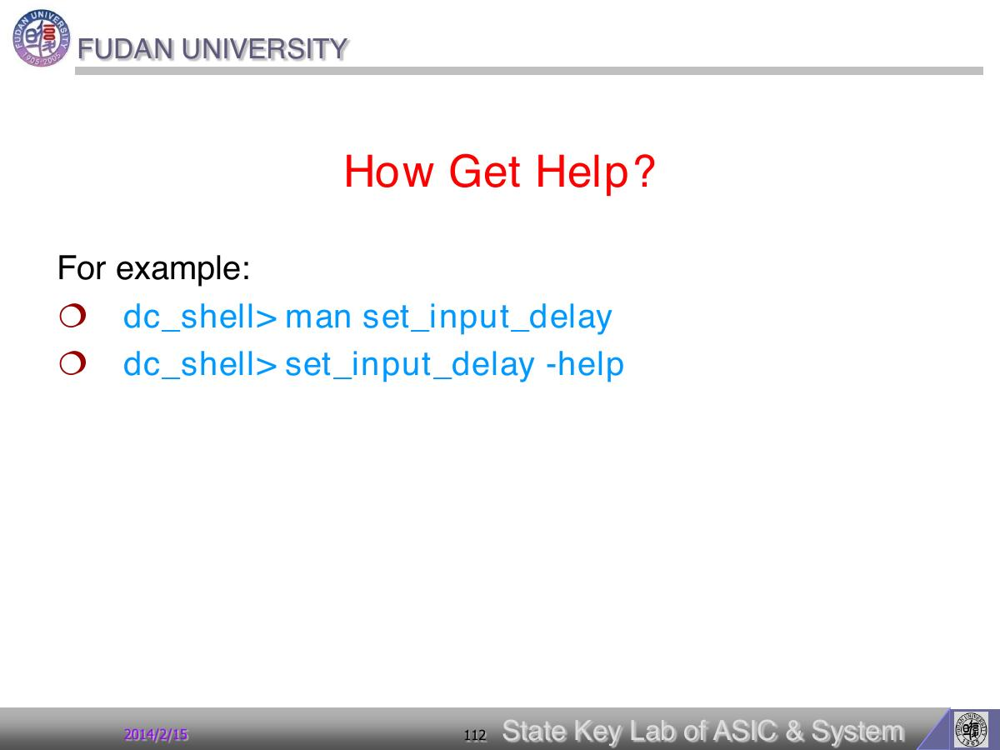

## 页面定位

- **页码**：112/112
- **所属阶段**：工程使用：启动 DC、项目目录和帮助系统
- **本页角色**：建立工程运行习惯
- **阅读问题**：本页要回答：如何把 DC 使用变成可复现、可查询的工程流程？
- **前后关系**：最后几页强调可复现工程习惯：脚本启动、目录组织、查帮助。

## 原文要点

> How Get Help?
> For example:
> - dc_shell> man set_input_delay
> - dc_shell> set_input_delay -help

## 原文解读

本页讲如何查 DC 帮助：`man set_input_delay` 和 `set_input_delay -help`。

本页关联的关键对象/命令：`set_input_delay`, `dc_shell`

## 我的理解

我的理解是：命令细节不要靠记忆硬背，尤其是 option、对象类型、默认值，应该回到工具帮助确认。

把它放回完整 DC 流程里看，本页不是孤立知识点，而是在帮助我们更准确地描述“设计、环境、约束、优化结果”中的一个环节。读这一页时，我会优先问：它改变的是 DC 数据库里的哪个对象？它会让 compile 的优化空间变大还是变小？它最终应该在什么报告里被验证？

## 实操提醒

遇到命令不确定时，先查 help，再查现有脚本中的用法。

## 本页小结

本页的核心收获：How Get Help? 这一页应被理解为“建立工程运行习惯”的读书笔记节点；掌握它的标准不是背下标题，而是能说明它如何影响后续约束、优化或 timing 报告。

## 导航

- 上一页：[Page 111](pages/page-111.md)
- 下一页：无
