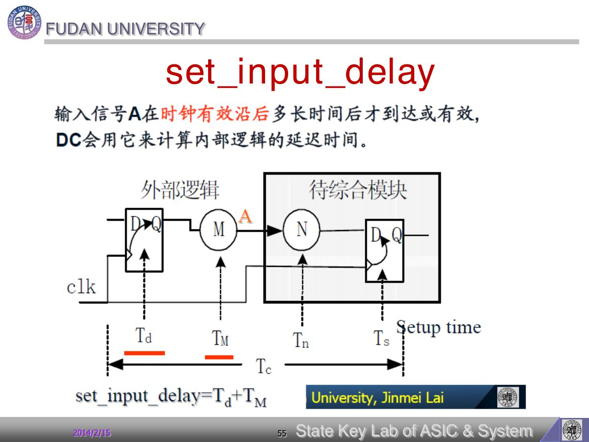

# Page 055 - set_input_delay

## 页面定位

- **页码**：55/112
- **所属阶段**：约束建模：设计规则、时序、面积和优先级
- **本页角色**：设置时序预算
- **阅读问题**：本页要回答：时钟和 I/O 时间预算如何写进 DC？
- **前后关系**：这部分回答“工具必须满足什么”：硬性 design rule 与优化目标要分清。

## 原文摘录

> set_input_delay

## 图中内容理解

这张图表达输入路径的系统级时序分割：外部触发器 launch 数据，经过外部逻辑 `TM` 到达本模块输入，再经过本模块内部逻辑 `TN` 被内部寄存器 capture。`set_input_delay` 对应的是外部已经花掉的 `Tclk-q + TM`，不是本模块内部延迟。图的电路含义是：模块边界把一条完整 reg-to-reg 路径切成外部段和内部段；约束要把外部段从周期预算中扣掉。

## 原文逐项解读

1. **原文**：`set_input_delay`
   **解读**：`set_input_delay` 是输入端口的时序边界约束。它告诉 DC：数据到达本模块输入前，外部电路已经花掉了多少时间。

## 关键概念拆解

- **相关对象/命令**：`set_input_delay`
- **它在流程中的位置**：本页属于“约束建模：设计规则、时序、面积和优先级”。这意味着它不是孤立知识点，而是在完整 DC 流程中承担“设置时序预算”的作用。
- **要验证的地方**：学习完本页后，应能在脚本、设计对象或报告中找到对应证据；例如库是否加载、端口是否被约束、路径是否出现在 timing report、或优化结果是否反映在面积/时序报告里。

## 我的理解

我的理解是：`set_input_delay` 的本质是模块边界的时间预算交接。外部逻辑已经消耗的 `Tclk-q + TM` 不能再算作当前模块可用时间；如果这里建模过小，DC 会误以为内部还有更多时间，结果在系统级集成时暴露 setup 问题。

更具体地说，读这一页时我会把它拆成三层：第一层是原文在定义什么对象或命令；第二层是它改变了 DC 数据库中的哪个属性；第三层是这个改变会怎样影响后续 compile、report 或工程维护。只有把这三层连起来，才算真正读懂，而不是记住几个英文命令。

## 对我们的启示

对我们的启示：做 block-level synthesis 时，接口约束必须来自系统级时序预算。不能为了让模块好过 timing 就随便把 input delay 设小；那只是把问题推迟到 top-level。

如果把这页用于真实项目，我会把它转成一个检查问题：当前脚本有没有明确表达这一页要求的环境、约束或报告检查？如果没有，这就是后续综合结果不可信或难以复现的风险点。

## 本页小结

本页的核心不是“set_input_delay”这个标题本身，而是理解它如何影响 DC 对设计的认识、优化空间和报告解释。复习时不要只背命令，要能说清：它作用于谁、设置什么、为什么需要、错了会导致什么后果。

## 导航

- 上一页：[Page 054](page-054.md)
- 下一页：[Page 056](page-056.md)
