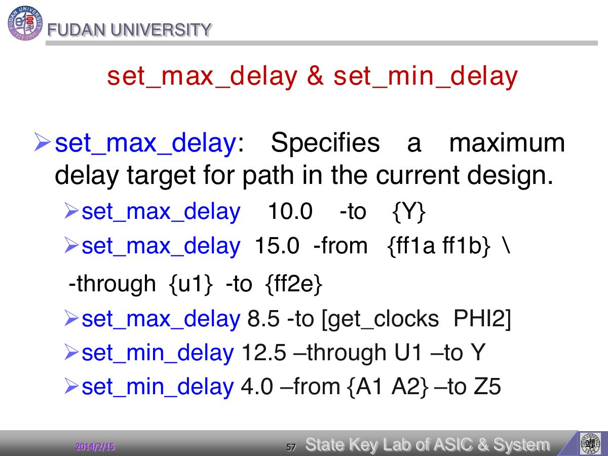

# Page 057 - set_max_delay & set_min_delay

## 页面定位

- **页码**：57/112
- **所属阶段**：约束建模：设计规则、时序、面积和优先级
- **本页角色**：设置时序预算
- **阅读问题**：本页要回答：时钟和 I/O 时间预算如何写进 DC？
- **前后关系**：这部分回答“工具必须满足什么”：硬性 design rule 与优化目标要分清。

## 原文要点

> set_max_delay & set_min_delay
> -set_max_delay: Specifies a maximum
> delay target for path in the current design.
> -set_max_delay 10.0 -to {Y}
> -set_max_delay 15.0 -from {ff1a ff1b} \
> -through {u1} -to {ff2e}
> -set_max_delay 8.5 -to [get_clocks PHI2]
> -set_min_delay 12.5 –through U1 –to Y
> -set_min_delay 4.0 –from {A1 A2} –to Z5

## 原文解读

本页讲 timing constraint。`create_clock` 建立时序坐标系，`set_input_delay/set_output_delay` 描述模块边界外部逻辑占用的时间，`set_max_delay/set_min_delay` 可直接约束路径。

本页关联的关键对象/命令：`set_max_delay`, `set_min_delay`

## 我的理解

我的理解是：时序约束的本质是分配时间预算。DC 优化的是“当前模块内部还能使用多少时间”，而不是凭空知道系统级时序。

把它放回完整 DC 流程里看，本页不是孤立知识点，而是在帮助我们更准确地描述“设计、环境、约束、优化结果”中的一个环节。读这一页时，我会优先问：它改变的是 DC 数据库里的哪个对象？它会让 compile 的优化空间变大还是变小？它最终应该在什么报告里被验证？

## 实操提醒

写 I/O delay 时要明确 launch/capture clock、外部组合逻辑、setup/hold 关系，避免把外部预算留给内部使用。

## 本页小结

本页的核心收获：set_max_delay & set_min_delay 这一页应被理解为“设置时序预算”的读书笔记节点；掌握它的标准不是背下标题，而是能说明它如何影响后续约束、优化或 timing 报告。

## 导航

- 上一页：[Page 056](page-056.md)
- 下一页：[Page 058](page-058.md)
