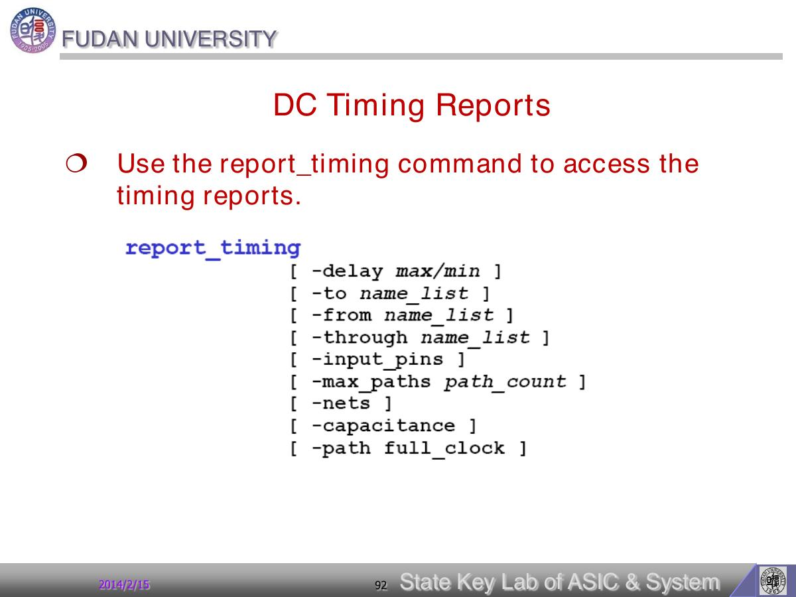

# Page 092 - DC Timing Reports

## 页面定位

- **页码**：92/112
- **所属阶段**：STA 与时序报告：路径、clock model、I/O 约束和 slack
- **本页角色**：拆解 timing report
- **阅读问题**：本页要回答：timing report 每一段数字从哪里来，slack 如何形成？
- **前后关系**：这部分回答“如何判断结果是否真的满足时序”：看路径、看 required/arrival、看 slack。

## 原文要点

> DC Timing Reports
> - Use the report_timing command to access the
> timing reports.

## 原文解读

本页讲综合结果和属性报告。report_design、report_clock、report_port、report_timing 等命令用于验证 DC 当前数据库中的对象和约束。

本页关联的关键对象/命令：`report_timing`

## 我的理解

我的理解是：报告不是最后才看的成果物，而是每个阶段的反馈回路。读入后、约束后、compile 后都应该报告一次。

把它放回完整 DC 流程里看，本页不是孤立知识点，而是在帮助我们更准确地描述“设计、环境、约束、优化结果”中的一个环节。读这一页时，我会优先问：它改变的是 DC 数据库里的哪个对象？它会让 compile 的优化空间变大还是变小？它最终应该在什么报告里被验证？

## 实操提醒

建立脚本习惯：每个关键阶段输出 log/report，便于比较前后状态。

## 本页小结

本页的核心收获：DC Timing Reports 这一页应被理解为“拆解 timing report”的读书笔记节点；掌握它的标准不是背下标题，而是能说明它如何影响后续约束、优化或 timing 报告。

## 导航

- 上一页：[Page 091](page-091.md)
- 下一页：[Page 093](page-093.md)
