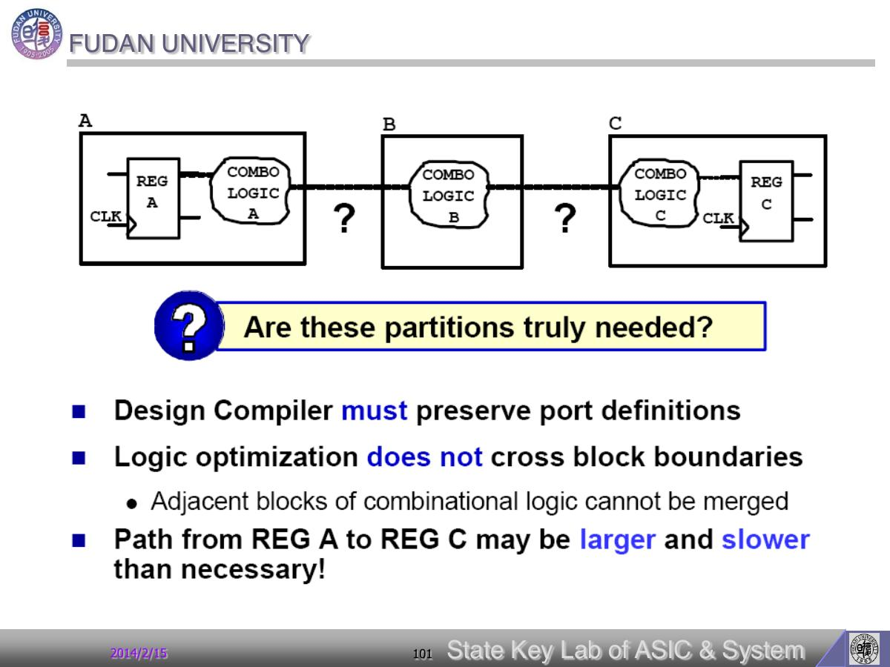

# Page 101 - Partitioning visual note

## 页面定位

- **页码**：101/112
- **所属阶段**：Partitioning：层次划分、glue logic 和工程边界
- **本页角色**：改进设计分区
- **阅读问题**：本页要回答：如何划分 block 才能减少跨层级复杂度？
- **前后关系**：这部分把综合从命令层拉回架构层：分区方式会直接决定脚本复杂度、可测性和可收敛性。

## 原文要点

> 本页 OCR 可抽取文本为空或很少，解读主要依据页面标题、页码位置和单页图像。

## 原文解读

这页是 partitioning 的视觉说明页，强调 block 边界如何影响综合。

本页关联的关键对象/命令：`partitioning`

## 我的理解

好的分区让约束和报告更清楚；坏的分区会制造跨层级 glue logic 和不必要的时序压力。

把它放回完整 DC 流程里看，本页不是孤立知识点，而是在帮助我们更准确地描述“设计、环境、约束、优化结果”中的一个环节。读这一页时，我会优先问：它改变的是 DC 数据库里的哪个对象？它会让 compile 的优化空间变大还是变小？它最终应该在什么报告里被验证？

## 实操提醒

划分 block 时检查：接口逻辑是否过碎，glue logic 是否可移入某个 block，工艺相关单元是否应独立处理。

## 本页小结

本页的核心收获：Partitioning visual note 这一页应被理解为“改进设计分区”的读书笔记节点；掌握它的标准不是背下标题，而是能说明它如何影响后续约束、优化或 timing 报告。

## 导航

- 上一页：[Page 100](page-100.md)
- 下一页：[Page 102](page-102.md)
